# KOSMOS_3.0

## 1/ Assemblage des composants intérieurs au caisson

### 1.1 Assemblage de la caméra :

* Rassembler, la Picam HQ, sa nappe \(câble plat\), la structure caméra I3, 4 vis M2,5\*5mm et 4 rondelles M2,5.

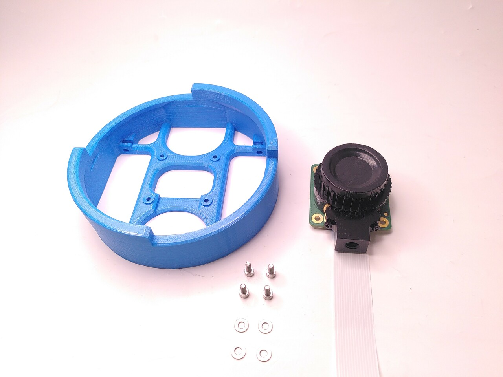

​

* A l'aide d'une clé alen de 2mm, visser la caméra sur I3 à l'aide des 4 vis M2,5 et 4 rondelles. La caméra doit être positionnée comme présentée sur la photo ci dessous. La sortie de la nappe du côté opposé aux fixations.

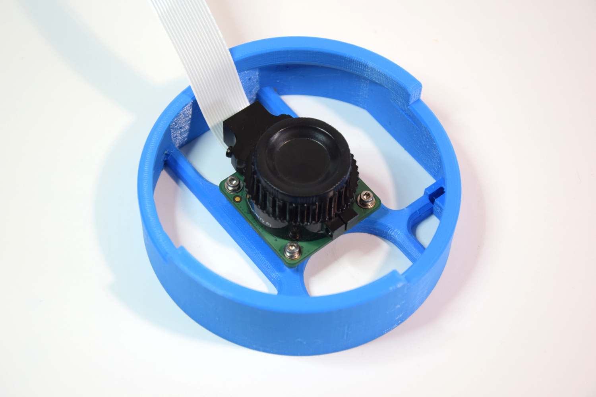

​

​

### 1.2 Assemblage de la Raspberry :

​

* Rassembler, le support de la Raspberry, structure S1, la Raspberry Pi 4 modèle B, 4 entretoises en laiton M2,5\*10, 4 vis M2,5 6mm et 4 rondelles M2,5.

​

* A l'aide d'une pince plate, visser les 4 entretoises sur les trous R1, R2, R3 et R4 \(cf photo ci dessous\).

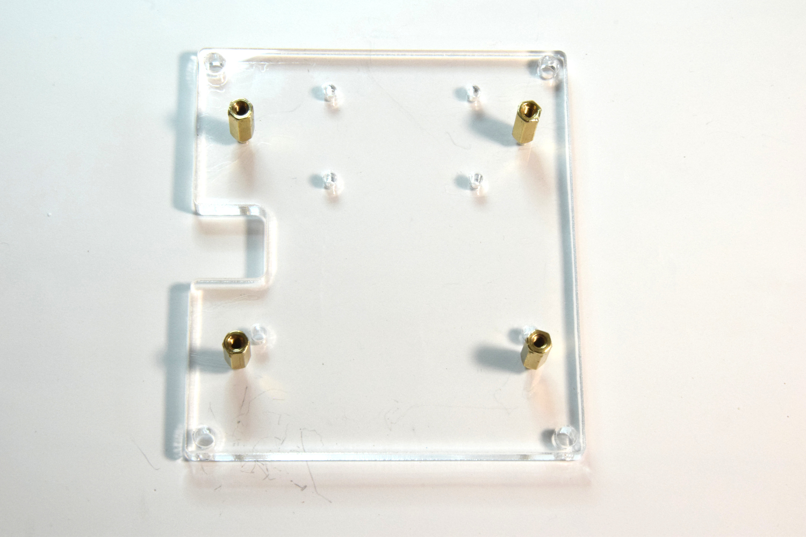

​

* Enfin, à l'aide d'une clé alen 2mm, visser la raspberry sur son support \(cf photo ci-dessous\). Veiller au sens, l'encoche de la structure S1 doit être à l'opposée des connecteurs USB de la Raspberry. Disposer les rondelles entre la Raspberry Pi et les vis.

​

​

### 1.3 Installation du convertisseur et de l'ESC :

​

* Rassembler, le convertisseur 12V vers 5V, la Raspberry sur son support, l'ESC (contrôleur moteur brushless), 2 vis M3\*5mm et 2 colsons. 

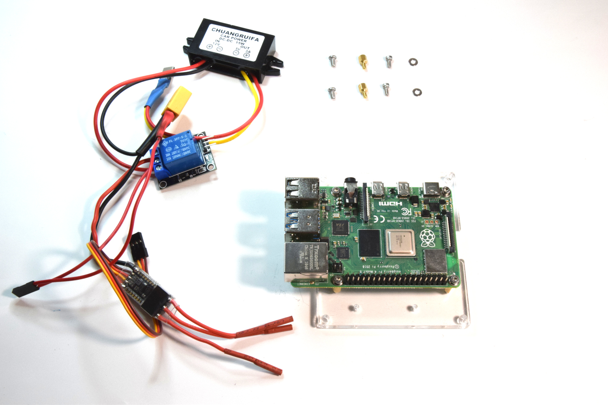

​

* Visser avec les deux vis M3 le transformateur 12V vers 5V (Chuangruifa). Veiller à positionner les câbles vers l'intérieur de la platine S1.

​

* Installer l'ESC sous le convertisseur à l'aide des deux colsons. On veillera à positionner les câbles du BEC (3 fils sertis) et d'alimentation du coté de l'encoche de S1. 

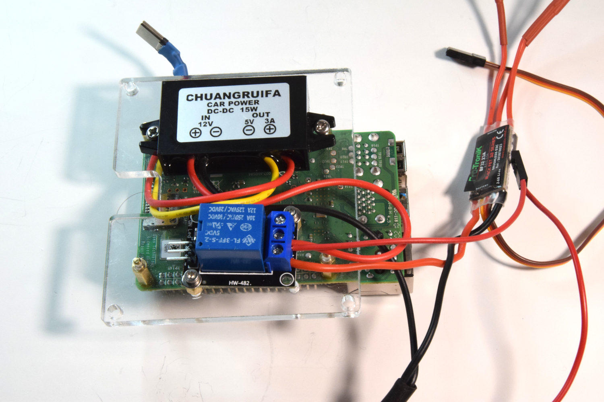

​

​

### 1.4 Finalisation de l'assemblage interne :

​

* Rassembler la Raspberry et son support, la caméra et sa structure, la structure I1 et I2, 8 ecrous M3, 6 vis M3\*10mm, et 2 vis M3\*15mm, 2 vis M4\*30mm, 2 écrous M4.

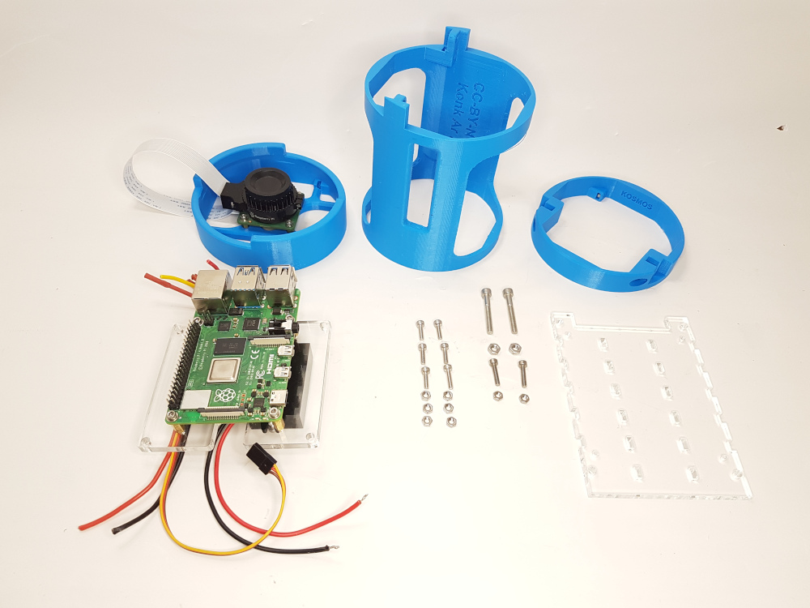
​

​

* Insérer 4 écrous M3 dans les fentes prévus à cet effet sur la structure I1 \(cf photo ci dessous\)

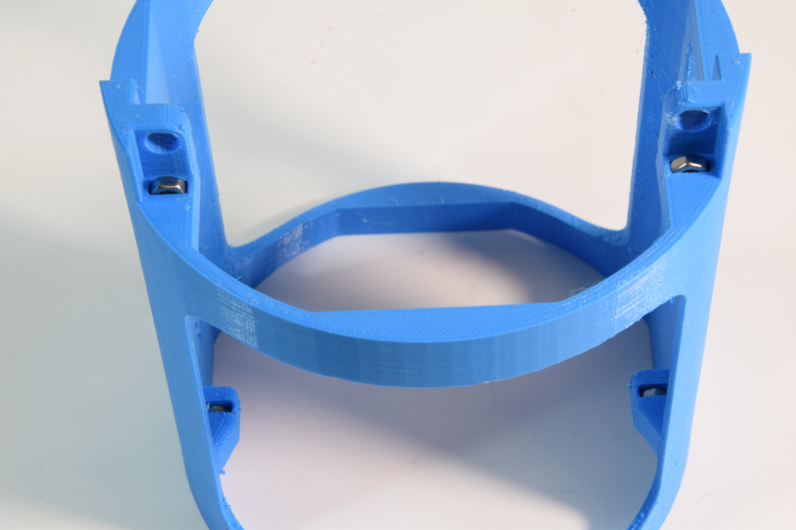

​

* Visser la carte Raspberry pi 4 et son support S1 sur la structure I1 à l'aide de deux vis M3\*15mm en haut (Côté opposé aux connecteurs USB) et deux vis M3\*10mm en bas (côté des connecteurs USB). Attention au sens de la Raspberry \(cf photo ci-dessous\).

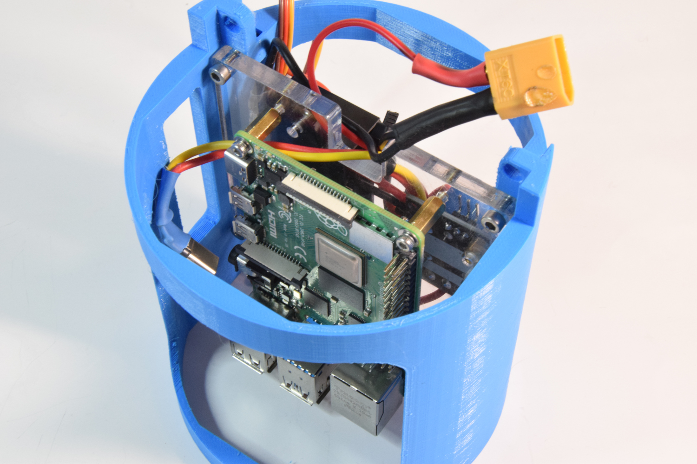

​

* Insérer 2 écrous M3 sur la structure I2 et 2 autres sur la structure caméra I3.
* Visser la plaque en PMMA S2 à l'aide de 2 vis M3\*10mm sur la structure batterie I2. Attention à bien veiller au sens.

​

* Visser l'autre extrémité de la plaque de PMMA S2 sur la structure caméra I3.

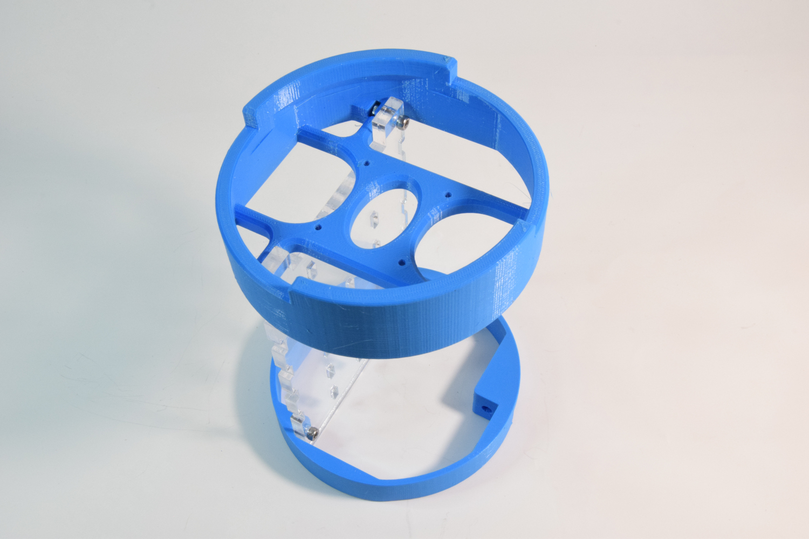

​

* Assembler les deux parties précédemment assemblées. Veiller à passer les câbles au travers des pièces et à ne pas les abimer.
* Visser ces deux parties au moyen de deux vis M4\*30mm et de deux écrous M4. Serrer de manière à ce que la tête de vis ne puisse géner l'insertion du KOSMOS dans le tube.

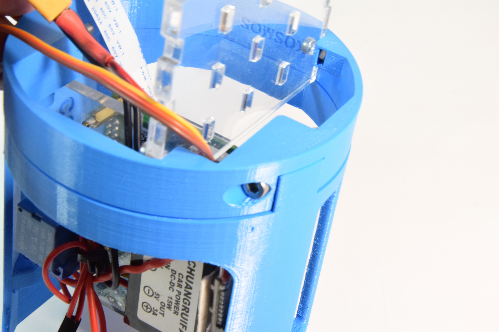

​

* Brancher la nappe de la PiCam à la carte Raspberry. La carte porte une inscription "CAMERA" au dessus de ce connecteur , il est à proximité des connecteurs USB. Pour la connexion, lever \(sans ôter\) la partie noir du connecteur et placer le côté bleu de l'’extrémité de la nappe face aux connecteurs USB. Refermer la pièce de serrage noir. \(cf photos ci dessous\)

​

​

### 1.5 Installation de la Batterie

​

* Rassembler la partie interne du KOSMOS, une batterie lipo 3s 2200mAh une rallonge de câble de recharge Lipo 3s et 2 colsons.

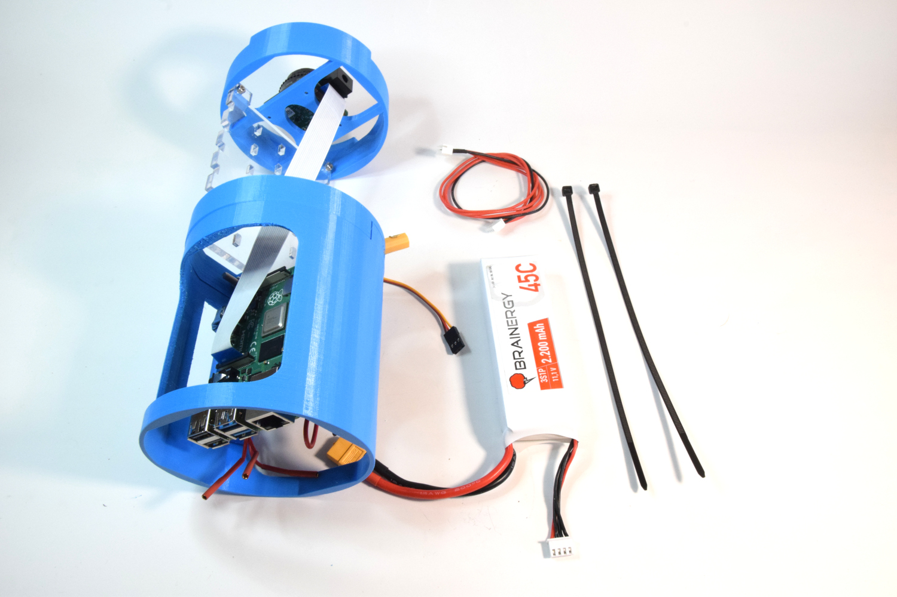

​

* Positionner la batterie sur S2 sur un des deux flanc étroit.  Maintenir en place la batterie à l'aide de colsons. On préférera positionner les câbles du côté de la raspberry et de veiller à mettre la batterie en buttée sur la structure où est vissée la Picam. 

​

* Brancher le connecteur XT60 avec celui du circuit d'alimentation.
* Brancher la rallonge de rechargement au connecteur de la batterie. Ce câble circulera vers l'arrière en passant devant la Raspberry.

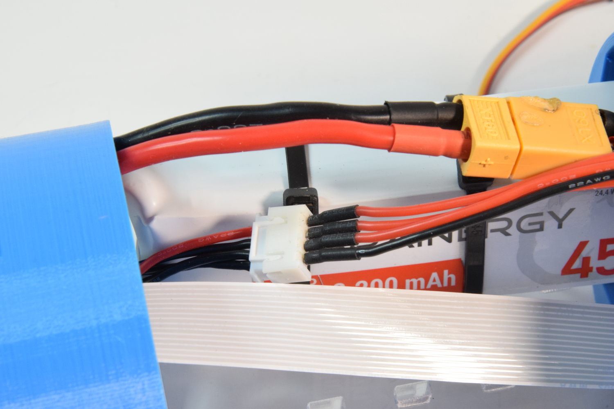

### 1.6 Câblages interne

Les étapes suivantes nécessitent des compétences en soudure électronique. Vous pouvez retrouver des conseils en annexes mais n'oubliez pas de bien recouvrir les soudures de gaines thermos-rétractable pour protéger des feux contacts. Il faut souvent veiller à insérer un morceau de gaine avant de souder. Le schèma suivant représente le circuit qui va être détaillé dans la partie 1.6. 

//Ici le schéma de montage du circuit d'alim//

 - Visser au moyen de 4 vis M3* 6mm, le PCB sur le dessus du KOSMOS à l'opposé de l'emplacement de la batterie. Connecter la nappe de 40 broches sur le connecteur dupont de 40 broches et l'autre extrémité sur les GPIO de la Raspberry. Attention à placer les deux extrémités de la nappe dans le même sens. Les deux connecteurs sont parallèles. 
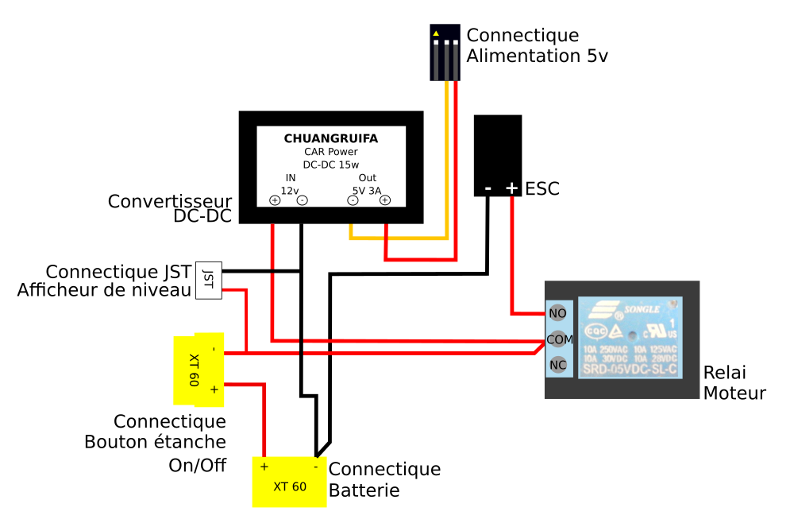

 - Souder à la borne positive d'un connecteur XT60, un câble rouge (14AWG) d'une longueur de 220 mm. 

 - Souder à l'autre extrémité du câble un connecteur XT60 mâle qui servira à connecter le bouton de mise en tension. 

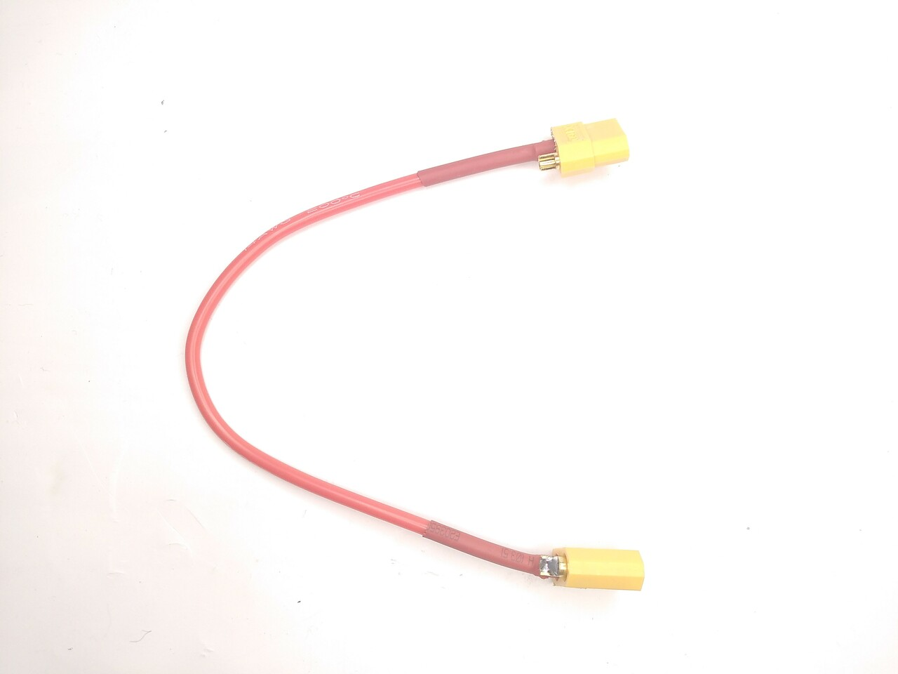

 - Souder à la borne négative du connecteur XT60 mâle deux câbles un fil de 200mm, Ainsi que le fil positif 12v du convertisseur (Chuangruifa). 

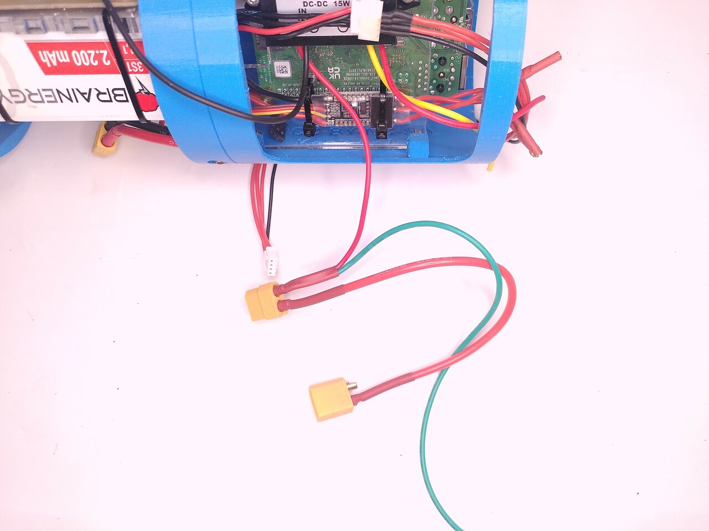

 - Étamer l'autre extrémité du fil de 200mm précédemment soudé et la visser sur le domino centrale (COM) du relai. Ajouter un fil de 100 mm sur ce même connecteur. 
 - Etamer le fil rouge de l'ESC et le brancher à la borne NO du relai.
 
 

 - Raccorder ensemble les fils noirs de l'ESC et du convertisseur (12v) ainsi que un fil de 20mm. Raccorder ses trois fils au pôle négatif du connecteur XT60 femelle qui se raccorde à la batterie. 

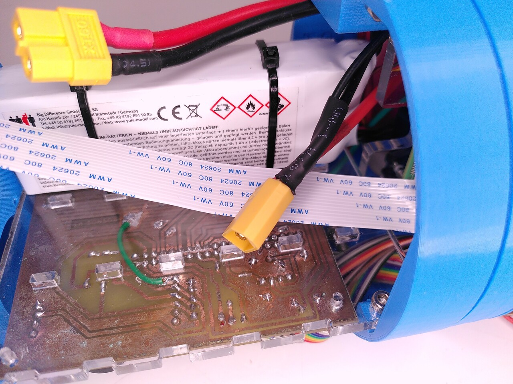 
 
 
 
 - Sertir sur une prise JST le fil venant de la masse de la batterie et le fil positif venant du relai (borne COM). Positionner la masse de manière à ce qu'elle soit du coté de l'indicateur de batterie (ici fil vert). 

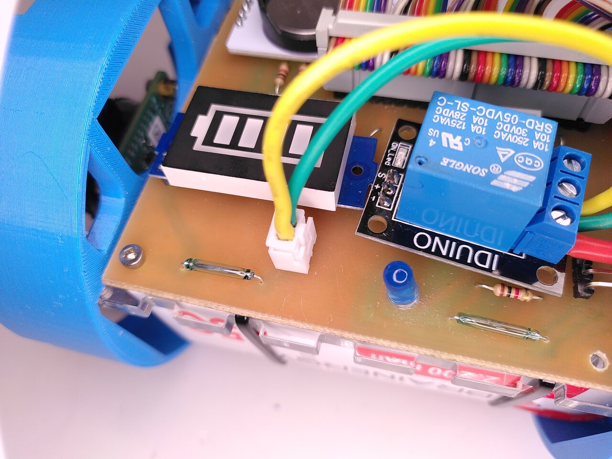 

 - Rallonger les fils de sortie 5v du convertisseur pour sertir une prise Dupont femelle. On utilisera un connecteur dupont 3 broches avec la masse au centre et le fil du positif à droite ou à gauche cela n'a pas d'importance. De cette manière il ne sera pas possible de brancher l'alimentation 5 v à l'envers. 

 - Couper le connecteur dupont de la prise de BEC de l'ESC (3 fils, jaune, rouge et marron ou noir). Y sertir un connecteur JST à deux broches. En excluant le fil rouge. Attention au sens. Le fil jaune destiné au signal doit être placé du coté de l'afficheur de niveau de batterie. 

 
 

 - Fabriquer un câble (rallonge du capteur de pression) de 180mm de long constitué de 4 fils (vert, blanc, rouge et noir). Sertir un connecteur JST 5 broches à une extrémité. Souder les fils sur un JST femelle à l'opposé. Attention à bien veiller à respecter, l'ordre, le sens du connecteur et les emplacement vides. 
                                                          
 
 

 - Fabriquer un câble (rallonge du capteur magnétique) de 180mm de long constitué de 3 fils (Jaune, rouge et bleu). Sertir un connecteur JST 4 broches à une extrémité. Souder les fils sur un JST femelle à l'opposé. Attention à bien veiller à respecter, l'ordre, le sens du connecteur et les emplacements vides. 

 
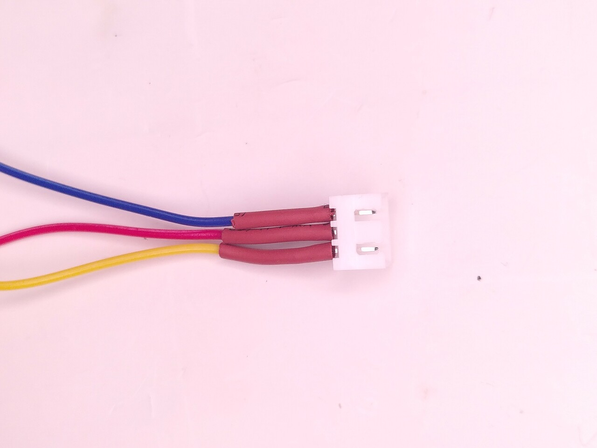 

 - Brancher la rallonge du capteur de pression sur le connecteur prévu à cet effet. 
 - Brancher la rallonge du capteur magnétique à son emplacement. 
 - Passer ces deux câbles le long de la raspberry de manière à ce que les prises soient présentés à proximité des connecteurs USB de la raspberry. 

 

 - Souder 3 connecteurs bananes au bout des trois fils de sortie de l'ESC

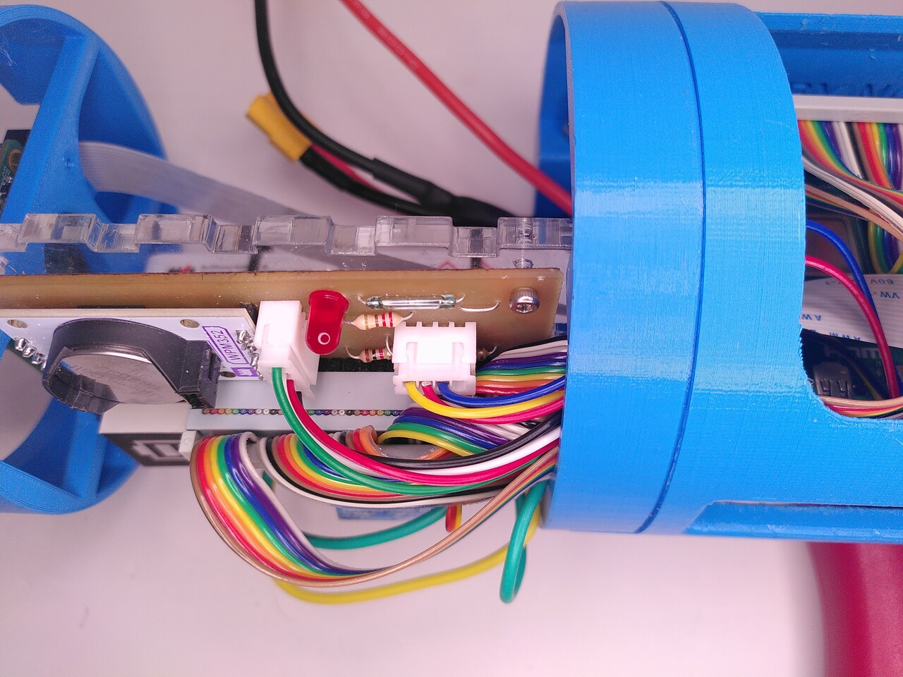 

### 1.7 Installation de l'objectif Edmund

 - Rassembler l'assemblage et l'objectif Edmund.
 

 - Ôter le capuchon qui protège le capteur de la Pi cam, veiller à conserver la bague C-CS sur la monture de la Pi cam. 
 - Visser l'objectif Edmund sur le Pi Cam et lui ôter sa protection. Les réglages se feront par la suite. 
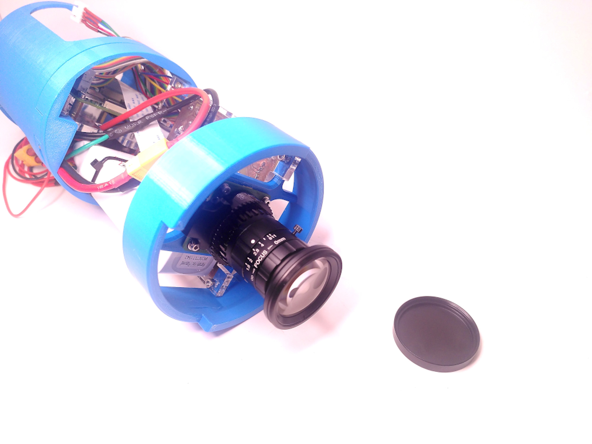 

## 2/ Assemblage du caisson

Pour l'assemblage du tube, il sera nécessaire de graisser \(graisse silicone de plongée\) certaines pièces pour à la fois assurer l'étanchéité et faciliter le démontage du tube étanche. Attention, il ne faut graisser que les pièces qui coulissent \(ex : Flange, bouchons, interrupteurs rotatifs\). Le graissage se fait au doigt et consiste à simplement huiler les surfaces qui doivent coulisser ou tourner tout en restant étanche.

​

### 2.1 Assemblage du bouton rotatif :

* Le bouton rotatif est livré démonté par Blue robotics. Rassembler le passe-coque, le bouton, les trois joints thoriques, le poussoir, les deux fils et l'écrou rouge.

* Placer le plus grand des trois joints thoriques dans la gorge du passe-coque.

​

* Au doigt, graisser les deux joints restants. Puis insérer les dans les deux gorges du bouton noir.

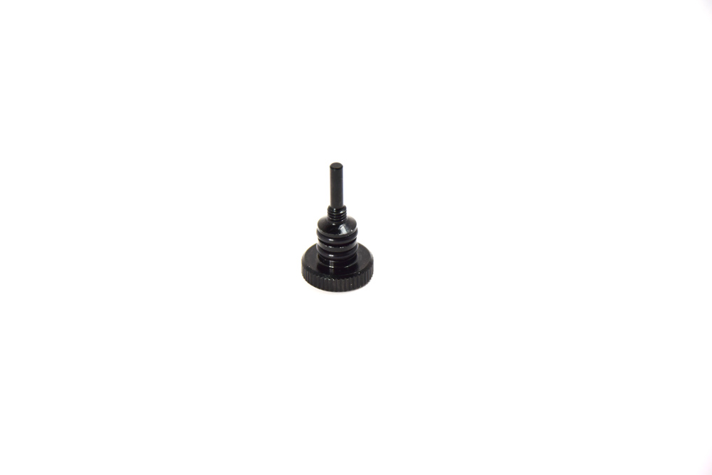

​

* Visser le bouton noir dans le passe-coque. Le vissage doit être facile. Si ce n'est pas le cas, il sera peut-être nécessaire de graisser d'avantage.

* Visser l'écrou sur le passe-coque.

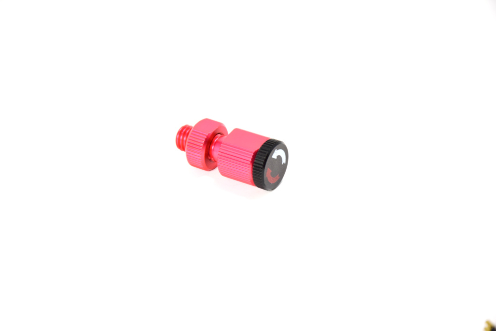

​

* A l'extrémité opposé au bouton noir, visser le bouton poussoir. Préalablement on aura ôté l'écrou se situant sur le poussoir. Ce dernier n'a pas de fonction sur le KOSMOS. Dévisser légèrement le bouton noir de manière à ce que le poussoir soit ouvert \(surveiller à l'aide d'un multimètre sur le mode continuité\).
* Pour finir connecter les fils sur les broches du bouton poussoir.

​

​

### 2.2 Assemblage du bouchon vent :

​

* Le bouchon vent est livré démonté par Blue robotics. Rassemblez le passe-coque, le bouchon, les trois joints thoriques, le poussoir, les deux fils et l'écrou.

​

* Placer le plus grand des trois joints thoriques dans la gorge du passe-coque. Puis visser l'écrou.

​

* Insérer les deux petits joints thoriques dans les deux gorges du bouchon.

​

* Visser le bouchon sur le passe-coque en graissant légèrement à la graisse silicone les joints.

​

​

### 2.3 Assemblage du capteur de pression

* Le capteur de pression est livré démonté par Blue robotics. Rassembler le capteur dans son passe-coque, le joint thorique et l'écrou.

​

* Insérer le joint thorique dans la gorge et engager l'écrou sur le capteur.

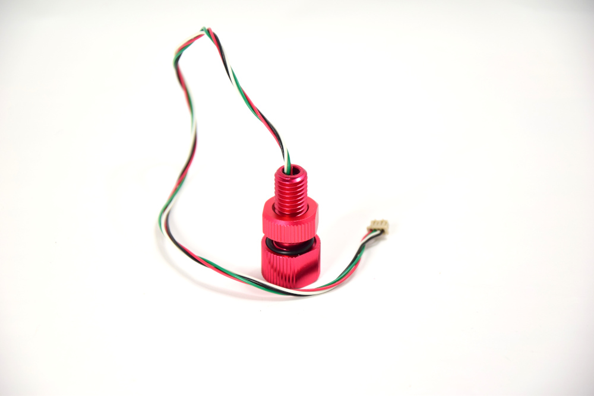
​

​

### 2.4 Serrage des passes-coques sur le end cap aluminium

​

* Rassembler, le end cap en aluminium à 5 trous, les deux connecteurs cobalts femelles, ainsi que les trois passes-coques précédamment assemblés \(bouton rotatif, bouchon vent, et capteur de pression\).

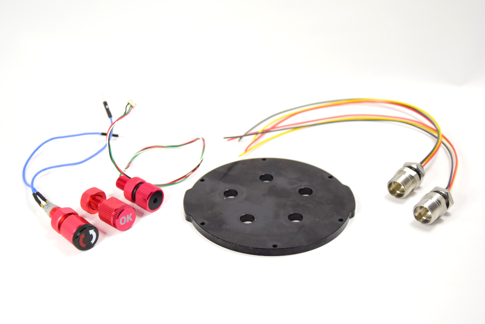

​

* Visser les connecteurs cobalt sur deux trous voisins. Attention à veiller à positionner le joint du côté externe.

​

* Visser et serrer les 3 autres passe-coques. Serrer fort les 5 passes-coques. Pour le bouton rotatif, il sera nécessaire de dévisser le bouton poussoir pour l'insérer dans end cap. 

​

### 2.5 Assemblage du end-cap sur la flange

​

* Rassembler, le end-cap et ses passes-coques, une flange ainsi que les pièces fournies avec la flange \(3 joints thoriques, et un 6 vis M3\).

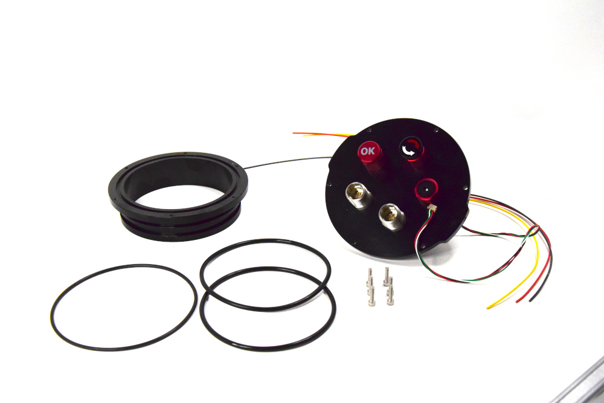

​

* Au doigts graisser légèrement les deux joints les plus épais.
* Insérer ses derniers dans les gorges prévues à cet effet.

​

* Insérer sans graisser le plus fin des joint thorique dans la dernière gorge de la flange.

​

* Visser le end-cap sur la flange à l'aide des 6 vis M3.

​

​

### 2.6 Assemblage du bouchon hublot

​

* Rassembler la seconde flange, ses 3 joints thoriques, le hublot \(end-cap clear\) et les 6 vis M3.

​

* Exactemment comme à l'étape précédente installer les 3 joints sur la seconde flange. Ne pas oublier le graissage des deux gros joints.
* Visser le hublot à l'aide des 6 vis M3.

​

### 2.7 Assemblage du détrompeur

Le détrompeur est une pièce bleu permettant d'insérer la caméra dans un sens défini dans le tube. Il est imprimé en 3D et se vis sur le bouchon hublot du caisson.

​

* Rassembler le bouchon hublot, le détrompeur \(I4\), et 4 vis M3\*20mm.

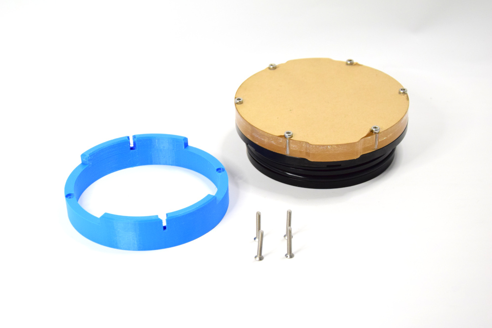

​

* Visser le détrompeur sur l'arrière du bouchon hublot.Il n'y a pas de sens à respecter sur cette étape.

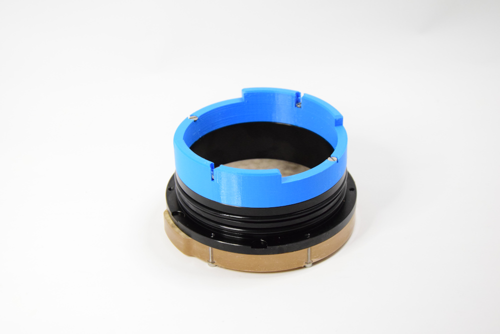

### 2.7 connectiques

 - Souder un connecteur XT60 femelle sur le bout des deux fils provenant du bouton d'allumage étanche. 

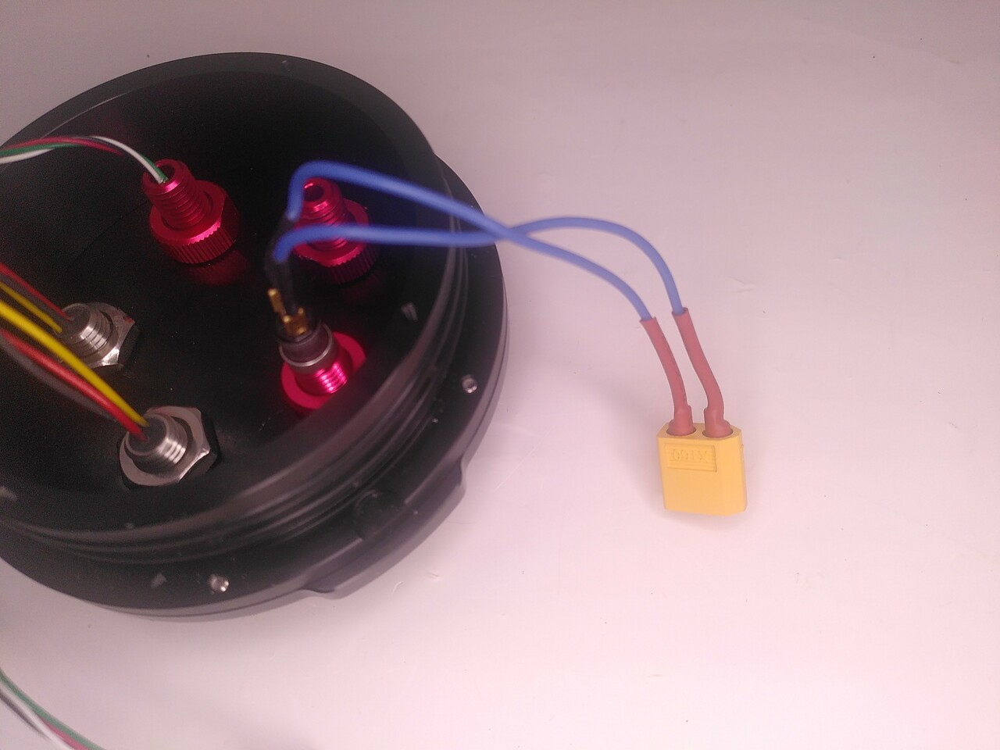 

 - Souder trois connecteurs bananes mâles sur les 3 fils provenant d'un des deux connecteurs cobalt 3 pins. 

 - Sertir sur les trois fils du second connecteur cobalt un connecteur JST mâle. En veillant à bien respecter le positionnement des fils de manière à pouvoir le brancher sur la rallonge du capteur magnétique. 

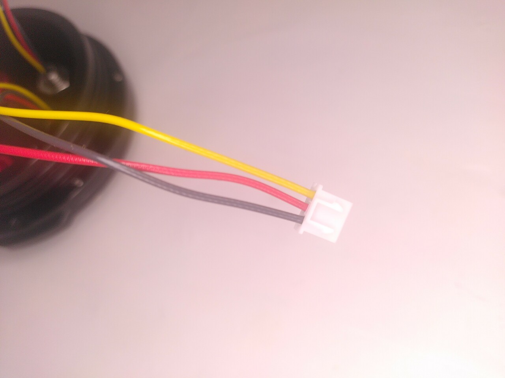

 - Sertir les 4 fils du capteur de pression sur un connecteur mâle JST 4 broches. 
 

### 2.8 Assemblage final du tube

​

* Rassembler les deux bouchons et le tube acrylique.

​

* Dévisser totalement le bouchon du vent \(OK\) pour faire un appel d'air.
* Insérer chaque bouchon à une extrémité du tube. Il doivent s'insérer facilement \(dans le cas contraire ajouter de la graisse.
* Refermer le bouchon du vent.

​

* Pour ouvrir le caisson dans les étapes suivantes, commencer par ouvrir le vent, puis tirer bien dans l'axe le bouchon des passes-coques. Il n'est pas nécéssaire de regraisser à chaque fois. Cependant il faudra veiller à ne pas salir les parties graissées.

## 3/ Assemblage du réducteur

Le KOSMOS est une caméra sous-marine capable de pivoter dans un sens unique par pas de 60°. Ainsi elle observera un panoramique en sous-échantillonant par 6 plans vidéos  de 60° et 30s chacun.

La question de la motorisation a longuement posée problème. Par soucis de reproductibilité \(outillage standart d'un Fab Lab\), nous avons vite écarté la possibilité de réaliser une transmission mécanique par arbre traversant. Nous avons donc du trouver un autre moyen. Nous sommes donc partis d'un moteur de ROV capable de tourner dans l'eau. Seulement il s'agit d'un moteur Brushless qui donc tourne vite et déploie peu de couple.

Afin de réduire la vitesse et augmenter le couple d'entrainement, nous avons donc décidé d'utiliser un réducteur à 4 étages. La dernière roue entraine un bras qui fait tourner une croix de Malte. Cette dernière permet de réaliser un angle de 60° précisément lorsque la dernière roue effectue un tours complet. Afin de valider la position des engrenages. Nous avons ajouté un capteur magnétique \(contact reed\).

​

### 3.1 Préparation des engrenages

​

* Préparer les pièces pour monter les 3 premiers pignons. Pour cela, rassembler les P2 , P3 et P3.2, et 9 vis M2,5 \* 12mm.

​

* A l'aide d'un foret à métaux de 4mm et d'une perceuse \(à colonne de préférence\), élargir les 3 trous des trois pignons n°1 sur une profondeur permettant à la tête de vis de ne pas dépasser.
* A l'aide d'une clé alen de 2mm, assembler les trois trio de pignons comme présenté ci-dessous. On place un pignon P3.2 entre un P2 et un P3. La vis viendra tarauder le pignon P3.  Avant de serrer veillez à bien aligner la denture entre les pignons P3 et P3.2.

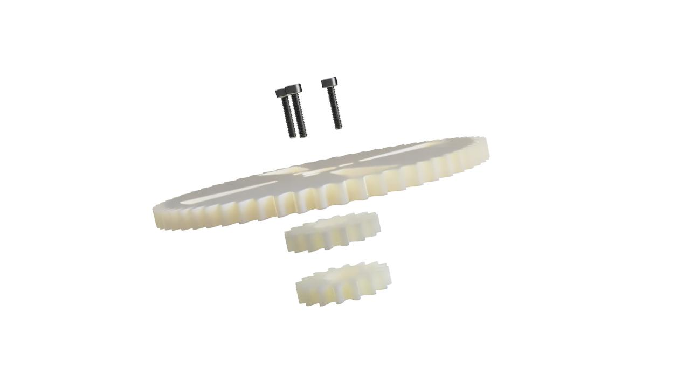
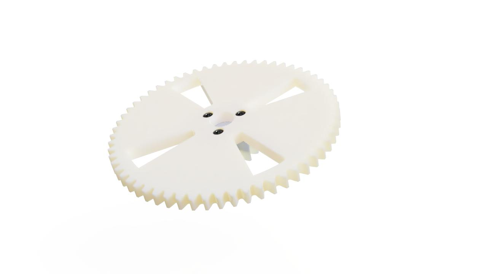

​

### 3.2 Assembler la croix de Malte

​

* Rassembler la croix de malte P4, une rondelle inox M8\*22mm, 4 vis M3\*18mm et la pièce R3.

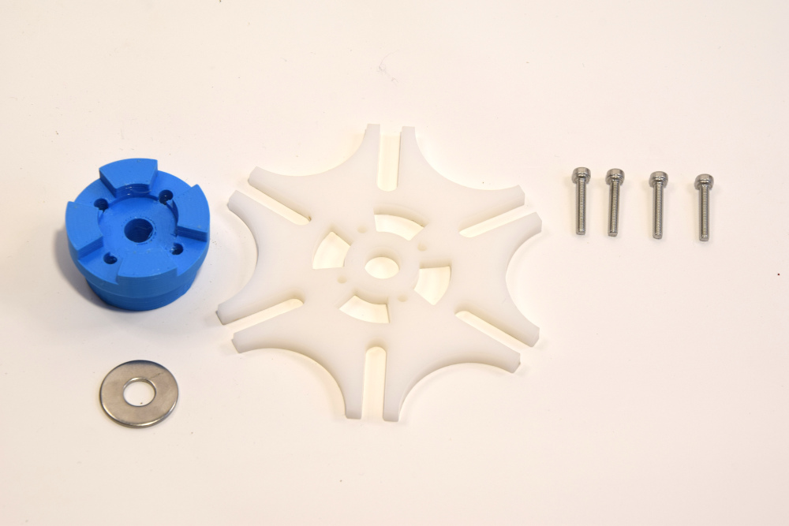

* Assembler la croix de Malte en insérant la rondelle dans l'emplacement prévu à cet effet, entre la croix de Malte et la pièce R3. Visser avec les 4 vis à l'aide d'une clé alen de 2,5mm.

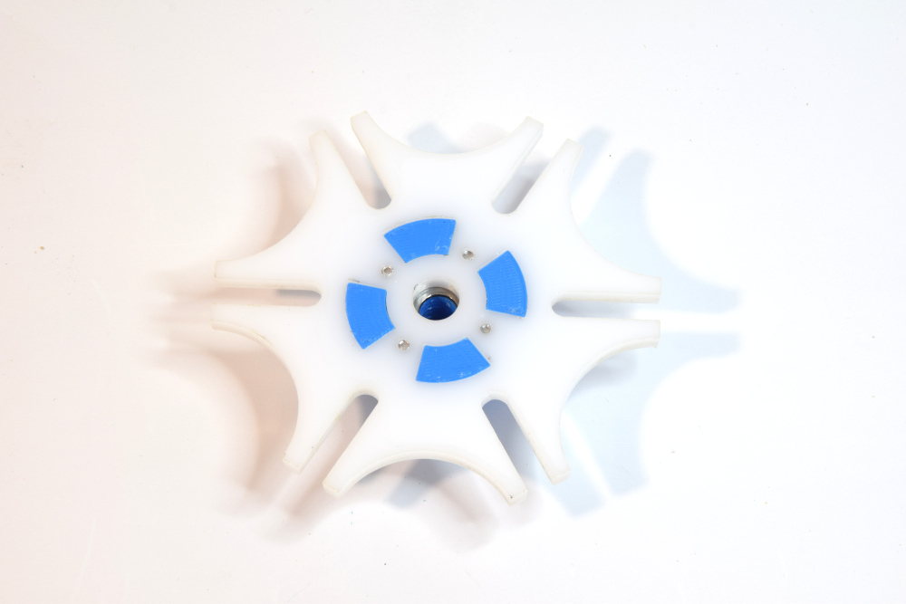
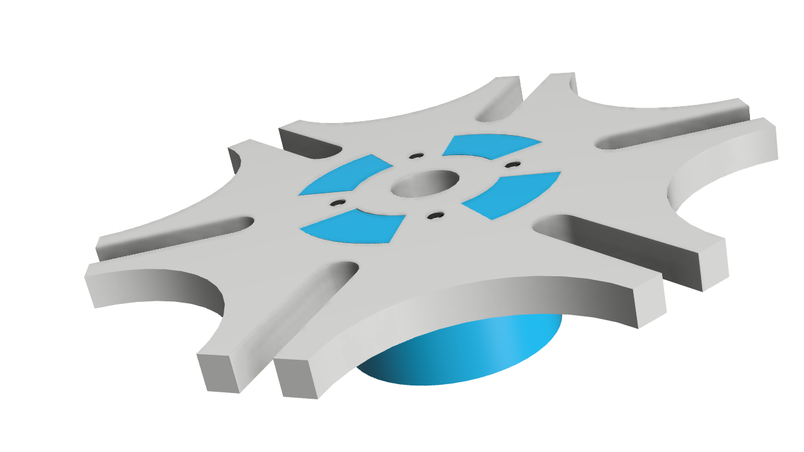

​

### 3.3 Découpe des entretoises et tiges filetés

* Couper 4 morceaux de tube inox à des longueurs différentes \(1\*42,5mm ; 1\* 49,2mm et 2\* 51,3mm\). On peut effectuer une première coupe au coupe tube puis finir au tour à métal. Veiller à bien ébarber les extrémités afin que la tige fileté s'incère facilement à l'intérieur du tube ;

​

* A l'aide d'une meuleuse ou à la scie à méteaux, couper 4 morceaux de tige filetée inox M8 de 1\*160mm et 3\*85mm de longueur. A l'aide d'une lime on s'assurera de redresser le filet afin qu'un écrou puisse se visser sans difficulté.

​

​

​

### 3.4 Assemblage de l'arbre primaire

* Rassembler la croix de malte précédemment montée, deux pignons, deux rondelles M8\_18mm, deux rondelles M10\_22mm, 2 écrous freins M8, la pièce R5, le morceau de tube d'inox de longueur 42,5mm et de la tige fileté M8 de longueur 160mm.

​

* Installer le tube dans la croix de malte, cette dernière viendra s'épauler sur la rondelle prise dans la croix de malte. Puis insérer une rondelle M10 ;

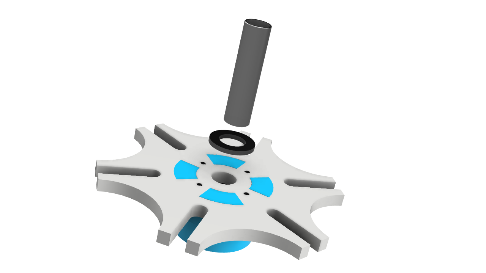

​

* Insérer un pignon \(petit pignon vers le bas\) puis une rondelle M10, puis le deuxième pignon \(petit pignon vers le bas\). L'entretoise doit dépasser de moins d'un millimètre.

​

* Visser un écrou frein sur la tige fileté à 85mm \(Ajouter de l'huile sur la tige pour faciliter le vissage\). Ajouter une rondelle M8 sur le coté opposé au frein de l'écrou.

​

* Insérer cette tige fileté à travers l'assemblage précédemment fait. L'écrou pré-vissé sera en buté sous la croix de malte séparé d'une rondelle M8.

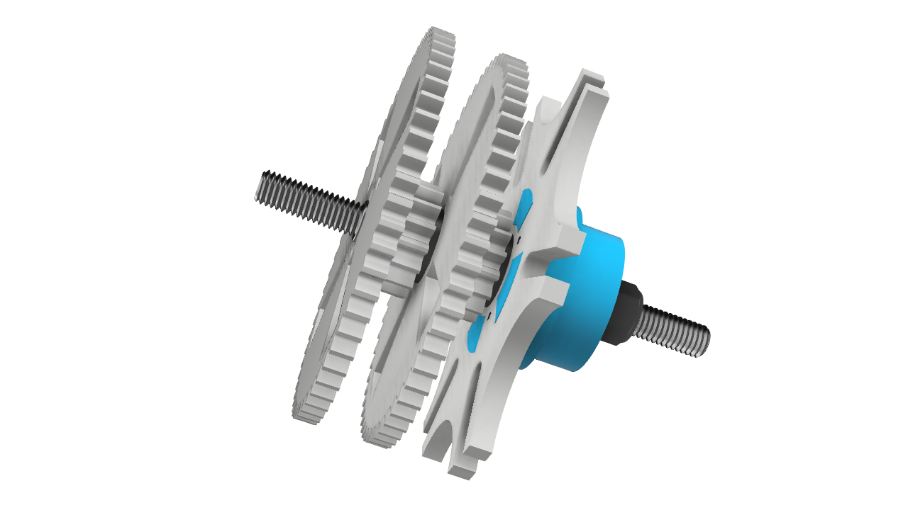

​

* A l'opposé de la croix de Malte \(au dessus des pignons\) insérer une rondelle M8.

​

* Au dessus de la rondelle insérer la pièce R5.

​

* Serrer le tout par un écrou frein que l'on place au dessus du tout. Serrer fermement à l'aide de clés plates.  On pourra s'aider d'un écrou et contre-écrou pour visser correctement les écrous freins.

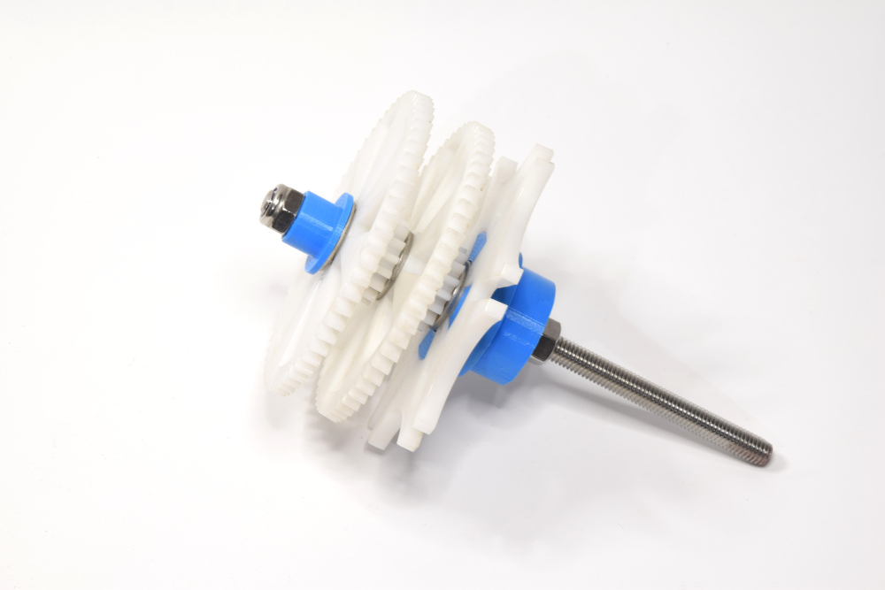

​

* Assurez-vous que les pignons tournent librement. La croix malte doit elle rester immobile.

​

​

### 3.5 Assemblage du bras de malte

​

* Rassembler les pièces 2\* P5.2 , P5 et la P2.2 ainsi que un aimant en néodyme carrée, 3 vis M2,5\*18mm et une vis M5\*20mm à tête fraisée ;

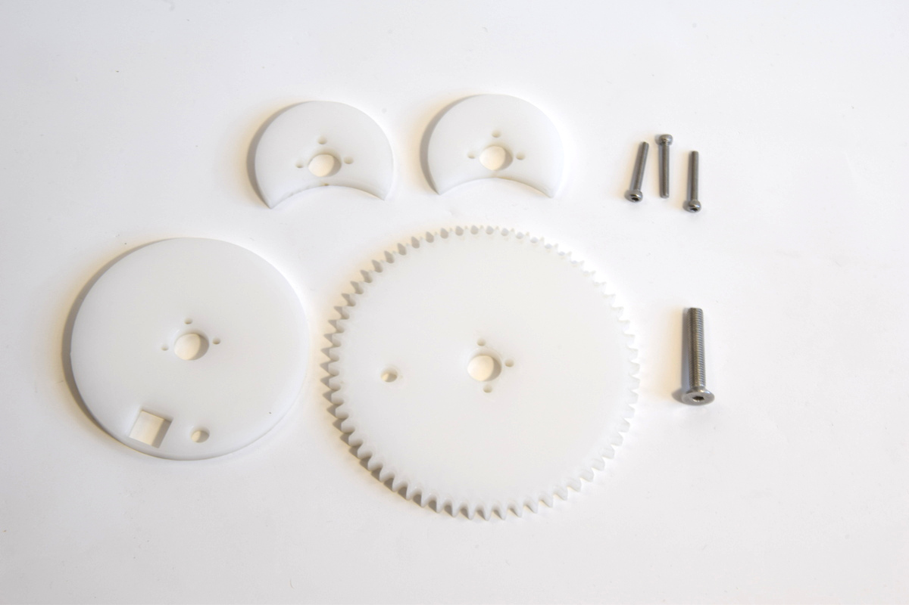

​

* A l'aide d'une perceuse à colonne et d'un foret de 4,5mm, percer la P2.2 pour loger la tête des 3 vis M2,5.
* A l'aide d'un foret de 10mm, percer la pièce P5 sur 2,5mm de profondeur pour loger la tête de la vis M5 ;
* Insérer 3 vis M2,5 dans les trois petits trous de la pièce P2.2. Insérer par dessus les deux P5.2 l'une sur l'autre. La tête de chaque vis M2,5 doit se loger dans la P2.2 et ne pas dépasser de cette dernière ;

​

* Visser par dessus la P5 qui sert de serrage, en veillant à ce que le logement de la tête de vis M5 soit à l'extérieur. A la colle chaude insérer l'aimant carrée dans son logement. Veiller à ce qu'il ne dépasse pas du tout du coté intérieur ;

​

* Rassembler le bras de malte que nous venons d'assembler,  une vis à tête fraisée M5\*16mm et une paille en inox de diamètre 5mm.
* Couper au coupe tube un bout de paille inox de 9mm de long et veiller à ce que la vis M5 s'y insère sans acros ;
* Visser la vis M5 en insérant entre la P2.2 et la P5 le tube inox 5mm. La tête doit se loger dans la pièce P5 et se visse dans la P2.2 ;

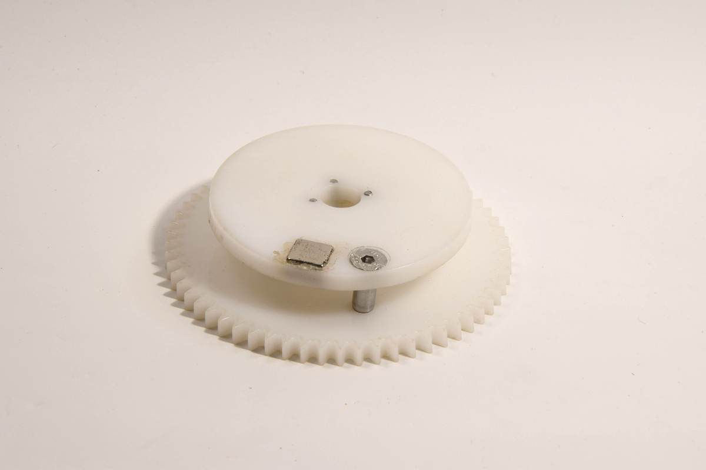

​

​

### 3.6 Assemblage de l'arbre secondaire

​

* Rassembler, le bras de malte précédemment assemblé, le tube inox 10mm\*49,2mm,  une tige filetée M8\*85mm, 4 rondelles M8\_18mm, 2 rondelles M10\_22mm, 2 écrous freins M8, la pièces R6, F1, F2, le dernier pignon et l'abre primaire ;

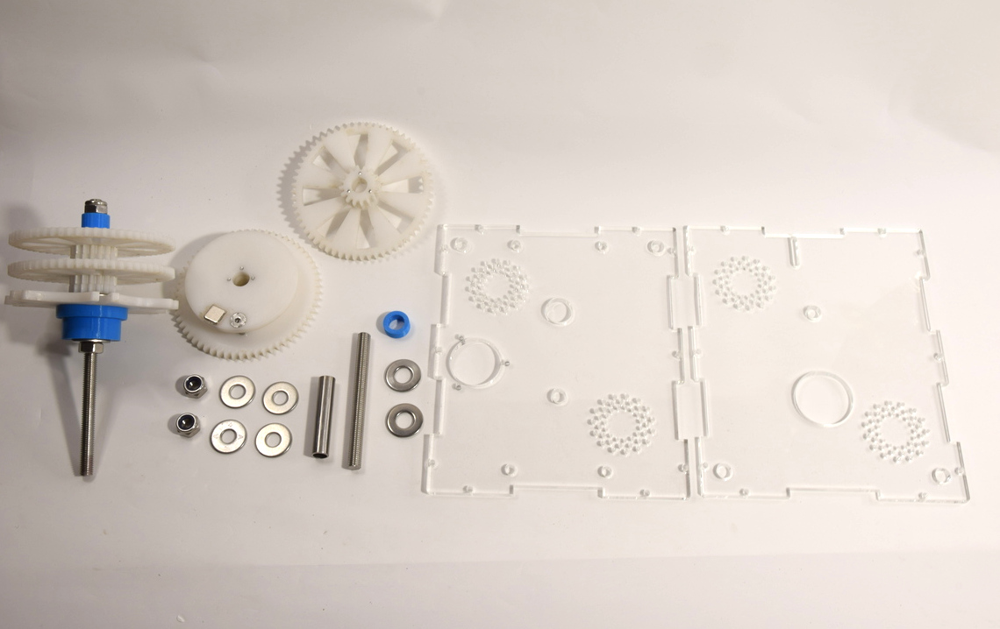

​

* Positionner l'arbre primaire sur F2 comme présenté ci-dessous. L'assemblage qui suis nécessite de faire jouer les deux arbres pour pouvoir enfiler les engrenages correctement ; \(Ajouter annotation des plaques + photos pas à jour \)

​

* Visser un  écrou neel stop M8 sur le bout de la tige filetée en laissant dépasser quelques millimètres. Insérer une rondelle M8 ;
* Passer la tige fileté à travers la pièce F2 par le trou indiqué en veillant au sens ;

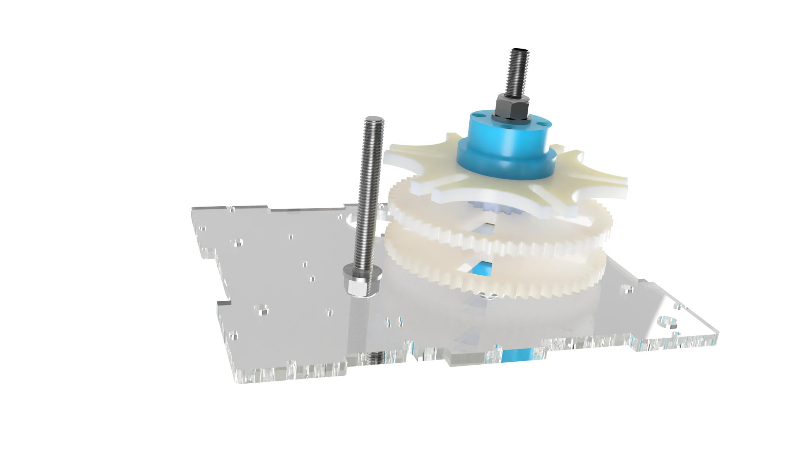

​

* Passer une rondelle M8, l'entretoise inox 10\*49,2mm, l'entretoise en plastique R6  et enfin une rondelle M10 ; \(Ajout d'une étape pour détailler l'ajout du tube puis de R6\)

​

* Enfiler le pignon \(petit pignon vers le haut \) puis une rondelle M10 ;

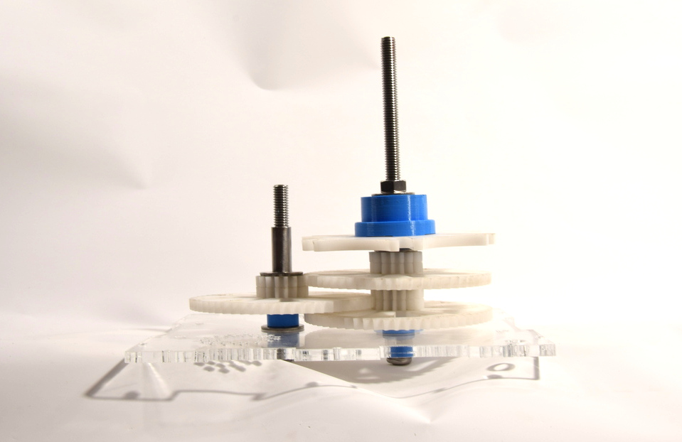

​

* Enfiler le bras de Malte \(grand engrenage vers le bas\), et pour finir une rondelle M8,

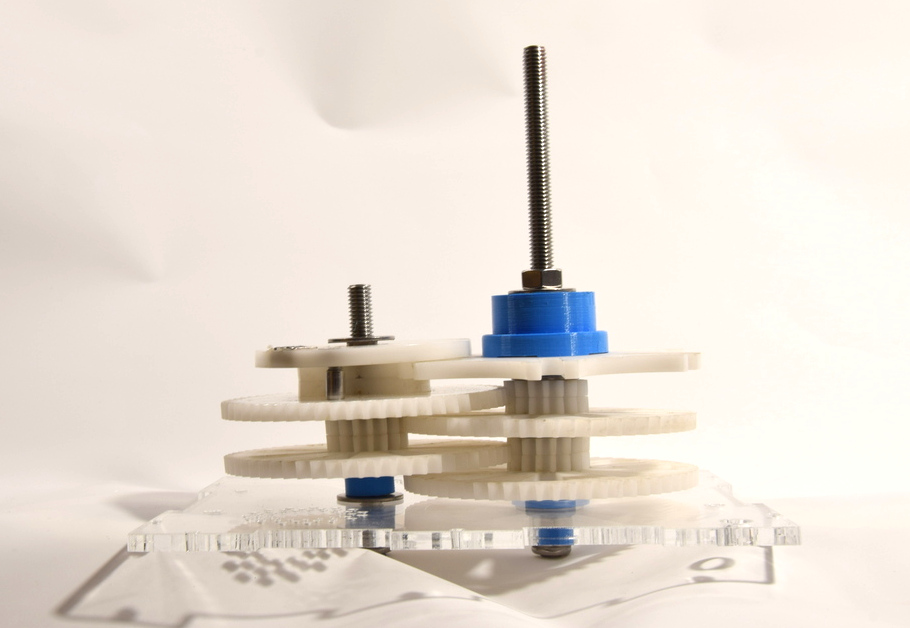

​

* Refermer par la flasque F1  ;

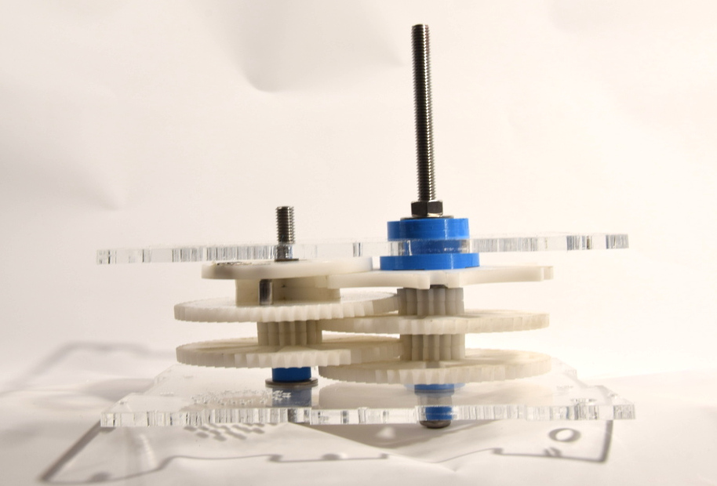

​

* Sur l'arbre secondaire, on ajoute à la sortie une rondelle M8 puis on sert généreusement à l'aide de deux clés de 13 les deux écrous de l'arbre secondaire de manière à ce que les deux flasques soient maintenues en parallèle ;

​

* Surveiller que les deux arbres s'entrainent correctement en tournant à la main le grand pignon le plus éloigné de la croix de malte ;

​

* Rassembler, les deux tubes inox 10\*51,3mm, deux tiges filetées de M8\*85mm, 2 écrous freins M8 et 2 écrous M8 ;

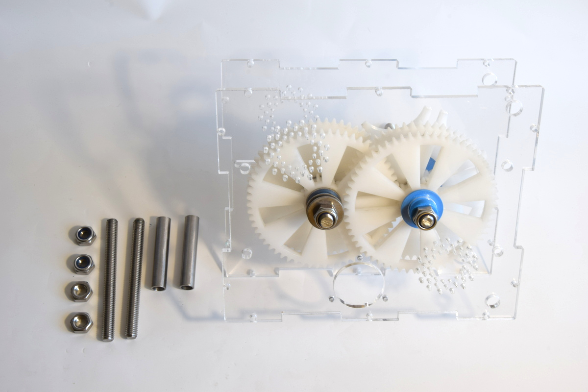

​

* Visser un écrou frein à l'éxtrémité de chaque tige filetée. Laisser la tige fileter dépasser de l'écrou de quelques millimètres ;

​

* Insérer ces tiges à travers la flasque F1, insérer sur chaque tige entre les deux flasques un tube inox \(entretoise\), puis serrer au moyen des écrous M8.

​

​

### 3.7 Fixation du moteur

​

* Rassembler le moteur auquel on aura ôté l'hélice \(si livré avec\) en plastique au moyen d'une dremel, 6 vis M3\*8mm, 3 vis M3\*40mm, les pièces C3, P1 et R4 ;

​

* Visser la plaque C3 sur le moteur \(du coté où sortent les fils\). Attention à verifier qu'en positionnant les fils du moteur dans l'encoche de R4, les trous destinés à passer les vis M3\*40 s'alignent entre C3 et R4 ;

​

* Visser le moteur au réducteur sur F2 avec les vis M3\*40mm.  Les vis traverssent C3 et R4 pour se serrer dans F2 ;

​

* Visser le pignon P1 au bout du moteur au moyen de deux vis M3\*8mm ;

​

### 3.8 Montage des bers (supports du caisson)

​

* Rassembler les pièces du ber 2\*R1 et 2\*R1.2. Ainsi que 2 vis M5\*30mm,  2 vis à tête hexagonale M5\*20mm et 4 écrous à frein filet M5.

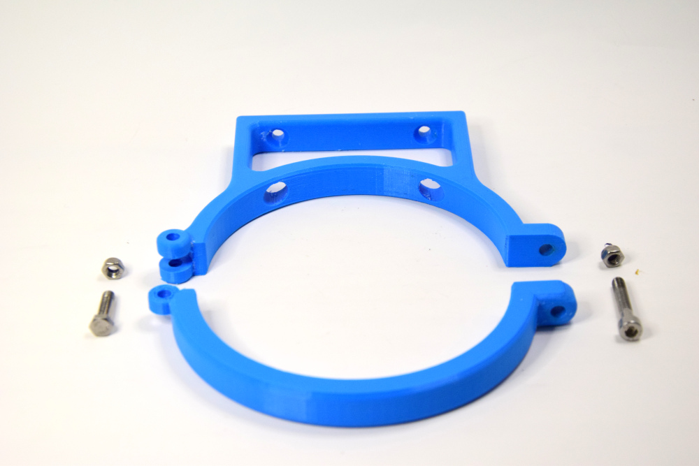

​

* Reproduire les étapes qui suivent deux fois.
* Installer la vis M5\*20mm à tête hexagonale de manière à former une charnière entre R1 et 1.2. Serrer à l'aide d'un écrou frein juste sufissament pour empêcher l'écrou de se désolidariser de la vis sans gêner l'ouverture du ber.
* Installer la vis CHC sur la fermeture du ber. On bloquera à l'aide de l'écrou frein M5.

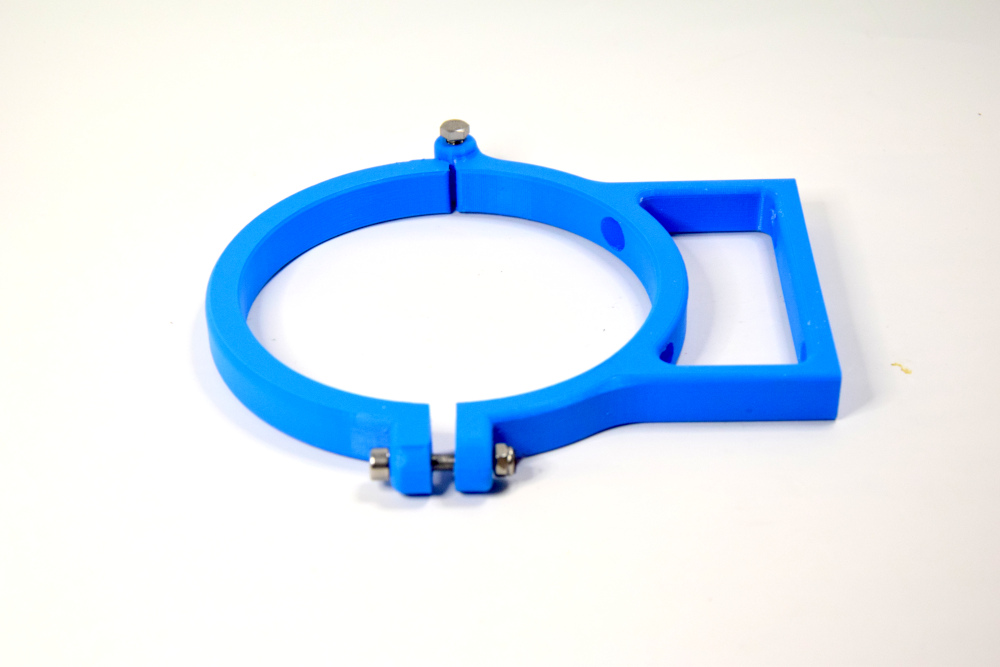

​

​

### 3.9 Installation des Bers sur le réducteur

​

* Rassembler le réducteur, les deux bers précédemment montées, 4 vis à tête fraisée M5\*20mm et 4 écrous M5 de préférence à frein filet.

​

* A l'aide des vis et des écrous M5, fixer les deux bers sur le dessus du réducteur. Veiller à ce que l'ouverture se fasse dans le même sens sur les deux bers.

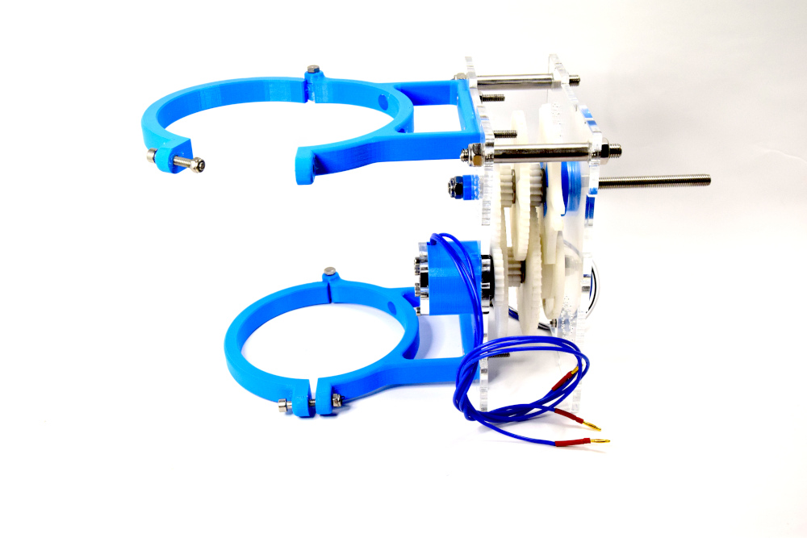

​

​

### 3.10 Installation du capteur magnétique

​

* Rassembler le capteur magnétique contact reed étanche, la pièce R2 et 4 vis M3*6mm.

* Au moyen d'un pistolet à colle, coller le capteur magnétique dans R2.
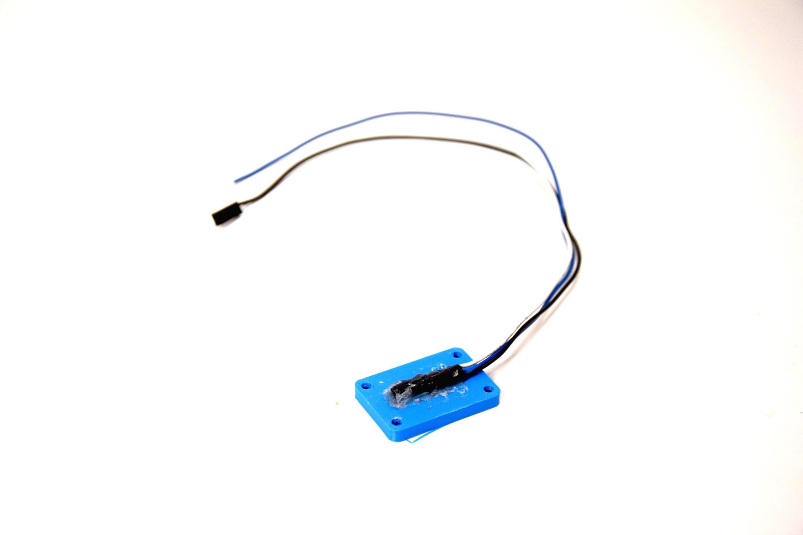

* Puis visser R2 sur F1 au moyen des 4 vis M3*6mm. 
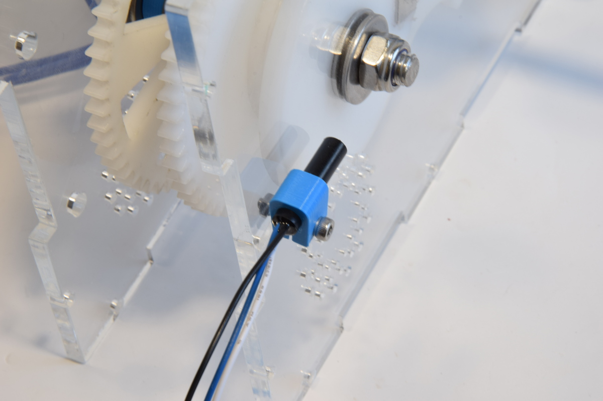

* Solidariser les fils du capteur au réducteur au moyen de rilsans. Utiliser les trous prévu à cet effet. Laisser courir les câbles et les laisser ressortir par l'encoche sur F2. 

​

​

### 3.11 Installation des parois du réducteur

​

* Rassembler le réducteur, 19 vis M3\*14mm 19 écrous M3 ainsi que les 4 plaques C1 et C2.

​

* Positionner 4 vis M3\*14mm dans chaque trou des deux plaques C2. Engager pour chaque vis un écrou sur chacune des vis sans la serrer.
* Positionner Les 17 autres vis et écrous de la même manière sur le tour complet du réducteur \(les deux plaques en PMMA parallèles\). Positionner les écrous vers l'intérieur du réducteur.

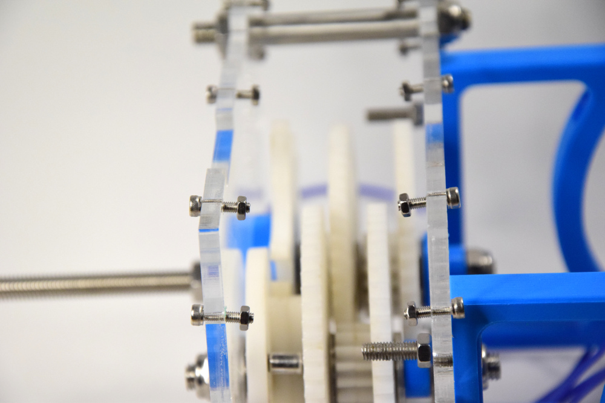

​

* Installer les plaques C2 sur les deux côtés les plus courts du réducteur. Serrer les vis une à une en veillant à ce que les écrous viennent bloquer la plaque. Attention à serrer à tâton pour éviter de fendre le PMMA.

​

* Installer Les plaques C1 sur les deux côtés longs du réducteur. Comme à l'étape précédente, veiller à ce que les écrous viennent bloquer la plaque. Attention à serrer à tâtons pour éviter de fendre le PMMA.

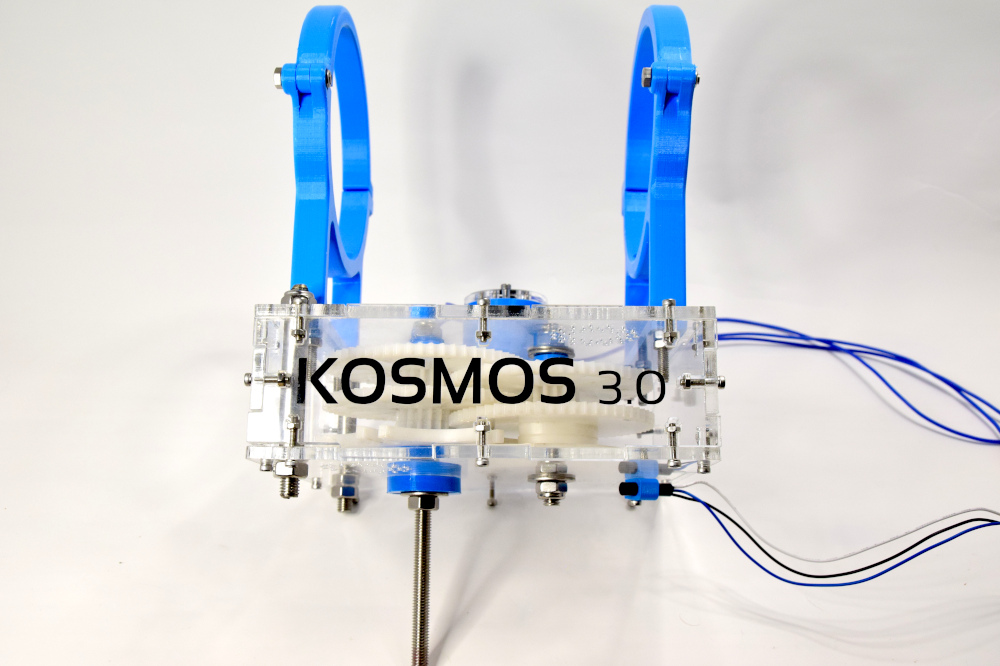

### 3.12 Raccordement des connectiques capteurs 
 - Rassembler le réducteur, la pièce R8 et un câble étanche cobalt,
 - Insérer les trois fils du capteur ILS dans les trois trous de la pièce R8
 - Dénuder les fils du capteur,
 

 - Insérer le câble cobalt étanche. Pousser la gaine à travers la pièce R8 de manière à la bloquer. 
 - Dénuder les fils du câble,

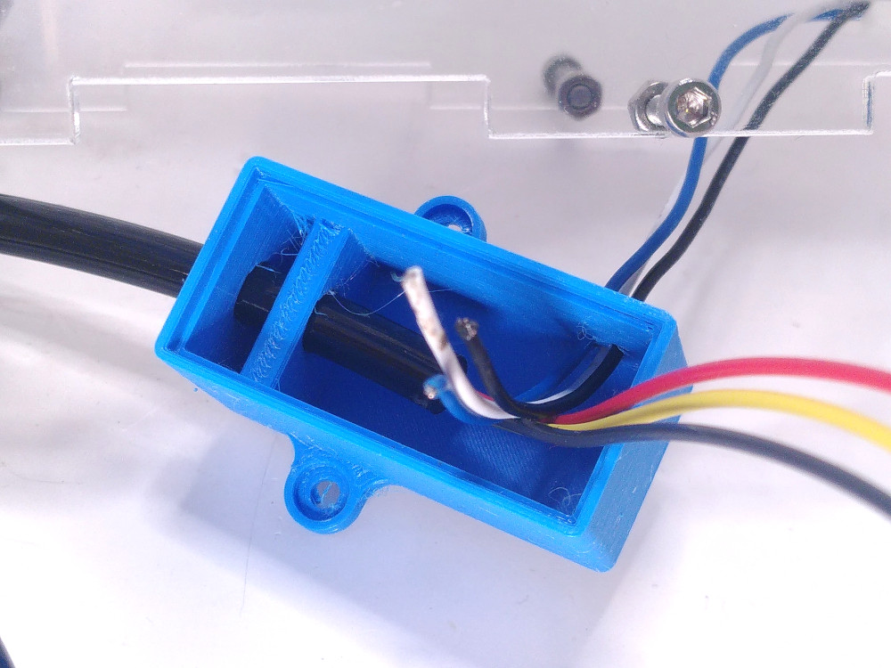

 - Insérer des sections de gaine thermorétractable sur chaque fil du capteur.

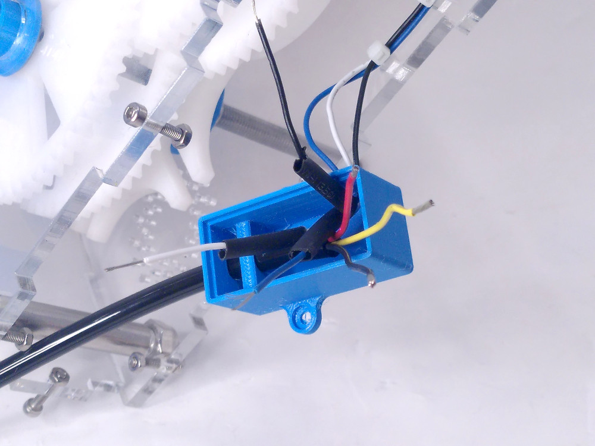

 - Étamer chacun des fils dénudés. Enfin les souder en respectant les branchements suivants : **Noir sur noir, rouge sur bleu, jaune sur blanc**. 

 - Décaler les gaines thermorétractable de manière à isoler les 3 soudures et les rétracter au moyen d'un pistolet à air chaud. 

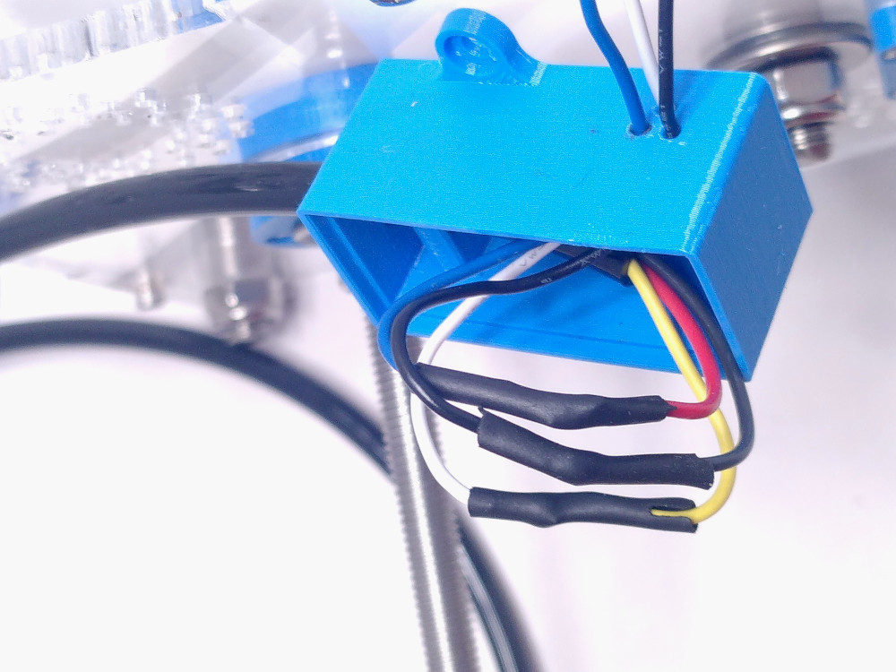

### 3.13 Raccordement des connectiques moteur
 - De la même manière que pour l'étape précédente, rassembler le réducteur, la pièce R6 et un câble étanche cobalt,
 - Insérer les trois fils du moteur dans les trois trous de la pièce R6
 - Dénuder les fils du moteur,
 - Insérer le câble cobalt étanche. Pousser la gaine à travers la pièce R8 de manière à la bloquer, 
 - Dénuder les fils du câble,
 - Insérer des sections de gaine thermorétractable sur chaque fil du moteur.
 - Étamer chacun des fils dénudés. Enfin les souder sans respecter de branchement particulier. 
 - Décaler les gaines thermorétractables de manière à isoler les 3 soudures et les rétracter au moyen d'un pistolet à air chaud. 

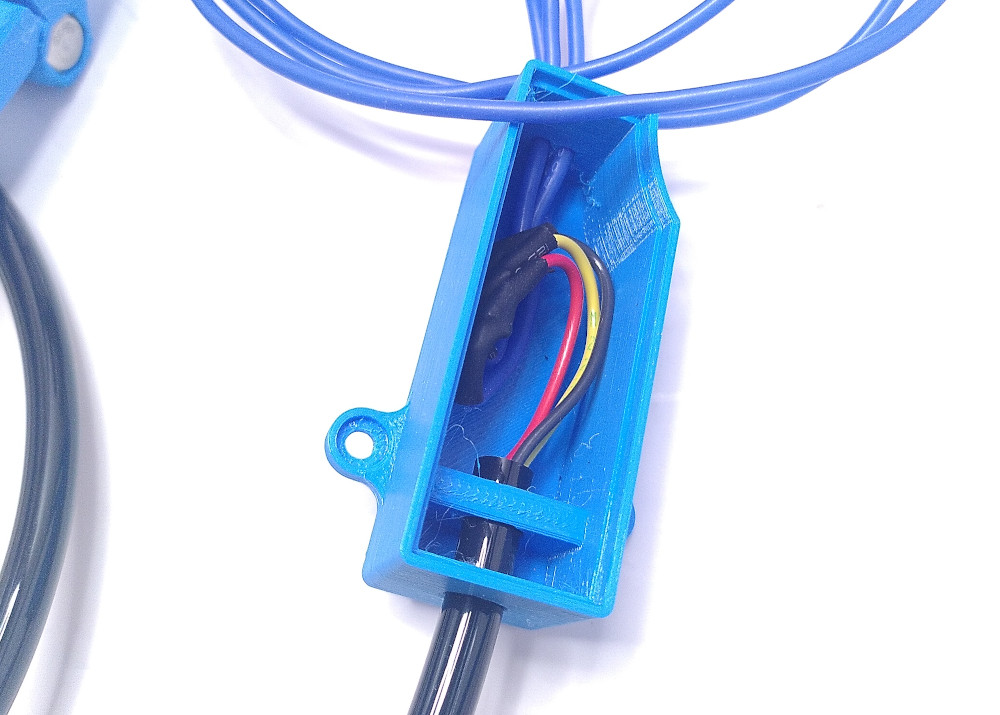

### 3.14 Étanchéification des connectiques et fixation
 - Préparer la résine époxy dans un récipient à part. Se référer aux spécifications du fabriquant pour le dosage entre résine et durcisseur. 
 - Positionner les pièces R8 et R6 à plat sur un morceau de bois vissé au moyen de deux vis à bois; S'assurer que les fils ne dépassent pas de l'épaulement. 

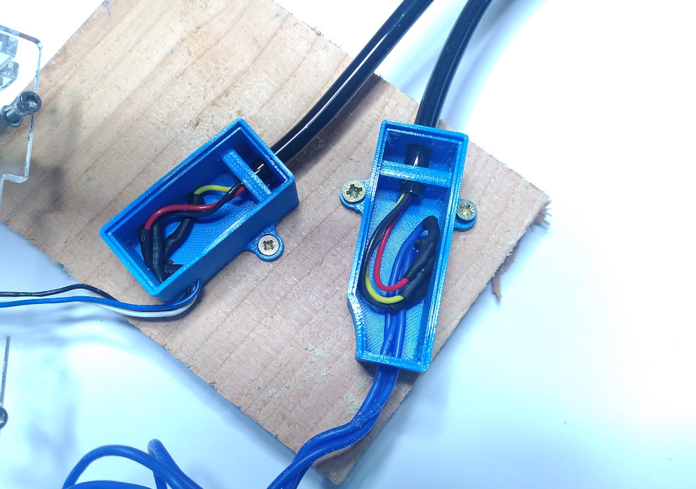

 - Couler la résine époxy dans les deux connecteurs R8 et R6 sans dépasser l'épaulement. 
 - Laisser sécher au moin 24h.
 - A l'aide de 4 vis M3*5mm, fixer les deux connectiques étanches sur le dessus du réducteur. 

 - Clarifier les câbles en les enroulants au moyen de rilsans. 

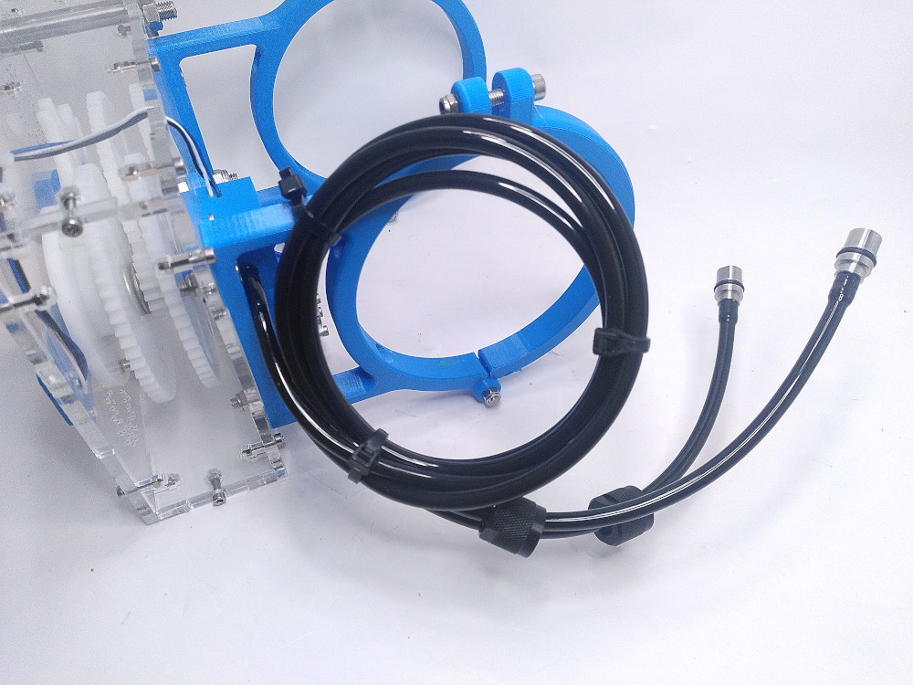

 
## 4/ Assemblage final du KOSMOS
Une fois toutes les sous-parties assemblées il ne reste plus qu'à faire l'assemblage final. Soit à insérer le KOSMOS dans son tube, le raccorder au connecteurs de la flange mais aussi à solidariser le tube sur le réducteur. 

### 4.1 Installation du KOSMOS dans son tube

 - Insérer la structure du KOSMOS (assemblage fait en partie 1) dans son tube en ôtant uniquement le bouchon munit des capteurs et connecteurs. Veiller à ce que les deux pièces bleus s'imbriquent correctement. 

 - Coucher le tube et sortir légèrement son contenu, rassembler aussi le bouchon en aluminium avec ses connecteurs et capteurs et la clé USB.

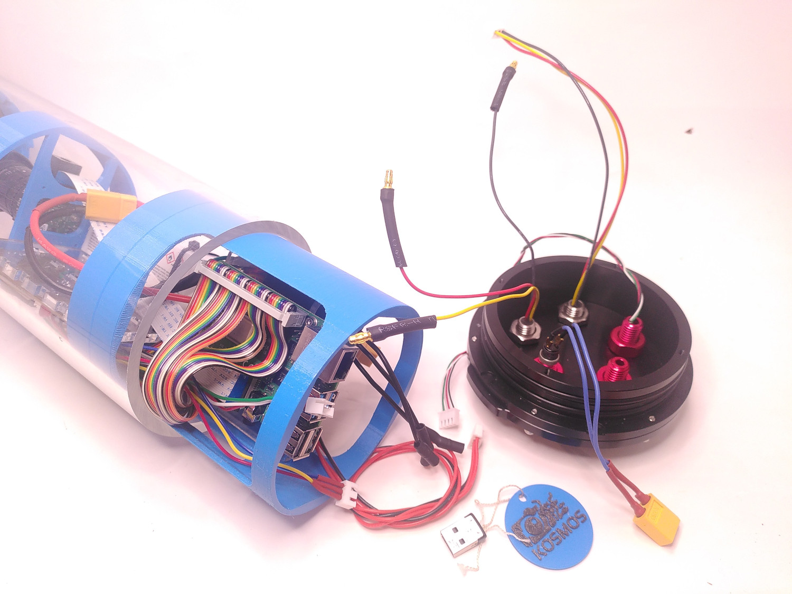

 - Connecter les deux connecteurs JST (3 broches pour l'ILS et 4 broches pour le capteur de pression), Attention, le câble de charge de la ou des batterie(s) doit resté non connecté. Il ne servira qu'au moment de charger la batterie.

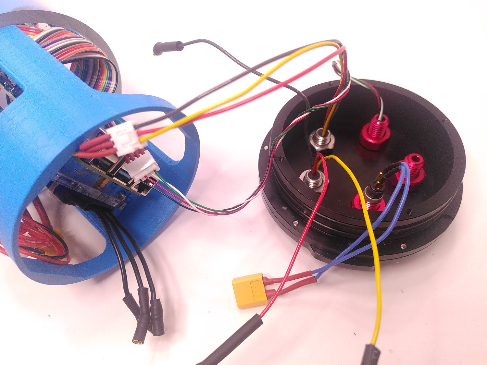

 - Connecter les trois connecteurs bananes entre eux. Il n'y a pas d'ordre de branchement à respecter

 - Connecter les connecteurs XT-60 (jaune) entre eux ils permet de mettre en série le bouton de mise en tension.

 - Connecter la clé USB à un port USB 3.0 (bleus) de la Raspberry. Il s'agira de son emplacement préféré. Lors des étapes d'installation du software, il sera nécessaire de la débrancher. Cette clé USB sera par ailleurs le stockage des données ainsi que l'emplacement d'un fichier de paramétrage essentiel le "kosmos_config.ini" en l’absence de cette clé le KOSMOS ne pourra démarrer et ne pourra stocker ses données. 

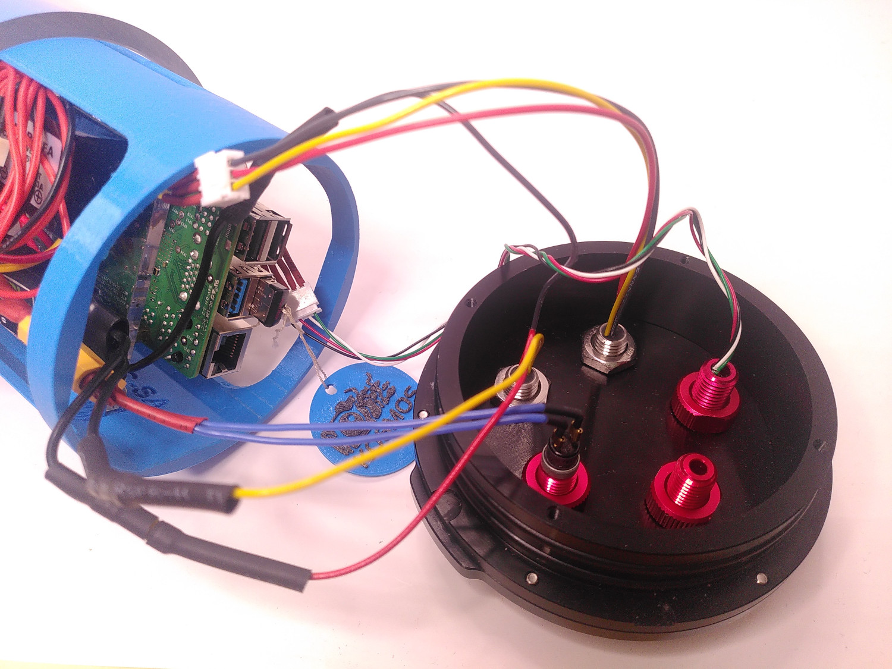 

 - Refermer le tube en laissant coulisser la structure interne dans le tube acrylique. Puis insérer délicatement le bouchon pour fermer le tube en ayant au préalable dévissé le bouchon de purge "Ok". Si le bouchon en aluminium s’insère avec difficulté, veiller à avoir graissé correctement les joints comme précisé dans l'étape 2.8. 

 
 
 
 - Une fois le bouchon refermé correctement, qu'aucun fil n'est coincé, refermer le bouchon vent "ok".

 

### 4.2 Positionner des auto-collants
Les autocollants sont importants sur KOSMOS, ils permettent, de marquer la version du système, de guider aux bons assemblages, au bon démarrage et marquer la compatibilité entre un tube et son réducteur (le moteur à l'habitude de tourner avec un ESC spécifique, intervertir avec un autre KOSMOS pourrait entrainer des erreurs). 

On peut faire imprimer ces autocolants sur du vinyle à une société extérieur ou les fabriquer sois même au moyen d'une découpe vinyle ou plotter de découpe. 

Découper les autocolants dans du vinyle en utilisant les fichiers vectoriels contenu dans l'archive hardware/stickers. 
 - stickers_kosmos_name.svg : 4 fois en noir.
 - stickers_number.svg : Modifier le fichier pour nommer votre KOSMOS comme vous le souhaitez. Découper cette vignette en 2 exemplaires.
 - stickers_power_steps.svg : Une fois en blanc
 - stickers_wire_indicators.svg : Une fois d'une couleur Une autre d'une autre couleur
 

 - Sur la flange repérer quel connecteur cobalt 3 pin est destiné à recevoir le moteur (3 fils connectés à l'ESC), et quel connecteur est connecté à la carte électronique (ILS). 
 - Utiliser un anneau autocollant d'une couleur différente pour chaque connecteur.
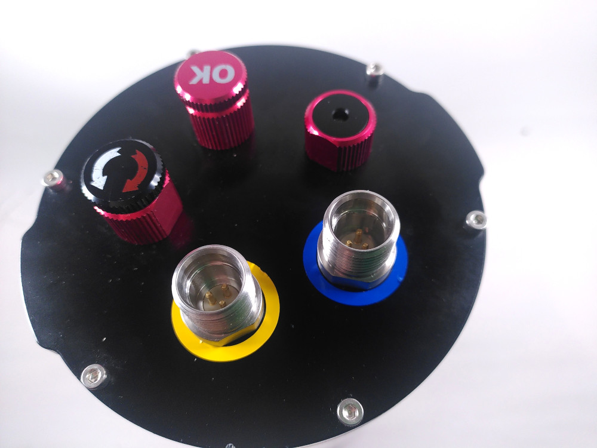 

 - Utiliser les bandes autocollantes pour marquer les cales cobalts en veillant à ce que le câble du moteur porte la même couleur que le connecteur de cloison relié à l'ESC. Inversement pour le capteur ILS. 
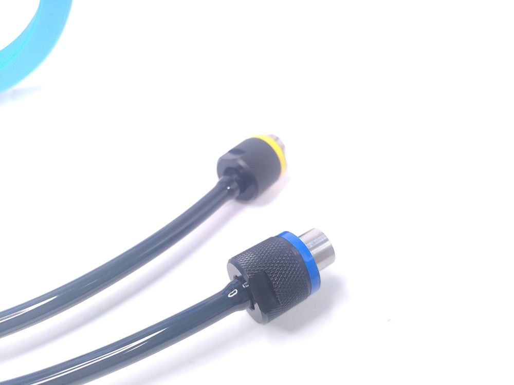 

 - Placer 2 petits triangle blanc l'un sur la tranche du hublot et l'autre sur le corps du tube en PMMA. Ce marqueur permettra de fermer le tube dans le bon sens lorsque l'on démontera la flange du hublot. On pourra utiliser deux autres autocollants triangles pour s'assurer que le tube sera bien horizontale lorsque celui-ci sera placé sur le réducteur (caméra bien horizontale).
 

 - Placer des autocollants KOSMOS et numéro de version Sur le tube (avant arrière) et sur les deux flancs (gauche / droite) du réducteur. 

 
 - Placer un autocollant de numéro d'instrument sur un coté du réducteur et un autre correspondant à la même référence sur le tube. 
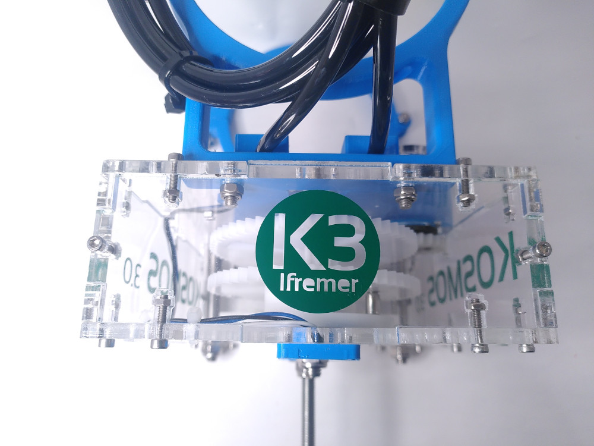

 

### 4.3 Solidariser le tube sur le réducteur
L'étape suivante n'est pas forcément requise. Lors du transport du KOSMOS on préférera stocker le tube dans une caisse étanche molletonnée. Quand au réducteur qui sera très souvent humide, le stocker dans une caisse en plastique 
