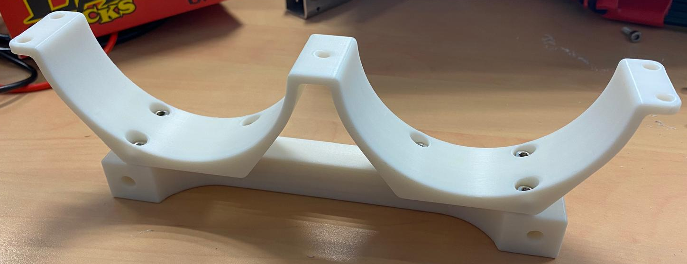
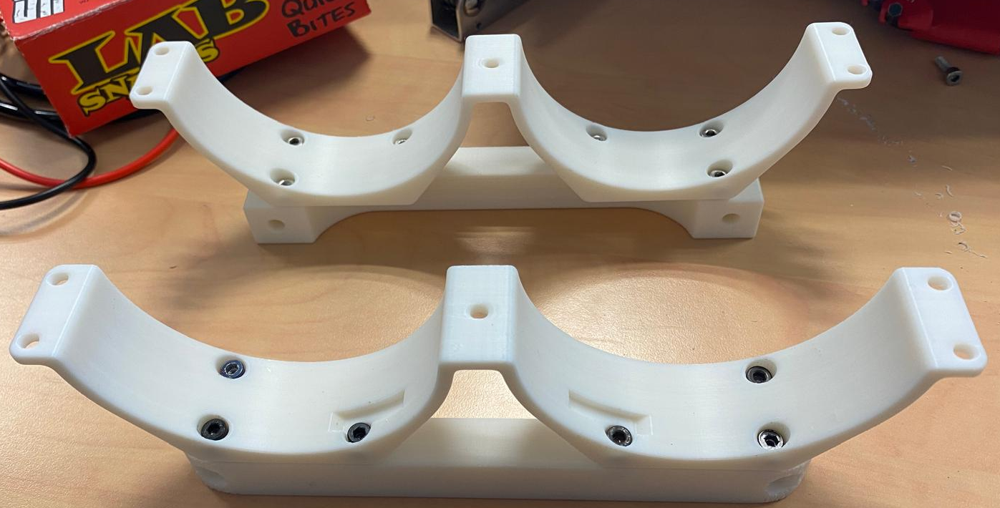
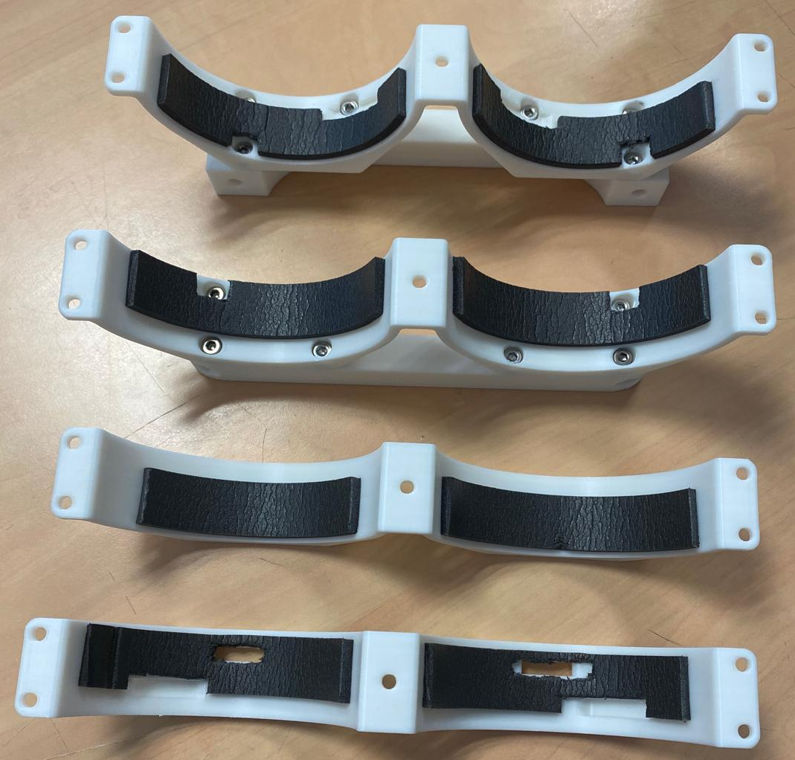
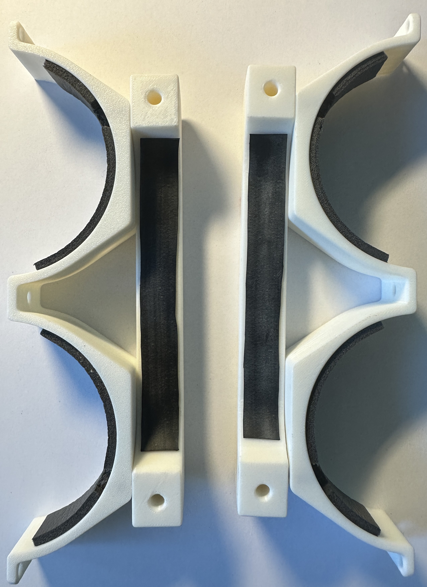

# Assemblage final de KOSMOS

(étapes à mettre
imprimer les pièces, why not remettre les fichiers là
visser (vis 8mm)
mettre mousse cf photo
fixer les caissons dans berceau)

# 1. Préparation des pièces du berceau

## 1.1 Impression des pièces du berceau

- Imprimer les pièces contenues dans le dossier `KosmosV4System/hardware/3Dprint_files/V4_SystemeComplet` avec un plastique compatible avec l'immersion et un taux de remplissage de 100% 

## 1.2 Assemblage des pièces du berceau 

- Fixer le berceau BAS AVANT sur le Sandwich AVANT à l'aide de boulons M4 de longueur 8mm. On taraudera directement le plastique.

- Fixer le berceau BAS ARRIERE sur le Sandwich ARRIERE à l'aide de boulons M4 de longueur 8mm. On taraudera directement le plastique.

## 1.3 Collage de la mousse sur les pièces sandwich AV et ARR

- Coller de la mousse sur les berceaux BAS en laissant des trous pour les vis. A noter qu'il ne faut pas mettre de mousse au delà du détrompeur (petite encoche dans le plastique) pour le berceau ARRIERE.
- Coller de la mousse sur les berceaux HAUT en laissant des trous pour les brides de sécurité. A noter qu'il ne faut pas mettre de mousse au delà du détrompeur (petite encoche dans le plastique) pour le berceau ARRIERE.

## 1.4 Collage du caoutchouc sur les sandwichs AVANT et ARRIERE

- Découper deux morceaux de chambre à air de 13cm de longueur et de 1.5cm de largueur.
- Fixer ces deux morceaux de caoutchouc dans les gorges des sandwichs avec du scotch double face.

# 2. Fixer les caissons dans le berceau

- 10x M4 14mm

