icon:material/cog
## 1. Assemblage du boitier électronique

### Etape 1 - Réalisation les raccordements entre les câbles et les connecteurs

??? Matériel

    [Matériel boitier électronique](../../../../hardware/micro_kosmos/02_materiel_boitier_electronique.md)

#### Relier un câble USB à un câble micro USB en passant par le commutateur 

???+ info

    Ce câble fera le lien entre la batterie et la Raspberry et permetta d'alimenter la carte. Le commutateur permet de couper le courant sans débrancher les câbles.

- couper le câble USB à une trentaine de centimètre du branchement USB  
- enfiler la gaine thermo sur le câble (elle sera chauffée à la fin)  
- utiliser les connecteurs cosses pour faire le lien entre les pins du commutateur et le câble USB, brancher le fil noir et le fil rouge  
- chauffer la gaine thermo pour recouvrir tous les fils  
- répéter les mêmes étapes avec le câble micro USB et le commutateur  

  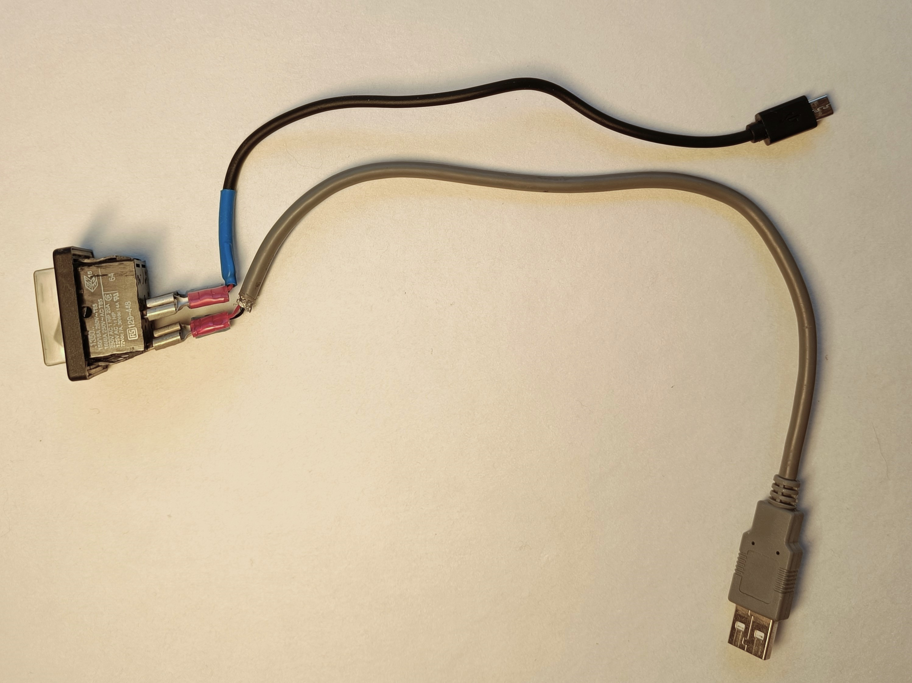{ width="300" }  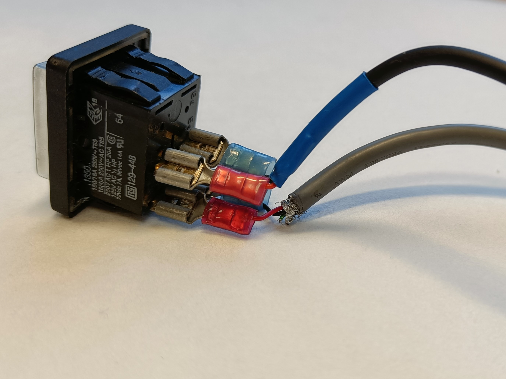{ width="300" }

#### Relier un câble USB au ventilateur

???+ info

    Ce câble fera le lien entre le ventilateur et la raspberry. Brancher le ventilateur sur la carte pemet de l'alimenter et de le faire fonctionner.

- couper le câble USB à une trentaine de centimètre du branchement USB  
- enfiler la gaine thermo sur le câble (elle sera chauffée à la fin)   
- souder les câbles rouges ensemble et les câbles noirs ensemble  

 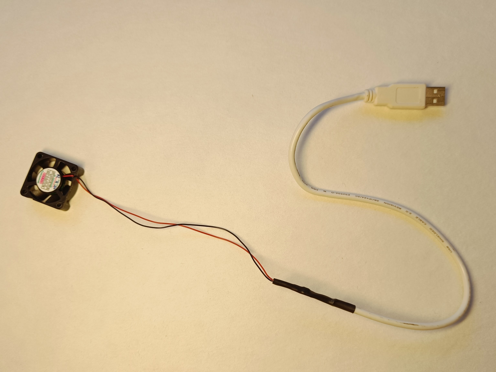{ width="300" }

#### Relier des câbles de prototypage au bouton poussoir  

???+ info

    Ces câbles feront le lien entre le bouton poussoir et la raspberry.

- répéter les mêmes étapes que pour le câble USB et le ventilateur  

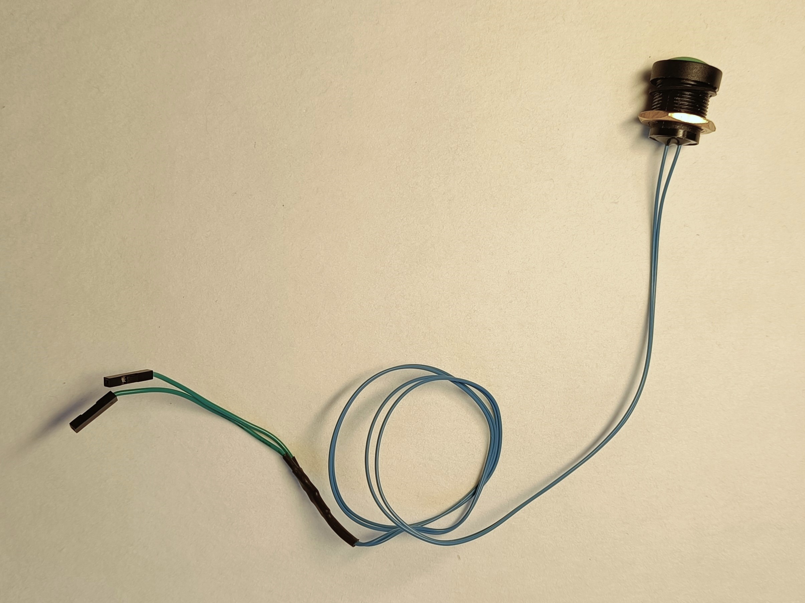{ width="300" }

### Etape 2 - assemblage de la carte ethernet et de la carte raspberry  

???+ info

    La carte Ethernet permet de communiquer avec le caisson vidéo

- monter les supports sur la raspberry
- souder la barette noire sur la carte ethernet
- brancher carte ethernet sur la raspberry
- connecter la nappes sur l'éthernet et sur la raspberry  

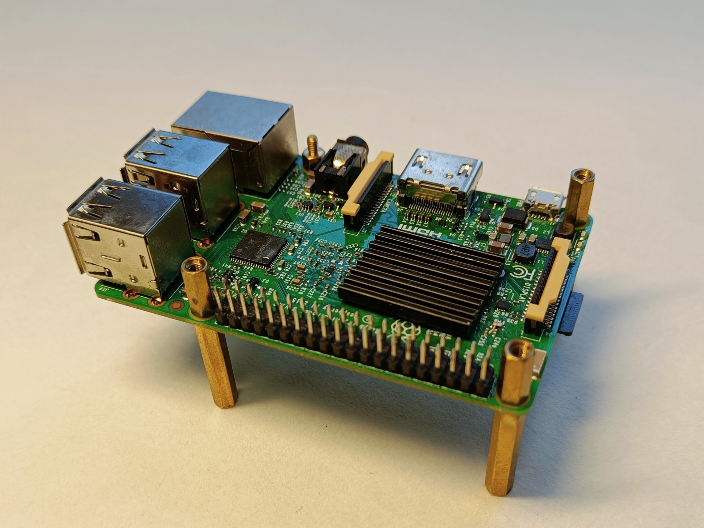{ width="300" } 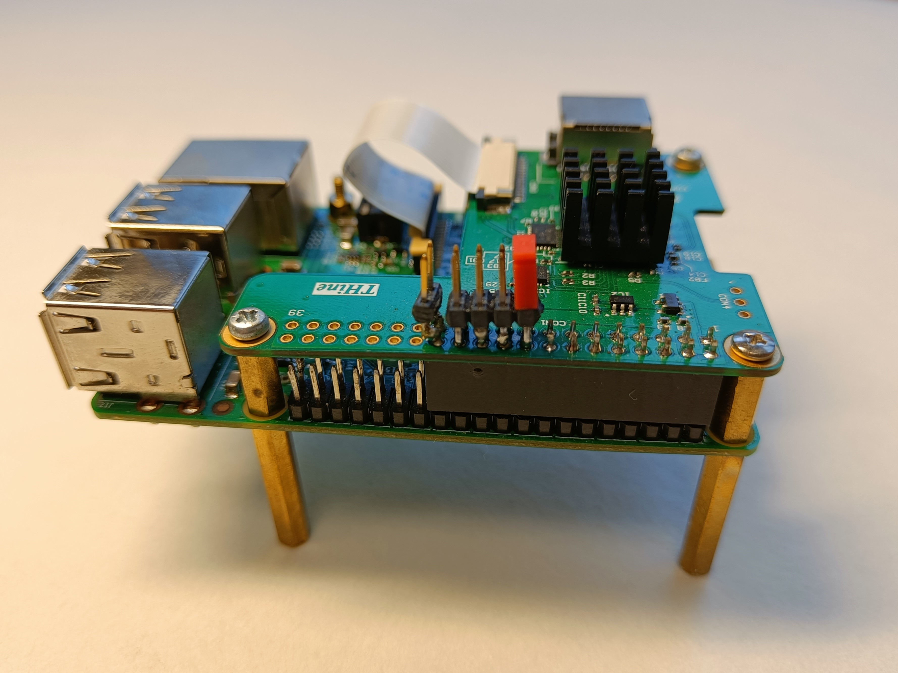{ width="300" } 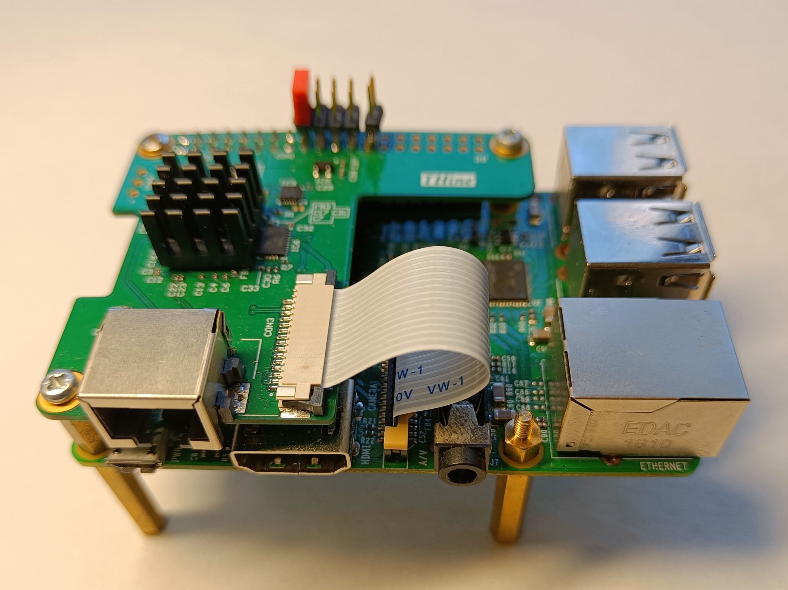{ width="300" }

### Etape 3 - Perçage des côtés du boitier 

???+ info

    Ces ouvertures permettront de placer les connecteurs.

???+ tip

    Réaliser une ouverture supplémentaire pour que l'air puisse circuler et refroidir le système

    Si votre boitier est différent réfléchisser à la meilleur manière de l'organiser à l'intérieur

- percer des trous pour les connecteurs et leurs vis
  - (1) connecteur HDMI femelle/femelle : un trou de 22mm de diamètre et 2 trous de 3.5mm (vis)
  - (2) connecteur ethernet femelle/femelle : un trou de 27mm de diamètre
  - (3) bouton poussoir : un trou de 16mm de diamètre
  - (4) commutateur : un trou de 29mm * 22mm
  - (5) ventilateur : un trou de 26mm de diamètre et 4 trous de 3mm (vis)
  - (6) aération : un trou de 20mm de diamètre
  - (7) fixation raspberry au boitier : 4 trous de 2.5mm (vis)
  
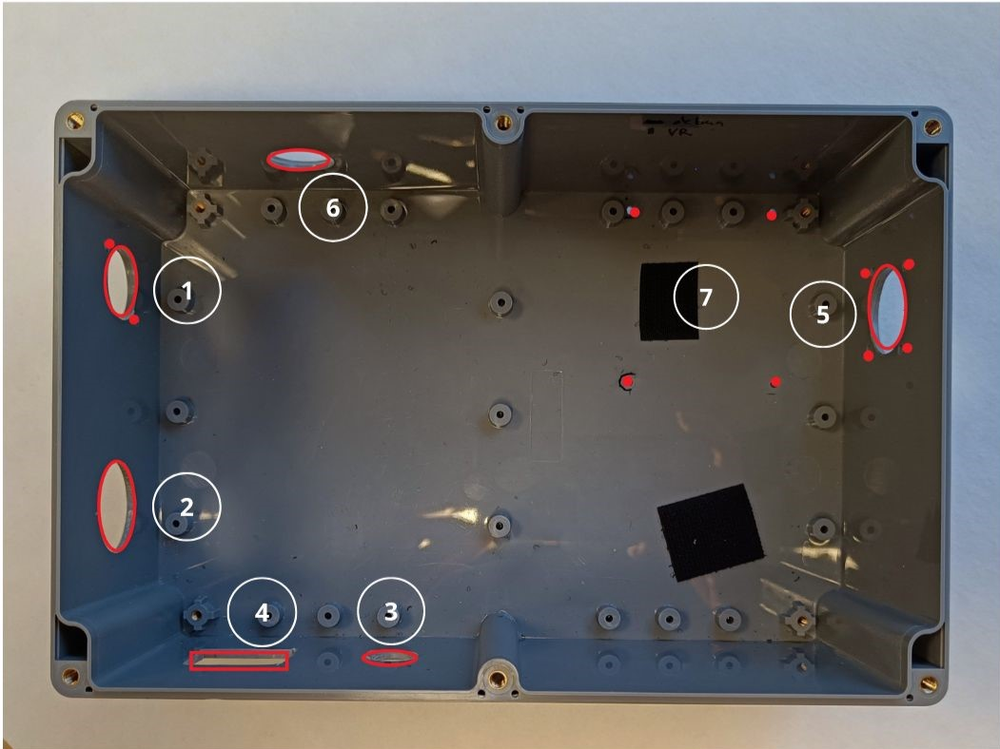{ width="300" }

### Etape 4 - Fixation du receiver gaming, de la carte gps et du ventilateur dans le boitier

- fixer le receiver gaming et la carte gps à l'aide de velcro
- visser le ventilateur
- brancher le câble micro USB sur la carte gps, il sera difficile d'accès lorsque la carte raspberry sera fixée

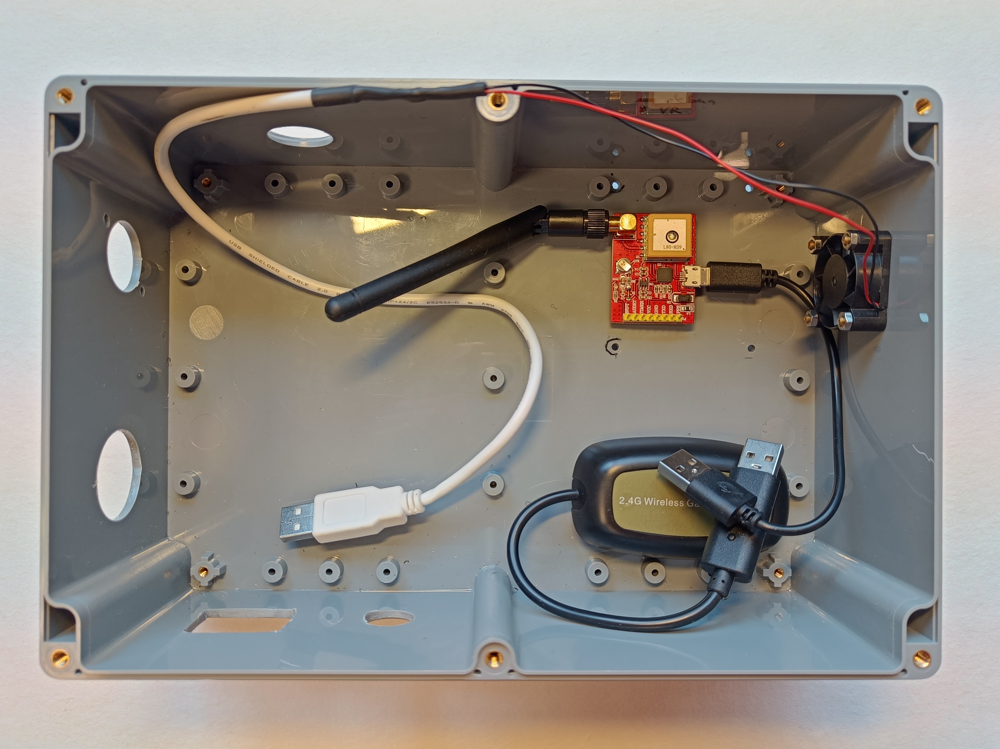{ width="300" }

 ### Etape 5 - Fixation du clavier et de la batterie dans le couvercle  
 - fixer le clavier et la batterie à l'aide de velcro

 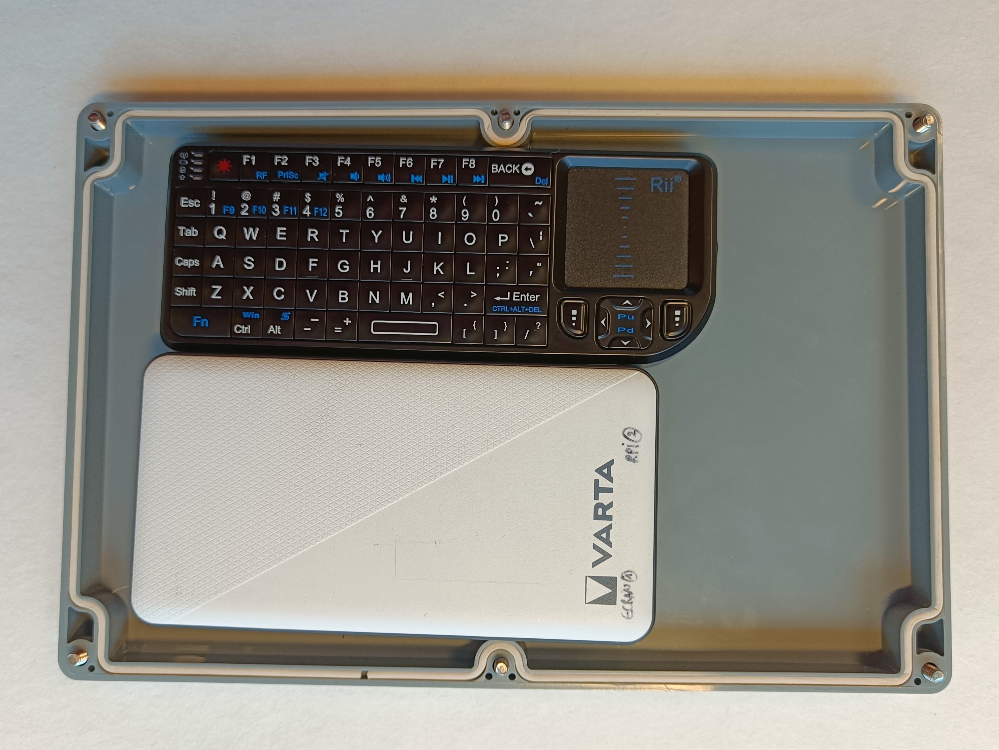{ width="300" }

### Etape 6 - Fixation de la raspberry au boitier

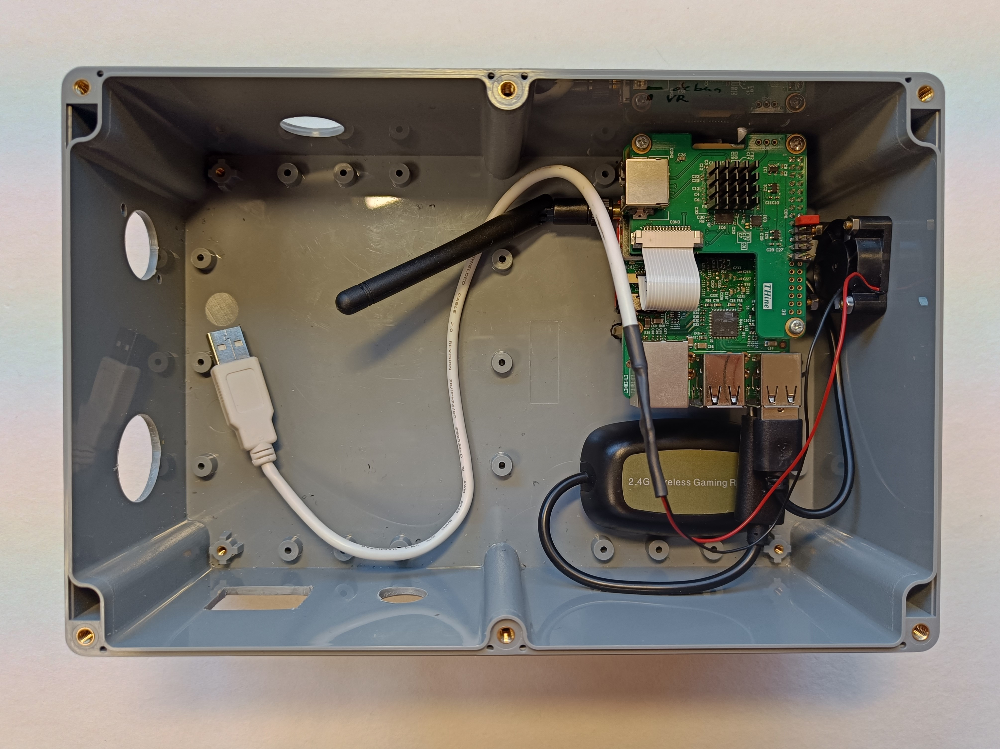{ width="300" }

### Etape 7 - Fixation de l'interrupteur, du bouton poussoir, des connecteurs et réalisation des branchements

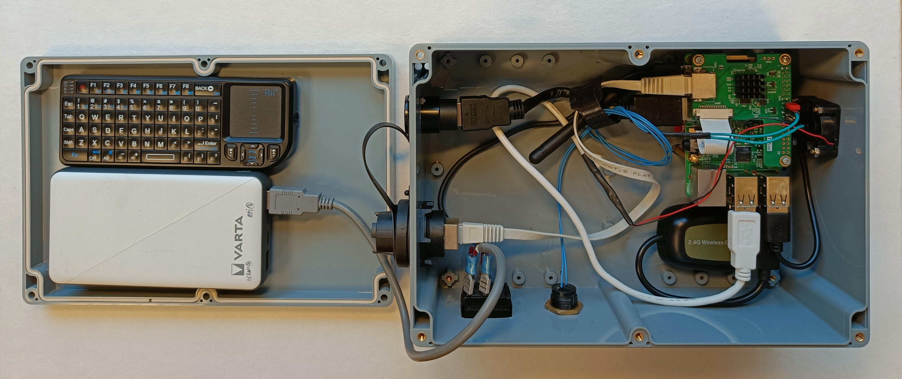

## 2. Assemblage du caisson vidéo

??? Matériel

    [Matériel caisson vidéo](../../../../hardware/micro_kosmos/04_materiel_caisson_video.md)

  
## 3. Assemblage du trépried

??? Outils  
    * imprimante 3D {[Etape 1](assembly-guide_fr.md#etape-1-impression-3d)}
    * foret M3, M6 {[Etape 2](assembly-guide_fr.md#etape-2-assemblage-de-la-partie-inferieur-du-trepied)}
    * meuleuse {[Etape 2](assembly-guide_fr.md#etape-2-assemblage-de-la-partie-inferieur-du-trepied)}

??? Matériel

    [Matériel trépied](../../../../hardware/micro_kosmos/07_materiel_trepied.md)
    

### Etape 1 - Impression 3D
Imprimer les pièces inférieurs et supérieurs du socle ainsi que les pièces de maintient du caisson vidéo.

### Etape 2 - Assemblage de la partie inférieur du trépied
 - Découper le tube en aluminium de manière à obtenir trois segments d'environ "500mm". Ces segments formeront les trois pieds.
 - Couper les extrémitées de chaque segment en biais (environ 45°).
 - Percer les tubes avec un foret de 6mm à environ 20cm du bord (un peu plus que la longueur des plombs que vous avez choisis). Ceci est la partie basse des pieds du trépied.
 - Percer deux trous à l'autre extrémité du tube. Un avec un foret de 3mm à environ 20mm du bord du tube et un autre à 100mm du bord. Les trous doivent traversés le tube de part et d'autre pour pouvoir y insérer des vis.
 - Percer les plombs avec un foret de 3mm perpendiculairement au trou déjà existant. Ce trou permettra de faire passer le serre câble pour maintenir la partie basse du plomb sur le tube.
 - Fixer les plombs sur la partie basse des pieds. Visser et ajouter un serre câble comme ci-dessous.

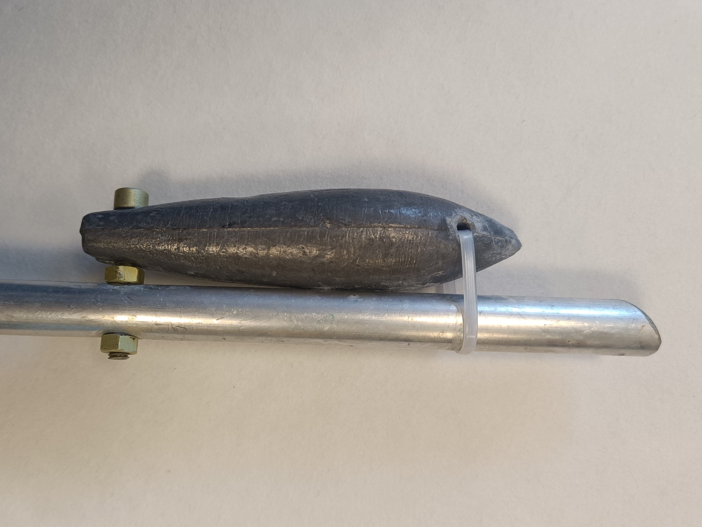{ width="300" }

 - Couper le tête des clous, insérer les dans les trous réalisés à 100mm de la partie haute et plier les bords qui dépasse contre le tube. Ces clous servent de butées et empèchent la partie inférieur du socle de glisser.  
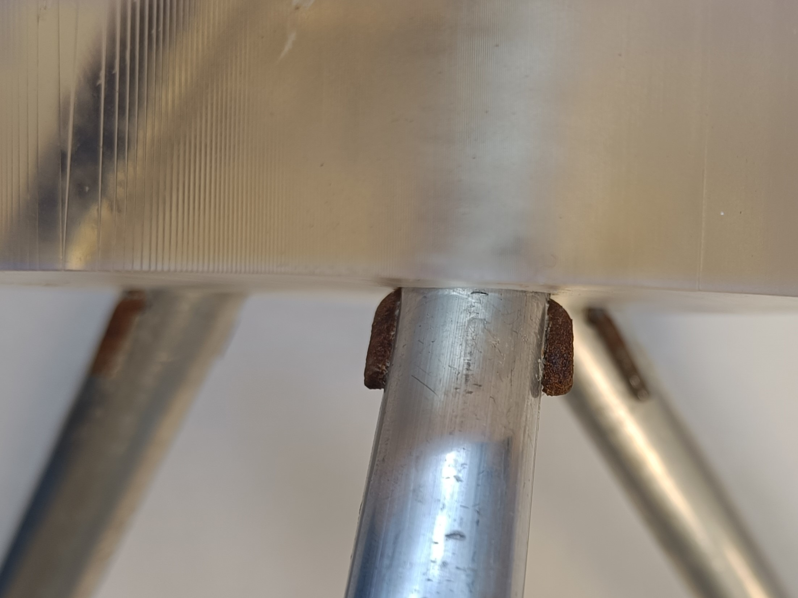{ width="300" }

 - Insérer la partie haute des tubes dans le socle inférieur du trépied imprimée en 3D  
 - Faire passer un fil de fer dans les trous réalisés à 20mm de la partie haut. Ce fil sert également de butée et empèche la partie inférieur du socle de glisser hors de la pièce 3D.     
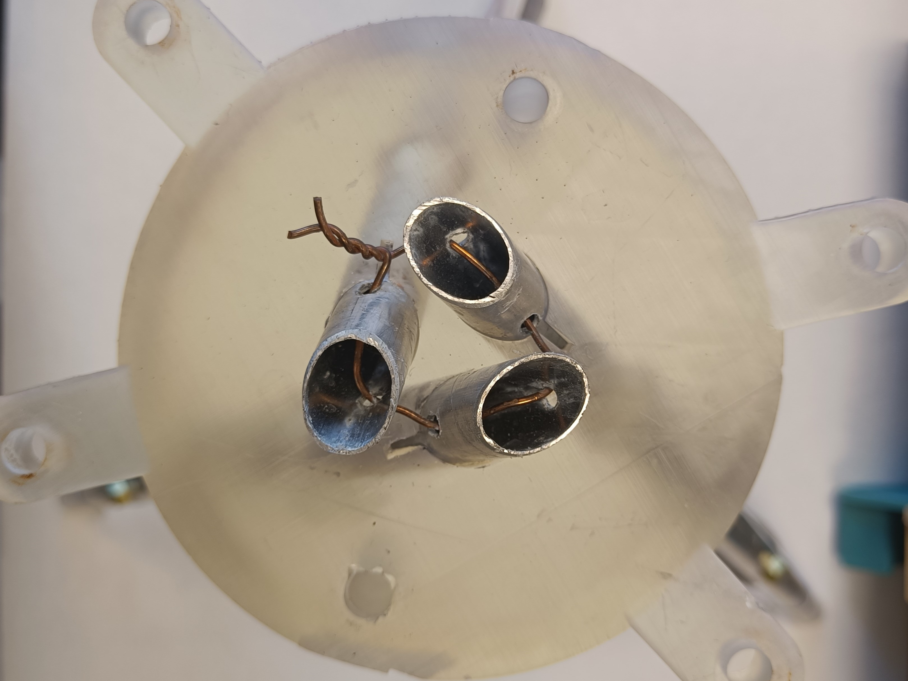{ width="300" }
  
### Etape 3 - Assemblage de la partie supérieur du trépied

???+ info

    Un ber est une structure initialement placée sous les navires pour les supporter lors de la construction ou la réparation.

 - Coller les bandes de mousse à l'intérieur des bers. Attention à laisser les trous prévus pour les vis libres.
 - Percer 2 trous dnas la plaque métalique avec un foret M4 et un trou avec un foret M10. Il faut que les trous correspond aux trous déjà présent sur la partie centrale du socle supérieur imprimé en 3D;
 - Positionner la plaque métallique au dessus de la partie supérieur du socle et fixer l'anneau d'accroche M10 à la partie supérieur du socle.  
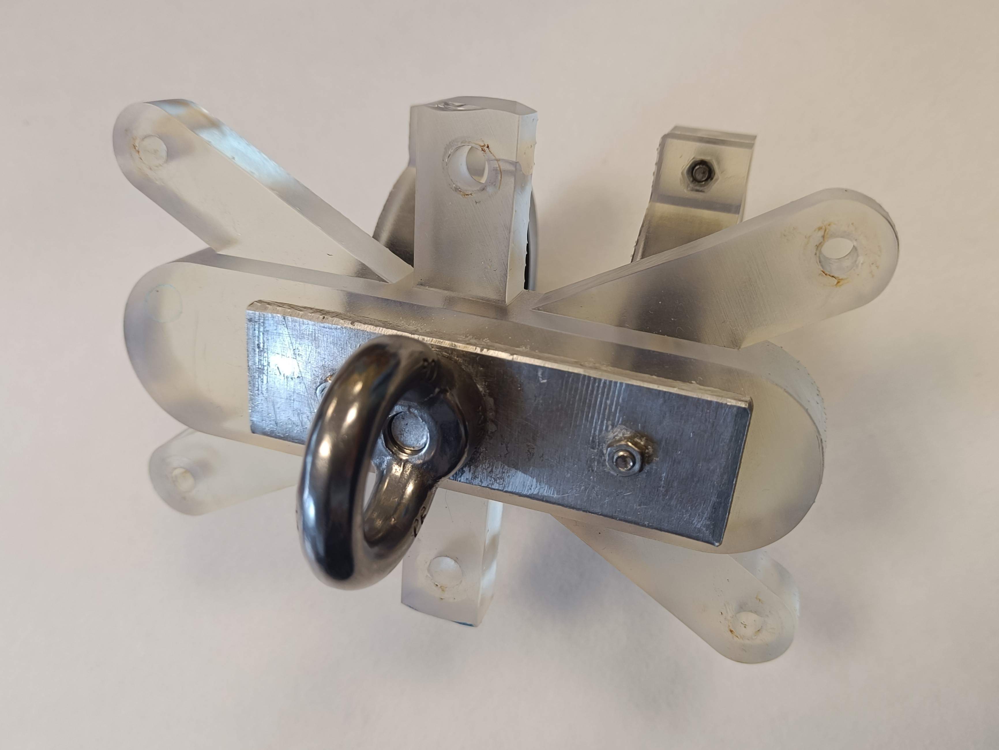{ width="300" }
 
 - Visser le ber supérieur à la partie supérieur du socle avec des vis M4  
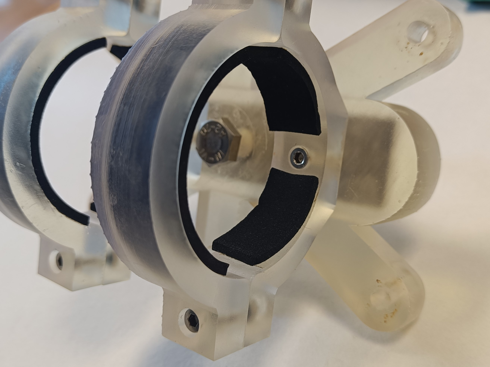{ width="300" }

 - Visser le ber inférieur pour former le support du caisson vidéo. (Ne serrer pas avant d'avoir inséré le caisson vidéo.)

### Etape 4 - Assemblage de la partie haute et de la partie basse du trépied
 - Découper la tige filetée de manière à avoir 2 segments de 170mm et 4 segements de 145mm
 - inserrer des écrous nylstop de chaque côté des tiges filetées  
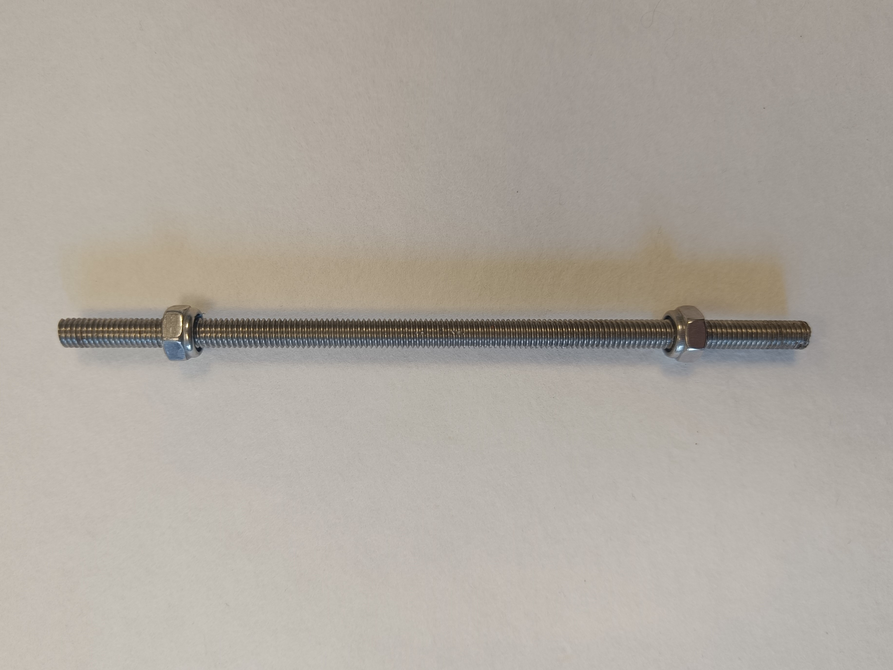{ width="300" }

 - Lors du montage des écrous, placer des rondelles de chaque côté de la pièce imprimée pour la protéger. Insérer les tiges filetées dans le socle inférieur puis visser un écrou avec oreilles en dessous.  
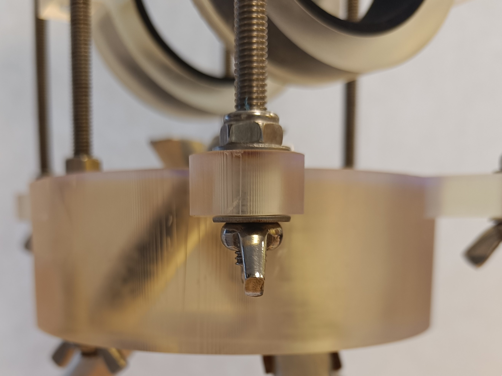{ width="300" }

 - Insérer des rondelles sur les tiges puis positionner la partie supérieur du socle. Ajuster les écrous de manière à ce que le socle vienne se poser horizontallement.

 - Comme pour la partie basse, fixer le haut avec des écrous à oreilles  
   
   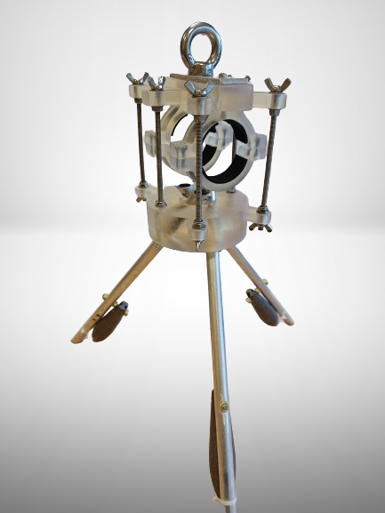
   
## 4. Assemblage du casque

??? Outils
  
    * foret M2 {[Etape 3](assembly-guide_fr.md#etape-3-percer-la-coque-exterieur-du-casque)}
    

??? Matériel

    [Matériel casque](../../../../hardware/micro_kosmos/05_materiel_casque.md)
    
### Etape 1 - Impression 3D
Imprimer les pièces de suport de l'écran ainsi que celles du support de batterie.

### Etape 2 - Assemblage écran
 - Visser l'écran à son support
 - Mettre de la mousse sur les diagonales du support pour caler la carte
 - brancher un cable micro usb  
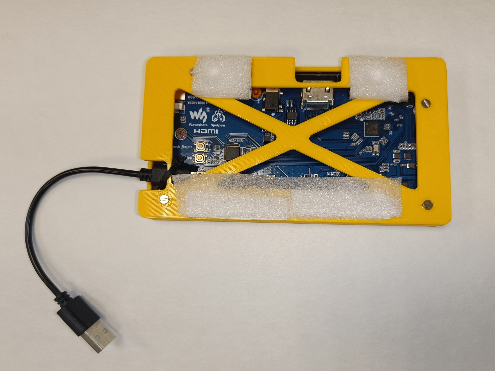{ width="300" }

### Etape 3 - Percer la coque extérieur du casque
 - Réaliser une ouverture sur le haut du casque pour pouvoir accéder à la prise hdmi de l'écran
 - Percer également l'avant de la coque pour pouvoir visser la partie basse du support de la batterie.  
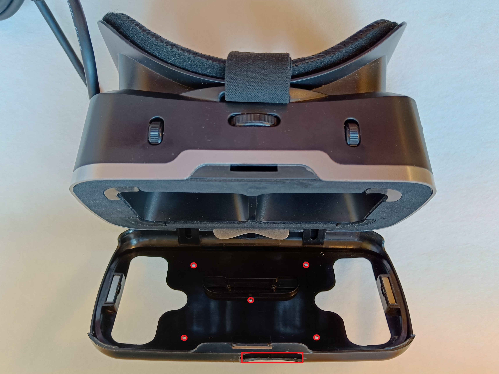{ width="300" }

### Etape 4 - Assemblage de la batterie

???+ info

    Sur les supports la mousse permet de caler les éléments.

 - Mettre de la mousse sur les diagonales du support inférieur et supérieur de la batterie

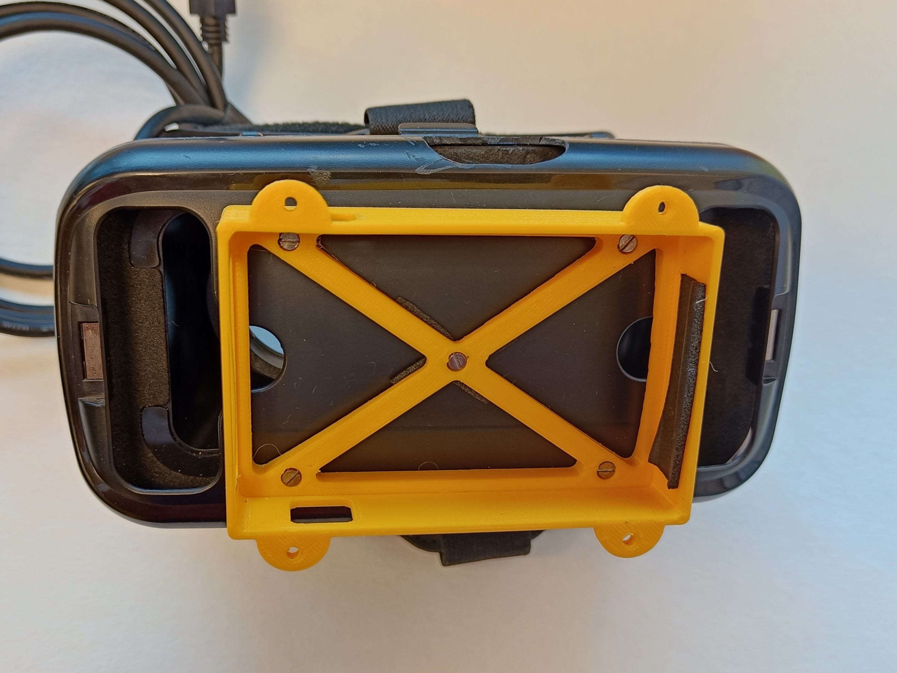{ width="300" }
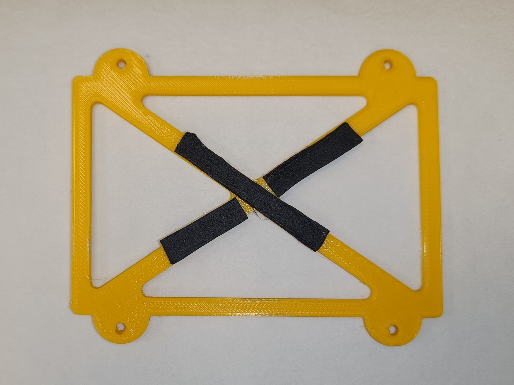{ width="300" }

 - Visser la partie basse du support de la batterie au casque
 - Placer la batterie à l'intérieur du support
 - Visser la partie supérieur du support pour le fermer

### Etape 5 - Asssemblage final
 - Mettre l'écran dans le casque
 - Fermer le casque
 - Brancher le cable hdmi et relier le cable usb à la batterie
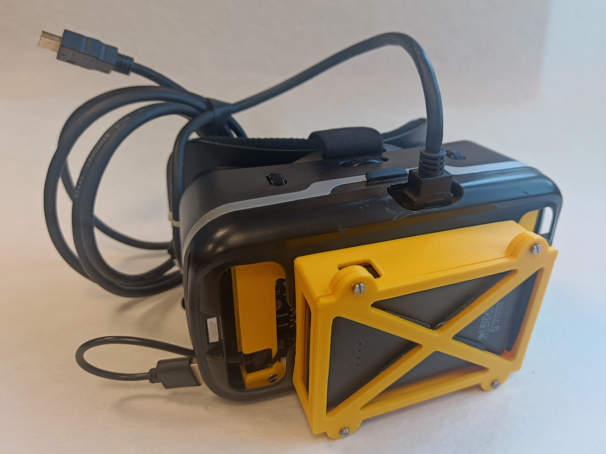{ width="800" }

## 5. Assemblage du câble

??? Outils
    
    * ex1
    * ex2
  
??? Matériel

    [Matériel cable](../../../../hardware/micro_kosmos/03_materiel_cable.md)
    

## 6. Assemblage de la paravane

??? Outils
  
    * ex1
    * ex2
  
??? Matériel

    [Matériel paravane](../../../../hardware/micro_kosmos/06_materiel_paravane.md)
    

    
