# Materiel Boitier Electronique

## Electronique:
| Visuel | Référence | Quantité | Dénomination | Usage |Substituabilité | Tips/Conseil |
|-------:|-----------|----------|--------------------------|--------------------|---------------------|----------|
|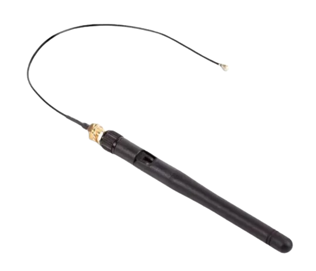        |[Raspberry  SC0480](https://www.kubii.com/fr/modules-de-reseaux/3087-kit-antenne-officielle-raspberry-pi-3272496303287.html)          |         1| Antenne           |Permet d'augmenter la portée du signal    |<blockquote> :red_circle: </blockquote>          |          |
|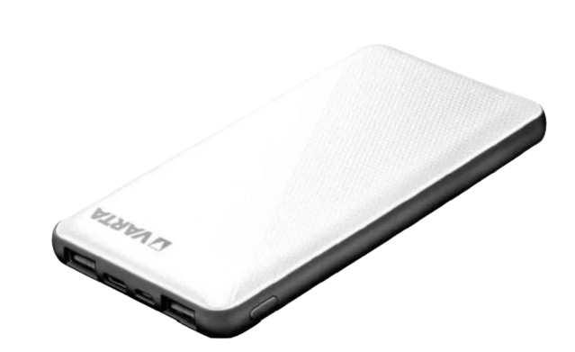        |[Varta 57977 101 111](https://fr.rs-online.com/web/p/batteries-externes/2309825?gb=s)           |         1| batterie 15Ah            |Alimente la raspberry    |<blockquote> :green_circle: </blockquote>          |          |
|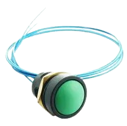        |[ITW SWITCHES 49-59113](https://fr.farnell.com/itw-switches/49-59113/commutateur-rond-vert/dp/734093?ost=734093)   |         1| bouton poussoir vert     |""            |<blockquote> :green_circle: </blockquote>          |          |
|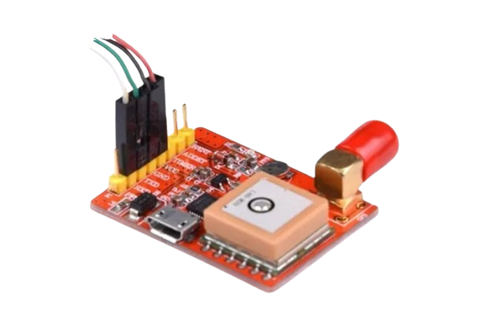        |[Raspberry RA168](https://www.kubii.com/fr/modules-de-reseaux/1922-module-gps-pour-raspberry-pi-kubii-3272496007888.html)            |         1| carte gps          |""                                         |<blockquote> :red_circle: </blockquote>          |          |
|        |[ARCOLECTRIC (BULGIN LIMITED) C6050ALAAC](https://fr.farnell.com/arcolectric/c6050alaac/commutateur-a-bascule-dpst-noir/dp/7674155)|         1| commutateur + cache étanche             |Permet d'allumer et d'éteindre le système     |<blockquote> :orange_circle: intérupteur avec auto maintient </blockquote>          |         |
|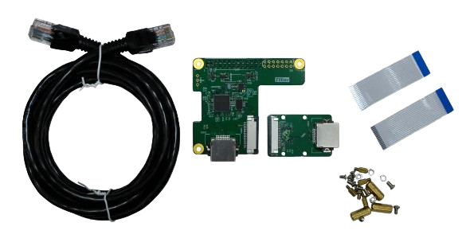        |[THine Solutions, Inc. THSER101](https://fr.rs-online.com/web/p/hat-et-complements-raspberry-pi/2206246?redirect-relevancy-data=7365617263685F636173636164655F6F726465723D31267365617263685F696E746572666163655F6E616D653D4931384E53656172636847656E65726963267365617263685F6D617463685F6D6F64653D6D61746368616C6C7061727469616C267365617263685F7061747465726E5F6D6174636865643D5E2E2A24267365617263685F747970653D43415443485F414C4C5F44454641554C54267365617263685F7370656C6C5F636F72726563745F6170706C6965643D59267365617263685F77696C645F63617264696E675F6D6F64653D4E4F4E45267365617263685F6B6579776F72643D5448696E6520536F6C7574696F6E732C20496E632E204361626C6520457874656E73696F6E204B697420666F72205261737062657272792050692043616D267365617263685F6B6579776F72645F6170703D5448696E6520536F6C7574696F6E732C20496E632E204361626C6520457874656E73696F6E204B697420666F72205261737062657272792050692043616D26)           |         1| kit d'extension ethernet |"Permettra à la camera et à la Raspberry de communiquer ensemble"              |<blockquote> :red_circle: </blockquote>          |           |
|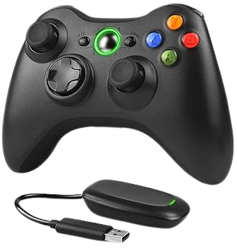        |[gaming_receiver](https://www.amazon.fr/Dhaose-Contr%C3%B4leur-Vibration-Bluetooth-Ergonomique/dp/B08JGMFRGC/ref=sr_1_5?adgrpid=572275035&hvadid=80607978251784&hvbmt=be&hvdev=c&hvlocphy=127027&hvnetw=s&hvqmt=e&hvtargid=kwd-9285639436%3Aloc-66&keywords=manette+xbox+360+sans+fil&)          |         1| Manette Xbox + Wireless gaming receiver     |Permet de controller kosmos (mouement, camera)  Permet de faire le lien avec la manète de Xbox et la crte raspberry                |<blockquote> :red_circle: </blockquote>          |          |
|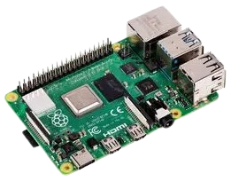        |[RASPBERRY-PI RPI4-MODBP-4GB](https://fr.farnell.com/raspberry-pi/rpi4-modbp-4gb/raspberry-pi-4-model-b-4gb/dp/3051887?st=rpi4) |         1| raspberry PI4 4GB        |Contient le programme de fonctionnement du µkosmos     |<blockquote> :red_circle: </blockquote>          |          |
|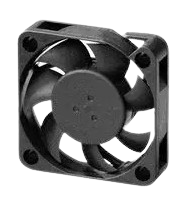        |[MULTICOMP MC002684](https://fr.farnell.com/multicomp/mc002684/ventilateur-40x40x10mm-5vdc/dp/3050784) |         1| ventilateur 5V          |Permet de refroidir le système      |<blockquote> :orange_circle: _5V_ </blockquote>          |          |

## Cable:
| Visuel | Référence | Quantité | Dénomination | Usage | Substituabilité | Tips/Conseil |
|-------:|-----------|----------|--------------------------|----------------------|-------------------|----------|
|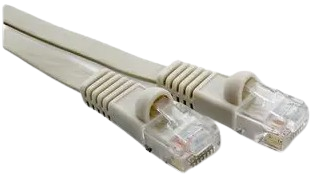   |[VIDEK 2966-0.3F](https://fr.farnell.com/videk/2966-0-3f/lead-flat-cat6-utp-beige-0-3m/dp/1515103?ost=1515103)  |         1|ethernet 0.3m           | Relie carte ethernet au raccord ethernet_externe   |<blockquote> :orange_circle: _connectique ethernet_ </blockquote>           |          |
|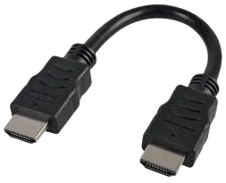        |[PRO SIGNAL PSG91337](https://fr.farnell.com/pro-signal/psg91337/hdmi-lead-black-0-15m/dp/3400642?ost=3400642)|         1| rallonge HDMI 10cm       | Relie la raspberry au bulgin HDMI   |<blockquote> :orange_circle: _connectique hdmi_ </blockquote>           |          |
|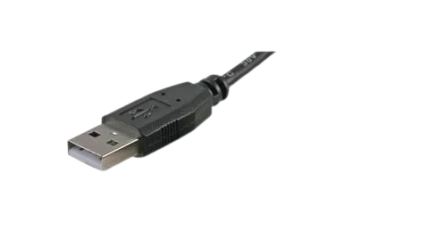          |[KUB06861-NR](https://www.kubii.com/fr/alimentations/1501-1088-mini-cable-blanc-usb-micro-usb-kubii-3272496003491.html#/couleur-noir)           |         2|cable USB           | Relie la batterie au commutateur    Relie le ventillateur à la carte |<blockquote> :orange_circle: _connectique usb_ </blockquote>          |Récup    Seul le connecteur usb est important l'autre bout du cable sera coupé et relier à d'autre petit cable par une soudure    |
|       |[KUB06861-NR](https://www.kubii.com/fr/alimentations/1501-1088-mini-cable-blanc-usb-micro-usb-kubii-3272496003491.html#/couleur-noir)           |         1|cable micro USB vers USB           | Relie la raspberry à la carte gps   |<blockquote> :orange_circle: _connectique usb et micro usb_ </blockquote>          |Récup     |
|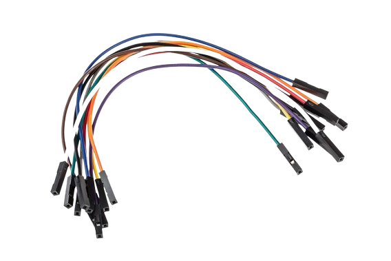        |[JW008FF_DEL](https://www.kubii.com/fr/fils-cables-adaptateurs/1592-1424-kit-fils-cables-jumper-40-200-mm-3272496311220.html#/connecteur-femelle_male)        |         2|cable de prototypage           | Relie des pins de la carte aux cables du bouton poussoir  |<blockquote> :green_circle: </blockquote>          |Récup     |

## Connecteur:
| Visuel | Référence | Quantité | Dénomination | Usage | Substituabilité | Tips/Conseil |
|-------:|-----------|----------|--------------------------|---------------------|----------------------|----------|
|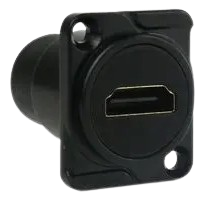        |[AMPHENOL AUDIO AC-HDMI-RRB](https://fr.farnell.com/amphenol/ac-hdmi-rrb/adaptateur-hdmi-type-d-fem-fem/dp/2951361?ost=ac-hdmi-rrb) |         1| HDMI femelle/femelle              | Permet de connecter la raspberry au casque de Réalité Virtuelle (VR)|<blockquote> :orange_circle: _hdmi vers hdmi_ </blockquote>          |          |
|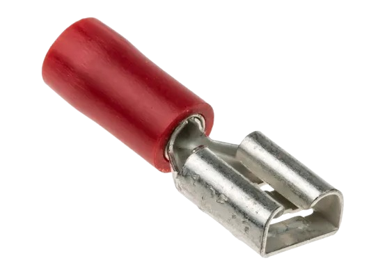        |[RS PRO 534-339](https://fr.rs-online.com/web/p/cosses-faston/0534339?gb=s)          |         4|connecteur cosse            | Fait le lien entre les pins du commutateur et les câbles                     | <blockquote> :green_circle: </blockquote>          | Les connecteurs cosses sont optionnel. Vous pouvez simplement réaliser des soudures entre les pins et les câbles          |
|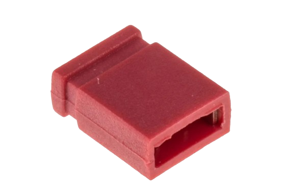        |[jumper](https://fr.rs-online.com/web/p/cavaliers-et-shunts/2518531)          |         1|jumper            | Fait le lien entre deux pins de la carte ethernet pour chager le mode de fonctionnement                    |<blockquote> :green_circle: </blockquote>          |Peut être remplacer par un câble de prototypage femelle/femelle          |
|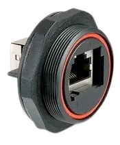        |[BULGIN LIMITED PX0839/90](https://fr.farnell.com/bulgin/px0839-90/connecteur-coupleur-cat5e-horizontal/dp/1687567?ost=px0839%2F90) |         1| ethernet femelle/femelle   | Permet de connecter la carte ethernet au cable ethernet externe |<blockquote> :orange_circle: _ethernet vers ethernet_ </blockquote>          |          |

## Mécanique:
| Visuel | Référence | Quantité | Dénomination | Usage |Substituabilité | Tips/Conseil |
|-------:|-----------|----------|--------------------------|---------------------|--------------------|----------|
|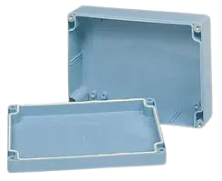        |[MULTICOMP PRO G3008](https://fr.farnell.com/multicomp/g3008/boitier-abs-240x160x90mm-ip65/dp/1526644?st=boitier%20ip65%20240%20mm)|      1| boitier 240 * 160 * 90       |Abrite les élément électroniques        |<blockquote> :red_circle: </blockquote>          |          |
|        |           |        4| pied                                   |Permet d'avoir la boite à plat          |<blockquote> :green_circle: </blockquote>          |Récup     |

  
## Visserie:
| Visuel | Référence | Quantité | Dénomination | Usage | Substituabilité | Tips/Conseil |
|-------|-----------|----------|--------------------------|--------------------|-------------------------------|----------|
|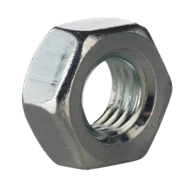{ width="150" }         |[RS PRO 189-563](https://fr.rs-online.com/web/p/ecrous-hexagonaux/0189563)           |         6|écrou M3                  |Permet fixer le bulgin hdmi et  le ventilateur                 |<blockquote> :green_circle: </blockquote>          |      |
|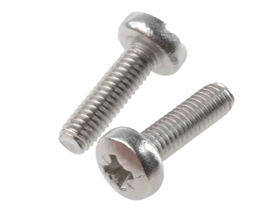{ width="150" }     |[RS PRO 908-7649](https://fr.rs-online.com/web/p/vis-a-metaux/9087649)           |         3|vis M2.5 * 5 mm           |Permet de fixer la carte Ethernet avec la carte Raspberry        |<blockquote> :orange_circle: _M2.5_ </blockquote>          |Récup      |
|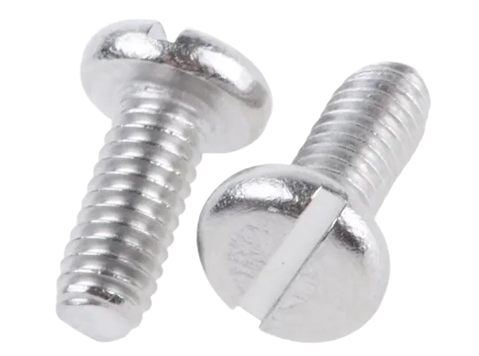{ width="150" }        |[RS PRO 526-928](https://fr.rs-online.com/web/p/vis-a-metaux/0526928)           |         4|vis M2.5 * 6 mm           |Permet de fixer la carte raspberry au boitier              |<blockquote> :orange_circle: _M2.5_ </blockquote>          |      |
|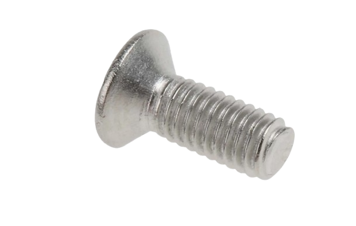{ width="150" }        |[RS PRO 914-1942](https://fr.rs-online.com/web/p/vis-a-metaux/9141942)           |         2|vis M3 * 8 mm             |Permet de fixer le bulgin hdmi              |<blockquote>:green_circle:</blockquote>          |      |
|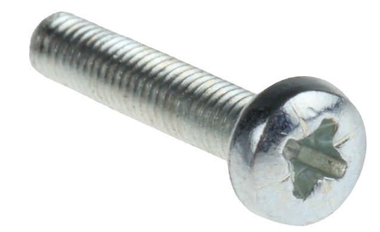{ width="150" }        |[RS PRO 560-619](https://fr.rs-online.com/web/p/vis-a-metaux/0560619)           |         4|vis M3 * 16 mm            |Permet de fixer le ventilateur              |<blockquote>:green_circle: </blockquote>        |      |
|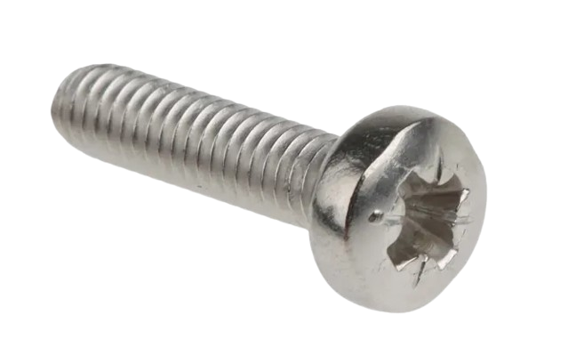{ width="150" }        |[RS PRO 190-513](https://fr.rs-online.com/web/p/vis-a-metaux/0190513)           |         6|vis M4 * 16 mm            |Permet la fermeture du boitier              |<blockquote> :orange_circle: _M4_ </blockquote>        |      |
|{ width="150" }      |[RS PRO 184-286](https://fr.rs-online.com/web/p/entretoises-filetees/1842896)           |         4|entretoise filetée M2.5 * 15 mm   |Permet de surelever la carte raspberry                 |<blockquote> :orange_circle: _M2.5_ </blockquote>           |      |
|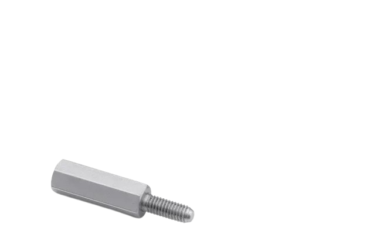{ width="150" }  |[RS PRO 184-3014](https://fr.rs-online.com/web/p/entretoises-filetees/1843014)           |         4|entretoise filetée  M2.5 * 6 mm   |Permet de surelever la carte ethernet                      |<blockquote> :orange_circle: _M2.5_ </blockquote>           |      |
 

## Consommable:
| Visuel | Référence | Quantité | Dénomination | Usage |Substituabilité | Tips/Conseil |
|-------:|-----------|----------|--------------------------|---------------------|--------------------|----------|
|        |           |     10cm| gaine thermo retractable    |"fait le liaison entre les différents câbles assemblés"          |<blockquote> :red_circle: </blockquote>          |Récup       |
|        |           |     10cm| velcro    |Permet de maintenir les composants en place et de pouvoir les enlever facilement si besoin       |<blockquote> :green_circle: </blockquote>          |Récup      Le velcro est optionnel et peut être remplacer par un autre moyen de fixation      |

## Outils:
- Tourne vis (Tête différentes en fonction des vis utilisées)
- Perçeuse
- Couronne perçeuse (permet de réaliser les trous pour les connecteurs)
- kit de soudure
- pistolet chauffant ou briquet
- cuteur

(Les images proviennent des sites fournisseurs)
