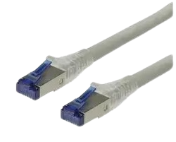
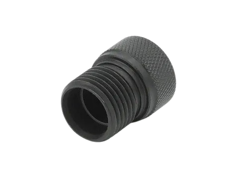
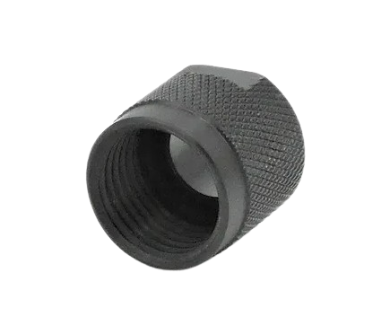
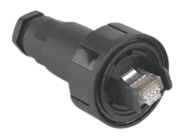
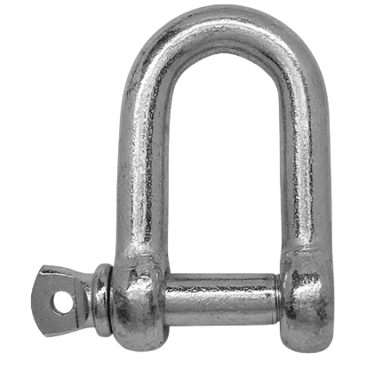
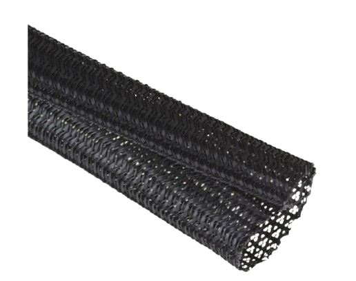
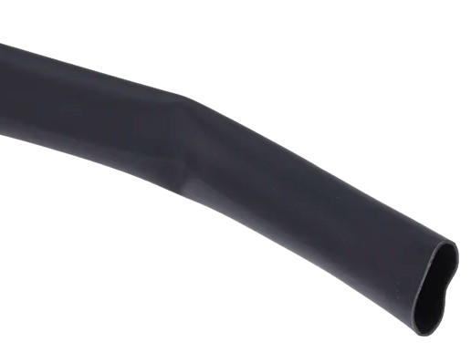

# Matériel Cable

## Cable:
| Visuel | Référence | Quantité | Dénomination | Usage |Substituabilité | Tips/Conseil |
|-------:|-----------|----------|--------------------------|--------------------|---------------------|----------|
|   |[ROLINE 	21.15.0871](https://fr.farnell.com/roline/21-15-0871/cordon-de-brassage-rj45-m-m-30m/dp/3003054?ost=21.15.0871)         |         1| cable ethernet 15m         |Permet ""   |<blockquote> :orange_circle: _ethernet_ </blockquote>  |          |

## Connecteur:
| Visuel | Référence | Quantité | Dénomination | Usage |Substituabilité | Tips/Conseil |
|-------:|-----------|----------|--------------------------|--------------------|---------------------|----------|
|        |[COB-1003](https://www.bluetrailengineering.com/product-page/cobalt-series-dummy-cap)          |         1|capuchon protection cable       | Permet de protéger le cable lorsqu'il n'est pas utilisé                    | <blockquote> :red_circle: </blockquote>  |          |
|        |[COB-1001](https://www.bluetrailengineering.com/product-page/low-profile-locking-sleeve)          |         1|fermeture capuchon protection       |Permet de protéger le cable lorsqu'il n'est pas utilisé                         | <blockquote> :red_circle: </blockquote>  |          |
|   |[BULGIN LIMITED PX0834/B](https://fr.farnell.com/bulgin/px0834-b/connecteur-precable-rj45/dp/9667733?st=bulgin%20px0834/b)           |         1| connecteur ethernet          |                 | <blockquote> :red_circle: </blockquote>  |          |

## Visserie:
| Visuel | Référence | Quantité | Dénomination | Usage |Substituabilité | Tips/Conseil |
|-------:|-----------|----------|--------------------------|--------------------|---------------------|----------|
|        |[RS PRO 124-4849](https://fr.rs-online.com/web/p/manilles/1244849?cm_mmc=FR-PLA-DS3A-_-google-_-CFS_FR_FR_RS+PRO_PO4700199950-_-Acc%C3%A8s,+Stockage+et+manutention-_-1244849&matchtype=&pla-2260779340447&gad_source=1&gclid=EAIaIQobChMI7YCP0uXQhAMVzj8GAB0ZgAvmEAQYASABEgLiavD_BwE&gclsrc=aw.ds)           |        3| manille |Permet d'accrocher un bout et de tirer sur le dispositif sans détériorier le cable et le connecteur | <blockquote> :green_circle: </blockquote>  |          |

## Consommable :
| Visuel | Référence | Quantité | Dénomination | Usage |Substituabilité | Tips/Conseil |
|-------:|-----------|----------|--------------------------|--------------------|---------------------|----------|
|        |          |         1|gaine dyneema     |Permet de créer des points d'accroche                        | <blockquote> :red_circle: </blockquote>  |          |
|        |[RS PRO 700-4535](https://fr.rs-online.com/web/p/gaines-thermoretractables/7004535?gb=s)          |         1|gaine thermo 6mm     |Protège les connexions entre les câbles                      | <blockquote> :red_circle: </blockquote>  |          |
|        |[scotch]()          |         1|scotch     |Protège les connexions entre les câbles                      |<blockquote> :green_circle: </blockquote>  |          |

## Outils
| Visuel | Référence | Quantité | Dénomination | Usage |Substituabilité | Tips/Conseil |
|-------:|-----------|----------|--------------------------|--------------------|---------------------|----------|
|        |[kit sertissage]()          |         1|kit sertissage câble ethernet     |Permet d'assembler le connecteur sur le câble ethernet                  | <blockquote> :red_circle: </blockquote>  |          |

