# Materiel caisson vidéo

## Electronique:
| Visuel | Référence | Quantité | Dénomination | Usage |Substituabilité | Tips/Conseil |
|-------:|-----------|----------|--------------------------|--------------------|---------------------|----------|
|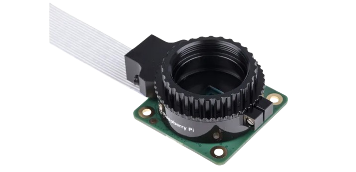        |[Raspberry Pi SC0261](https://fr.rs-online.com/web/p/cameras-pour-raspberry-pi/2012852?gb=s)        |         1| Camera raspberry Pi (Pi Cam)           |Camera compatible avec la carte Rasberry Pi             |<blockquote> :red_circle: </blockquote>          |           |
|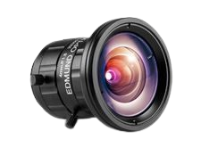        |[TECHSPEC Objectif à distance focale fixe série UC 4mm](https://www.edmundoptics.fr/p/4mm-uc-series-fixed-focal-length-lens/2966/)  |         1| Objectif 4mm     |Permet d'améliorer les performance de la Pi Cam            |<blockquote> :red_circle: </blockquote>          |           |

## Connecteur:
| Visuel | Référence | Quantité | Dénomination | Usage |Substituabilité | Tips/Conseil |
|-------:|-----------|----------|--------------------------|--------------------|---------------------|----------|
|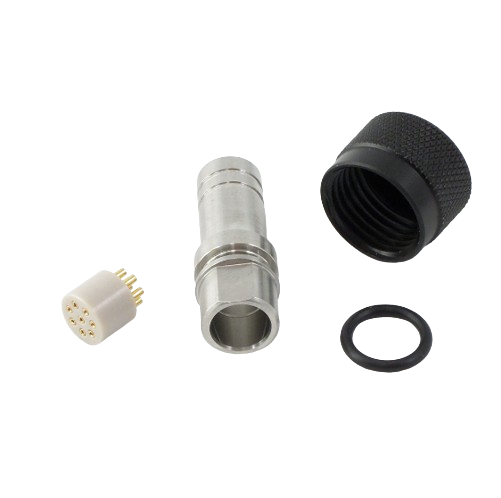        |[COB-3180-SS](https://bluerov-solutions.com/produkt/cobalt-series-cable-termination-kit-regular/)          |         1|8 pin terminaison kit       |Protège le connecteur lorsque le cable n'est pas branché  Une partie du kit est utiliser sur la cable                         |<blockquote> :red_circle: </blockquote>          |           |
|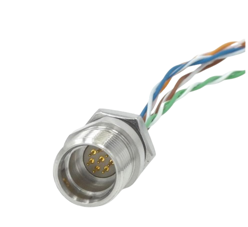        |[COB-1180-R1](https://www.bluetrailengineering.com/product-page/cobalt-series-bulkhead-connector)        |         1| Connecteur 8 pin           |Permet de faire le lien avec le "cable" et la carte de la PiCam              |<blockquote> :red_circle: </blockquote>          |           |

## Mécanique:
| Visuel | Référence | Quantité | Dénomination | Usage |Substituabilité | Tips/Conseil |
|-------:|-----------|----------|--------------------------|--------------------|---------------------|----------|
|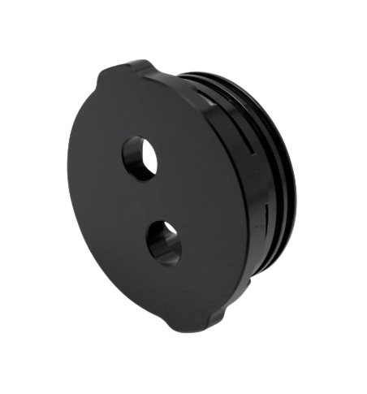        |[BR-100276-002](https://bluerobotics.com/store/watertight-enclosures/locking-series/wte-end-cap-vp/)          |         1| 2'' Flange Cap Aluminium 2 * M10   hole       |Ferme le bas du tube, les deux ouverture permettrons de mettre la valve de pression et le connecteur 8pin                    |<blockquote> :red_circle: </blockquote>          |           |
|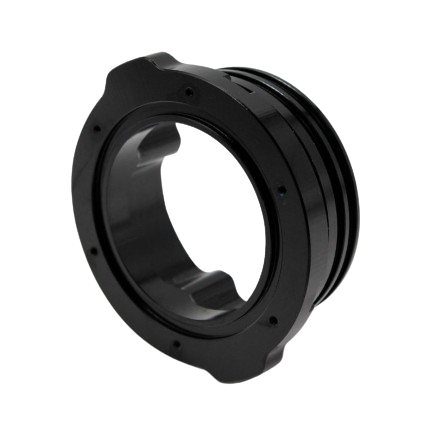        |[BR-100628-998](https://bluerobotics.com/store/watertight-enclosures/2-series/wte-flange-vp/)          |         1| 2'' O-Ring Flange       |Ferme le haut du tube                         |<blockquote> :red_circle: </blockquote>          |           |
|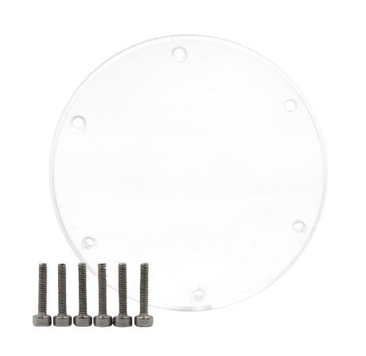        |[BR-100094](https://bluerobotics.com/store/watertight-enclosures/2-series/wte-end-cap-vp/)          |         1| 2'' End Cap Acrylic       |S'assemble sur O-Ring Flange pour fermer le haut du tube                         |<blockquote> :red_circle: </blockquote>          |           |
|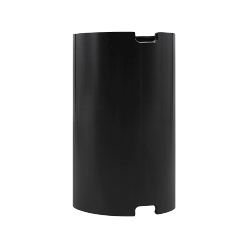        |[BR-100534-100](https://bluerobotics.com/store/watertight-enclosures/locking-series/wte-locking-tube-r1-vp/)           |         1| tube étanche     diametre: 50mm  longueur: 100mm  + 2 socles         |Abrite l'installation de la camera             |<blockquote> :red_circle: </blockquote>          |           |
|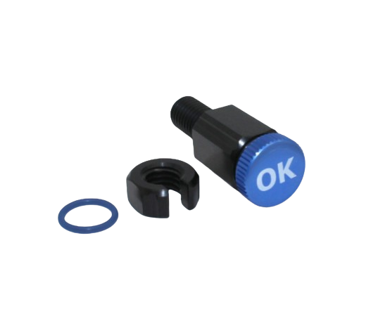        |[BR-100804](https://bluerobotics.com/store/cables-connectors/penetrators/vent-asm-r1/)           |         1| valve de pression         |"Permet de purger le dispositif"                         |<blockquote> :red_circle: </blockquote>          |           |

## Impresion 3D:
| Visuel | Référence | Quantité | Dénomination | Usage |Substituabilité | Tips/Conseil |
|-------:|-----------|----------|--------------------------|--------------------|---------------------|----------|
|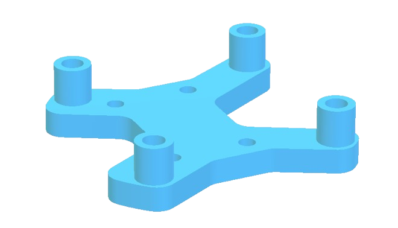        |[support_carte](../../hardware/micro_kosmos/3Dprint_files/caisson_video/Support_carte_caisson.stl)|      1| support carte             |Permet de fixer la carte ethernet                |<blockquote> :red_circle: </blockquote>          |           |

## Visserie:
| Visuel | Référence | Quantité | Dénomination | Usage |Substituabilité | Tips/Conseil |
|-------:|-----------|----------|--------------------------|--------------------|---------------------|----------|
|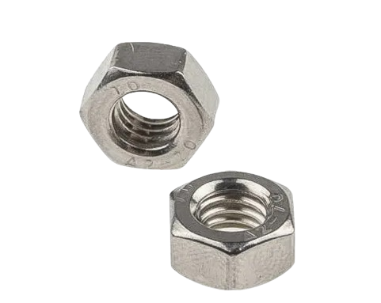{ width="150" }       |[RS PRO 179-5726](https://fr.rs-online.com/web/p/ecrous-hexagonaux/1795726)           |         4|écrou M1.6                 |                                         |<blockquote> :red_circle: </blockquote>          |           |
|{ width="150" }         |[RS PRO 189-563](https://fr.rs-online.com/web/p/ecrous-hexagonaux/0189563)           |         12|écrou M3                  |Permet d'assembler la carte ethernet, son support et la pi cam  |<blockquote> :red_circle: </blockquote>          |           |
|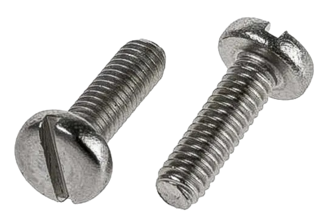{ width="150" }        |[RS PRO 179-5696](https://fr.rs-online.com/web/p/vis-a-metaux/1795696)           |         4|vis M1.6 * 10mm                |Permet de fixer la carte ethernet à son support   | <blockquote> :red_circle: </blockquote>          |          |
|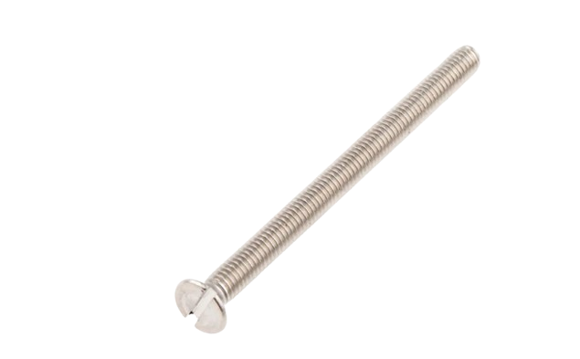{ width="150" }      |[RS PRO 914-1652](https://fr.rs-online.com/web/p/vis-a-metaux/9141652)           |         4|vis M3 * 40mm                |Permet de fixer la Pi Cam au flange cap du tube     |<blockquote> :red_circle: </blockquote>          |           |

(Les images proviennent des sites constructeurs)
