# Materiel Casque

## Electronique:
| Visuel | Référence | Quantité | Dénomination | Usage |Substituabilité | Tips/Conseil |
|-------:|-----------|----------|--------------------------|--------------------|---------------------|----------|
|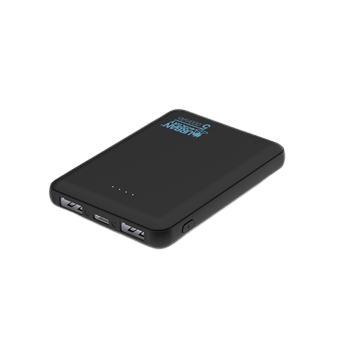        |[Urban Factory UPB05UF](https://www.fnac.com/Batterie-externe-Urban-Factory-UPB05UF-Juicee-Max-Powerbank-5000-mAh-Noir/a16416729/w-4#omnsearchpos=4)       |         1| Batterie 500mAh           |Alimente l'écran du casque de VR            |<blockquote> :green_circle: </blockquote>          |          |
|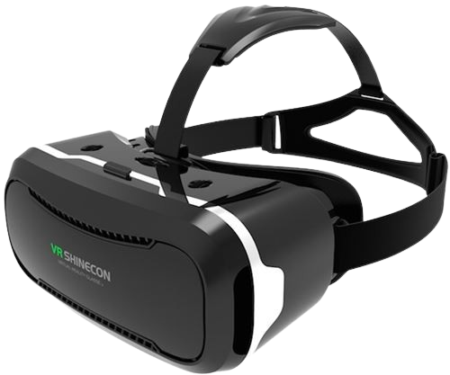        |[EAN 3002637644654](https://www.fnac.com/mp33894226/Casque-VR-pour-Smartphone-Realite-Virtuelle-Lunette-Jeux-Reglage-Universel/w-4#omnsearchpos=1)     |         1| Casque de réalité virtuelle          |permet de visualiser les image de la caméra             |<blockquote> :green_circle: </blockquote>          |Vous pouvez utiliser un simple écran, mais avec le soleil dehors les écrans sont souvent illisibles. Le casque permet de voir correctement les images;          |

## Cable:
| Visuel | Référence | Quantité | Dénomination | Usage |Substituabilité | Tips/Conseil |
|-------:|-----------|----------|--------------------------|--------------------|---------------------|----------|
| 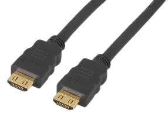{ width="300" }        |[MIGRIP-HDMI-5](https://fr.farnell.com/clever-little-box/migrip-hdmi-5/cable-hdmi-male-male-verrouillage/dp/2373729)           |         1|câble hdmi                | Relie le casque au boitier électronique |<blockquote> :orange_circle: _connectique hdmi_</blockquote>          |          |
|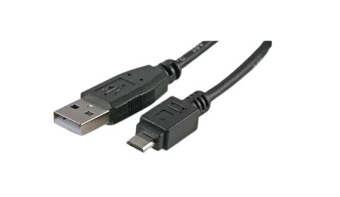{ width="300" }  |[KUB06861-NR](https://www.kubii.com/fr/alimentations/1501-1088-mini-cable-blanc-usb-micro-usb-kubii-3272496003491.html#/couleur-noir)           |         1|câble micro usb - USB     | Relie l'écran à la batterie             |<blockquote> :orange_circle: _connectique usb et micro usb_</blockquote>          |          |

## Impresion 3D:
| Visuel | Référence | Quantité | Dénomination | Usage |Substituabilité | Tips/Conseil |
|-------:|-----------|----------|--------------------------|--------------------|---------------------|----------|
|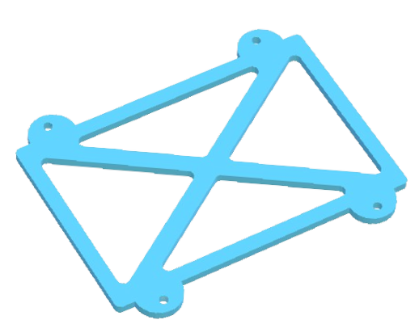        |[support_top_batterie](../../hardware/micro_kosmos/3Dprint_files/casque/Support_batterie_BOT.stl)|      1| Support supérieur batterie             |Partie haute de la boite dans laquelle la batterie sera maintenue                           |<blockquote> :red_circle: </blockquote>          |          |
|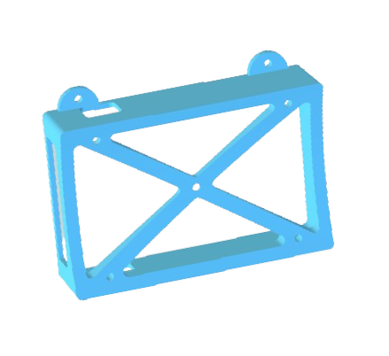        |[support_bot_batterie](../../hardware/micro_kosmos/3Dprint_files/casque/Support_batterie_TOP.stl)|      1| Support inférieur batterie              |Partie basse de la boite dans laquelle la batterie sera maintenue                           |<blockquote> :red_circle: </blockquote>          |          |
|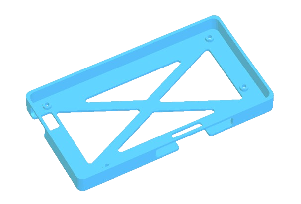           |[support_ecran](../../hardware/micro_kosmos/3Dprint_files/casque/Support_ecran.stl)|      1|Support de l'écran        |boite dans laquelle l'ecran sera maintenue                           |<blockquote> :red_circle: </blockquote>          |          |

## Visserie:
| Visuel | Référence | Quantité | Dénomination | Usage |Substituabilité | Tips/Conseil |
|-------:|-----------|----------|--------------------------|--------------------|---------------------|----------|
| 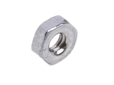{ width="150" }       |           |         9|écrou M2                  |                                         |          |
| 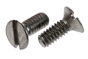{ width="150" } |[RS PRO 914-1624](https://fr.rs-online.com/web/p/vis-a-metaux/9141624)           |         4|vis M2*4mm                |Fixer l'ecran du casque à son support              |<blockquote> :green_circle: </blockquote>          | Récup  |
| { width="150" }|[RS PRO 526-906](https://fr.rs-online.com/web/p/vis-a-metaux/0526906)           |         5|vis M2*6mm                |Fixer le boitier de la batterie au casque             |<blockquote> :green_circle: </blockquote>          | Récup         |
|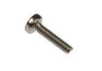{ width="150" }|[RS PRO 914-1475](https://fr.rs-online.com/web/p/vis-a-metaux/9141475)           |         4|vis M2*8mm                |Fixer le couvercle du boitier de la batterie          |<blockquote> :green_circle: </blockquote>          | Récup         |

## Consommable:
| Visuel | Référence | Quantité | Dénomination | Usage |Substituabilité | Tips/Conseil |
|-------:|-----------|----------|--------------------------|--------------------|---------------------|----------|
|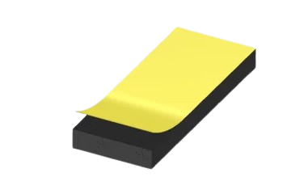   |[RS-PRO 619-1786](https://fr.rs-online.com/web/p/rubans-mousse/6191786)|      1|Mousse ruban           |Permet de maintenir certaines pièces et évite de les abimer                            |<blockquote> :green_circle: </blockquote>          |          |

(Les images proviennent des sites fournisseurs)
