# Materiel Trépied

## Mécanique:
| Visuel | Référence | Quantité | Dénomination | Usage |Substituabilité | Tips/Conseil |
|-------:|-----------|----------|--------------------------|--------------------|---------------------|----------|
|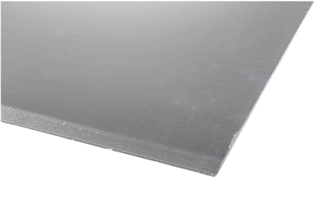   |[RS PRO 178-239](https://fr.rs-online.com/web/p/feuilles-metalliques/0178239?gb=s)           |         1| plaque métalique 30mm*100mm | protège le socle supérieur pour fixer l'anneau d'attache                                  |<blockquote> :green_circle: </blockquote>          |          |
|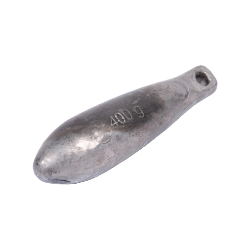        |[CAPERLAN 8655063](https://www.decathlon.fr/p/plomb-maquereau-long-peche-en-mer/_/R-p-335078?mc=8655063&utm_source=google&utm_medium=sea&utm_campaign=fr_t-perf_ct-shopp_n-shopping_hm_peche_mp_ts-gen_f-cv_o-roas_pt-pb_xx-shopping_hm_peche_mp&utm_term=_n-shopping_hm_peche_mp_ts-gen_pt-pb_yy-peche_plomb&gad_source=1&gclid=EAIaIQobChMIpd3PnKLOhAMVAahoCR3GDAL-EAQYAiABEgKDmfD_BwE)         |         3| plomb maquereau 600g          | Ajoute du poids pour que le système coule et reste stable au fond de l'eau      |<blockquote> :green_circle: </blockquote>          |          |
|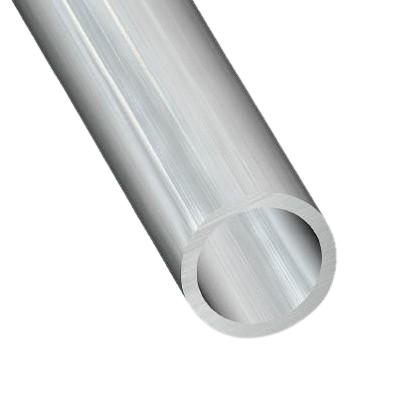        |[3232630508800](https://www.mr-bricolage.fr/tube-rond-aluminium-16x1mm-1m-brut-cqfd.html?storeID=S328&at_medium=paid&at_source=google&at_campaign=LIA_all_product_horscustom&at_adgroupname=Exlusion_de_tout_les_custom_label&at_content=3232630508800&at_temp=9055186&at_network=g&at_campaignid=19604470522&at_variant=652350492136&at_term=&gad_source=1&gclid=EAIaIQobChMI0dqDjKrOhAMVUbRoCR0_rwCEEAQYBCABEgIUFfD_BwE)           |        2m| tube alu 16*1mm          | Permettra de réaliser les pieds                  |<blockquote> :green_circle: </blockquote>          |          |

## Impression 3D:
| Visuel | Référence | Quantité | Dénomination | Usage |Substituabilité | Tips/Conseil |
|-------:|-----------|----------|--------------------------|--------------------|---------------------|----------|
| 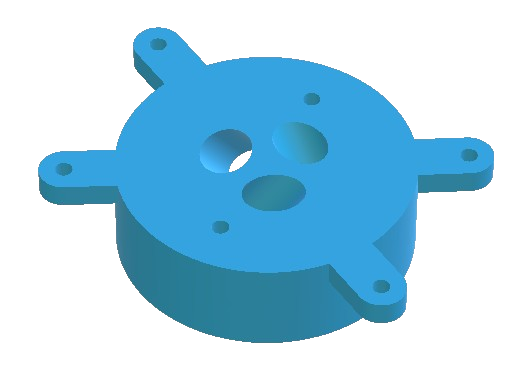        |[Trepied_SocleInferieur](../../hardware/micro_kosmos/3Dprint_files/trepied/Trepied_SocleInferieur.stl)           |         1| partie basse             |Piece dans laquel seront fixer les pieds                                         |<blockquote> :red_circle: </blockquote>          |          |
| 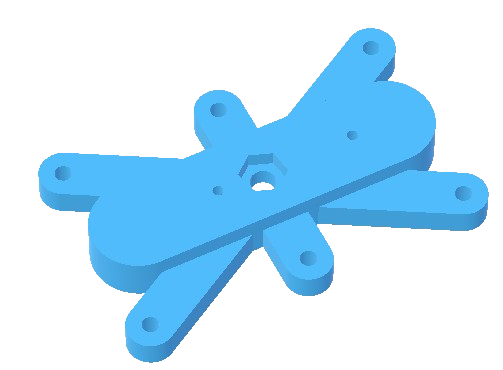        |[Trepied_SocleSupérieur](../../hardware/micro_kosmos/3Dprint_files/trepied/Trepied_SocleSupérieur.stl)           |         1| partie haute             |Piece qui permettra d'attacher l'anneau d'accroche                                          |<blockquote> :red_circle: </blockquote>          |          |
| 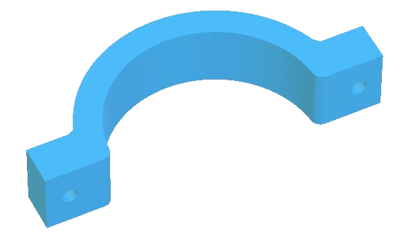        |[Trepied_CollierInférieur](../../hardware/micro_kosmos/3Dprint_files/trepied/Trepied_CollierInférieur.stl)             |         2| Ber*               |Piece inférieur de maintient du tube étanche                                         |<blockquote> :red_circle: </blockquote>          |          |
| 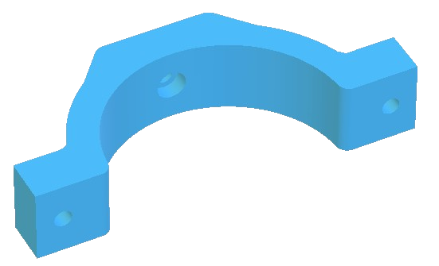        |[Trepied_CollierSupérieur](../../hardware/micro_kosmos/3Dprint_files/trepied/Trepied_CollierSupérieur.stl)             |         2| fermeture du Ber   |Piece suppérieur de maintient du tube étanche                                         |<blockquote> :red_circle: </blockquote>          |          |
*Ber : correspont en marine à la charpente qui maintient un bateau en traveaux 

## Visserie:
| Visuel | Référence | Quantité | Dénomination | Usage |Substituabilité | Tips/Conseil |
|-------:|-----------|----------|--------------------------|--------------------|---------------------|----------|
|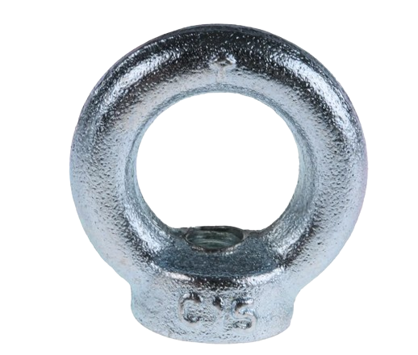{ width="150" }        |[RS PRO 124-4841](https://fr.rs-online.com/web/p/anneaux-de-levage/1244841?gb=s)           |         1| anneau d'accroche M10 A4 |Permet d'attacher un bout au micro kosmos |<blockquote> :green_circle: </blockquote>          |          |
|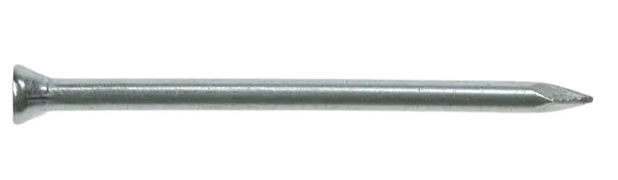{ width="150" }       |[RS PRO 177-6994](https://fr.rs-online.com/web/p/clous/1776994)           |         3| clou                     |Permetra de crer une butée pour le socle inférieur |<blockquote> :green_circle: </blockquote>          |peuvent être remplacé  par n'impourte quelle tige temps qu'elle est déformable          |
|{ width="150" }      |[RS PRO 521-872](https://fr.rs-online.com/web/p/ecrous-hexagonaux/0189579)           |         6| écrou M4                 |                                         |<blockquote> :green_circle: </blockquote>          |          |
|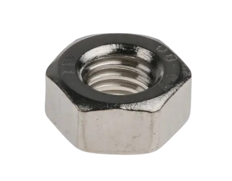{ width="150" }        |[RS PRO 189-591](https://fr.rs-online.com/web/p/ecrous-hexagonaux/0189591)           |        10| écrou M6                 |                                         |<blockquote> :green_circle: </blockquote>          |          |
|{ width="150" }      |[RS PRO 767-832](https://fr.rs-online.com/web/p/ecrous-hexagonaux/0767832)           |         8| écrou frein  M6         |Evite au montage de se déserrer          |<blockquote> :green_circle: </blockquote>          |peuvent etre remplacé par un montage écrou contre écrou (auquel cas il faut ajouter 6 écrous M6)         |
|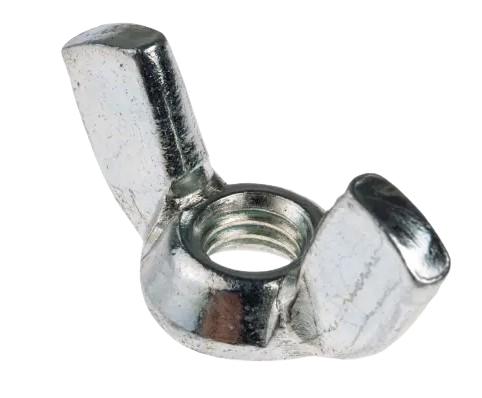{ width="150" }  |[RS PRO 521-872](https://fr.rs-online.com/web/p/ecrous-a-oreilles/0521872)           |        12| écrou oreille M6         |Ecrou placée en bout des tiges filetées            |<blockquote> :green_circle: </blockquote>          |          |
|        |           |         1| fil de fer               |"réduira le mouvement des pieds"                                         |<blockquote> :green_circle: </blockquote>          |          |
|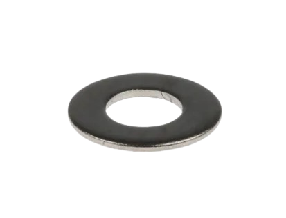{ width="150" }        |[RS PRO 189-658](https://fr.rs-online.com/web/p/rondelles/0189658)           |        24| rondelle M6              |                                         |<blockquote> :green_circle: </blockquote>          |          |
|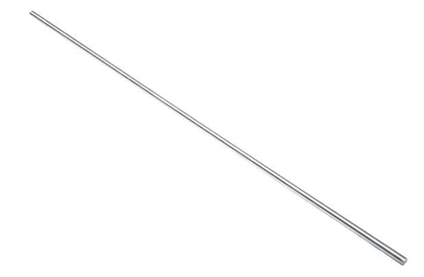        |[RS PRO 530-321](https://fr.rs-online.com/web/p/tiges-filetees/0530321?gb=s)     |      1m50| tige filletée M6         | Permet de faire le lien entre le socle inférieur et supérieur    |<blockquote> :green_circle: </blockquote>          |          |
|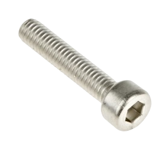{ width="150" }      |[RS PRO 187-1279](https://fr.rs-online.com/web/p/vis-a-six-pans/1871279)           |         4| vis M4 * 20mm     |Permet d'assembler les partie inférieur et supérieur du support du caisson vidéo   |<blockquote> :green_circle: </blockquote>          |          |
|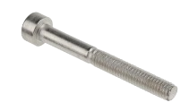{ width="300" }      |[RS PRO 124-7349](https://fr.rs-online.com/web/p/vis-a-six-pans/1247349)           |         2| vis M4 * 35mm     |Permet de fixer le support du caisson vidéo au socle supérieur du trépied          |<blockquote> :green_circle: </blockquote>          |          |
|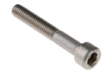{ width="150" }     |[RS PRO 187-1459](https://fr.rs-online.com/web/p/vis-a-six-pans/1871459)           |         3| vis M6 * 40mm     |Permet de fixer les plombs sur les pieds                                         |<blockquote> :green_circle: </blockquote>          |          |
|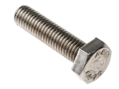{ width="150" }      |[RS PRO 190-383](https://fr.rs-online.com/web/p/vis-a-tete-hexagonale/0190383)           |         1| vis M10 * 40mm    |Permet de fixer l'anneau d'accroche                                         |<blockquote> :green_circle: </blockquote>          |          |

## Consommable:
| Visuel | Référence | Quantité | Dénomination | Usage |Substituabilité | Tips/Conseil |
|-------:|-----------|----------|--------------------------|--------------------|---------------------|----------|
|   |[RS-PRO 619-1786](https://fr.rs-online.com/web/p/rubans-mousse/6191786)           |         1| mousse en ruban          |Permet d'avoir un contact parfait avec le tube plexy|<blockquote> :green_circle: </blockquote>          | Peut être remplacer par un morceau de neoprene que l'on colle          |
|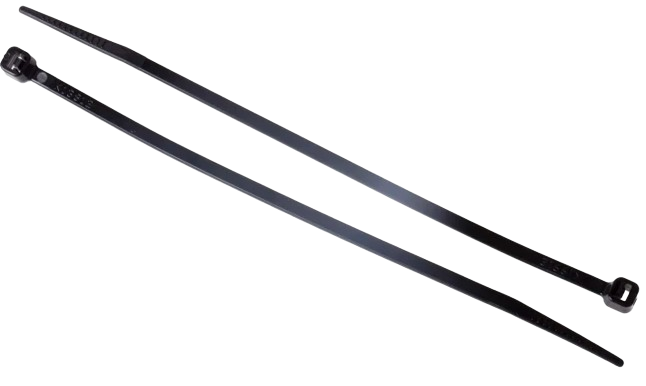        |[RS PRO 233-465](https://fr.rs-online.com/web/p/serre-cables/0233465?gb=s)           |         3|serre cable 150mm  | Maintient les plombs maquereaux   |<blockquote> :green_circle: </blockquote>          |          |

