## 1/ Impression des pièces en 3D

Imprimer toutes les pièces nécessaires. [Les fichiers STL sont disponibles ici](https://github.com/KonkArLab/KOSMOS/tree/main/hardware/3Dprint_files/) .

​

**1.1 Pour l'intérieur du caisson :**

* [1 x I1 qui va supporter la carte Rapsberry](https://github.com/KonkArLab/KOSMOS/tree/main/hardware/3Dprint_files/I1_KOSMOS_V3-0.stl)
* [1x I2, qui va faire le lien entre la structure Raspberry et la plaque sur laquelle va se positionner les batteries.](https://github.com/KonkArLab/KOSMOS/tree/main/hardware/3Dprint_files/I2_KOSMOS_V3-0.stl)
* [1x I3,qui va supporter la PiCam](https://github.com/KonkArLab/KOSMOS/tree/main/hardware/3Dprint_files/I3_KOSMOS_V3-0.stl)
* [1x I4, qui va se visser à une flange du tube pour empécher les structures internes du KOSMOS de pouvoir tourner dans le tube.](https://github.com/KonkArLab/KOSMOS/tree/main/hardware/3Dprint_files/I4_KOSMOS_V3-0.stl)

|    Visuel    |Référence|Quantité|Dénomination|Usage|Conseils d'impression|
|------------------------------------|------|------|-----------------|---------------------|---------------------|
|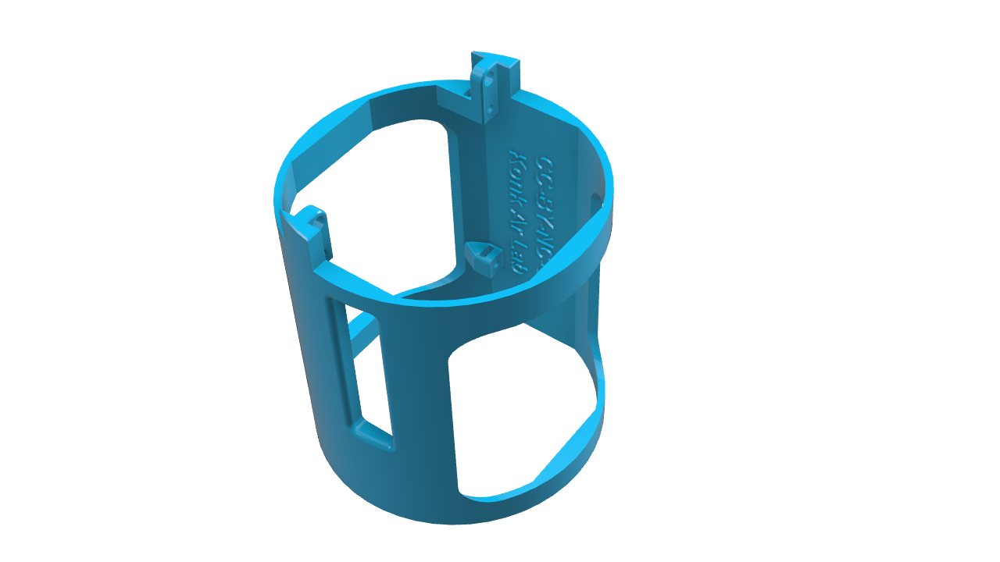|[I1](https://github.com/KonkArLab/KOSMOS/tree/main/hardware/3Dprint_files/I1_KOSMOS_V3-0.stl)|1|Section de la raspberry|Cette pièce est la section qui s'insérera dans le tube étanche, c'est le support de la carte raspberry et de divers autres composants.|Positionner des générateurs de supports pour supporter la partie en port à faux|
||[I2](https://github.com/KonkArLab/KOSMOS/tree/main/hardware/3Dprint_files/I2-2_KOSMOS_V3-0.stl)|1|Section batterie|I2 est la section qui va faire le lien entre la structure Raspberry et la plaque sur laquelle va se positionner les batteries|/|
|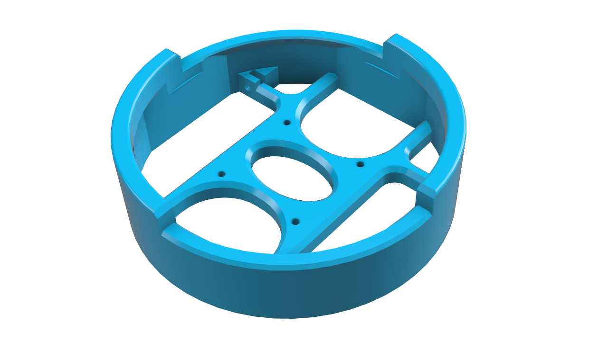|[I3](https://github.com/KonkArLab/KOSMOS/tree/main/hardware/3Dprint_files/I3_KOSMOS_V3-0.stl)|1|Section de support de la caméra|Cette section s'insère dans le tube et vien admettre la caméra qui pourr s'y visser|/|
||[I4](https://github.com/KonkArLab/KOSMOS/tree/main/hardware/3Dprint_files/R3_KOSMOS_V3-0.stl)|1|Détrompeur|Fixé à la flange du hublot, il permettra de contraindre les structures internes en rotation et d'éviter que le KOSMOS ne puisse filmer de travers.|/|

​

**1.2 Pour l'extérieur du caisson :**

​

Toutes ces pièces doivent êtres impérativement imprimés en PET. En effet, cette matière est la plus résistante à l'eau de mer parmi les matériaux disponibles en impression 3D FDM. Si vous disposez d'autres technologies, ne pas hésiter à essayer et nous faire part du résultat. Cependant, nous savons que la résine par SLA ne convient pas pour une raison de dureté. Il peut-être intéressant également de travailler à un réducteur sans impression 3D à la fraiseuse uniquement pour rendre la plongée possible à de plus grandes profondeurs.

Nous recommandons un taux de remplissage des pièces qui ne soit inférieur à 30%. Toutes nos pièces destinés à l'extérieur du caisson ont un taux de remplissage à 100%.

|    Visuel    |Référence|Quantité|Dénomination|Usage|Conseils d'impression|
|------------------------------------|------|------|-----------------|---------------------|---------------------|
|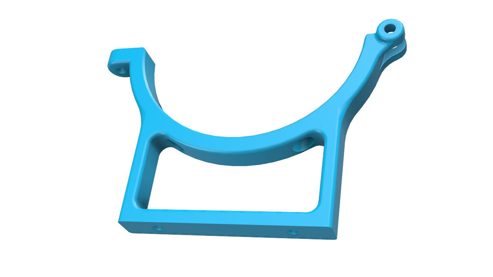|[R1](https://github.com/KonkArLab/KOSMOS/tree/main/hardware/3Dprint_files/R1_KOSMOS_V3-0.stl)|2|Ber|Supporte le tube étanche. Il permet avec R1.2 de soutenir le tube|Positionner un générateur de support pour supporter la partie en port à faux|
||[R1.2](https://github.com/KonkArLab/KOSMOS/tree/main/hardware/3Dprint_files/R1-2_KOSMOS_V3-0.stl)|2|Fermeture du Ber|Levier pouvant se refermer sur R1 pour bloquer le tube étanche au moyens de vis.|Positionner un générateur de support pour supporter la partie en port à faux|
||[R2](https://github.com/KonkArLab/KOSMOS/tree/main/hardware/3Dprint_files/R2_KOSMOS_V3-0.stl)|1|Support du capteur de positionnement|Receptacle du capteur de positionnement|/|
|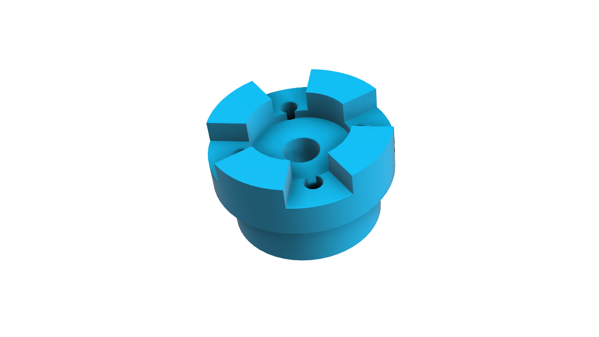|[R3](https://github.com/KonkArLab/KOSMOS/tree/main/hardware/3Dprint_files/R3_KOSMOS_V3-0.stl)|1|Embout de croix de Malte|Cette pièce reprend l'effort de la croix de Malte pour la retransmettre à l'arbre qui lui est solidaire au trèpied et donc au sol|Utiliser du support pour maintenir la périphérie en port à faux ainsi que les alésages.|
|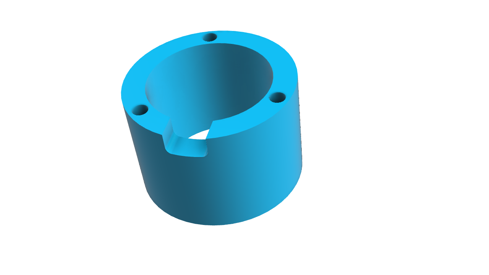|[R4](https://github.com/KonkArLab/KOSMOS/tree/main/hardware/3Dprint_files/R4_KOSMOS_V3-0.stl)|1|Entretois du moteur|Le moteur sera positionné dans ce tube. La hauteur de se dernier peut-être à modifier pour aligner parfaitement l'alignement du pignon moteur et du premier pignon méné.|/|
|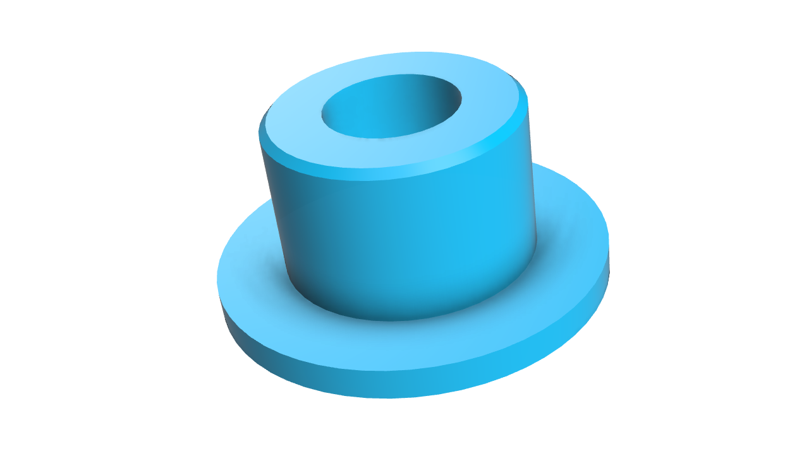|[R5](https://github.com/KonkArLab/KOSMOS/tree/main/hardware/3Dprint_files/R5_KOSMOS_V3-0.stl)|1|Bague d'arbre secondaire|R5 permet l'assemblage de l'arbre secondaire (contenant la croix de Malte) avec la boite du réducteur. Elle reprend le serrage de la croix de Malte sans contraindre les reste des pignons|/|
||[R6](https://github.com/KonkArLab/KOSMOS/tree/main/hardware/3Dprint_files/R6_KOSMOS_V3-0.stl)|1|Entretoise d'abre primaire|Cette rondelle permet de contraindre les pignons de l'arbre primaire en translation. Sa hauteur doit être ajusté pour ne pas en empécher la rotation libre.|/|
|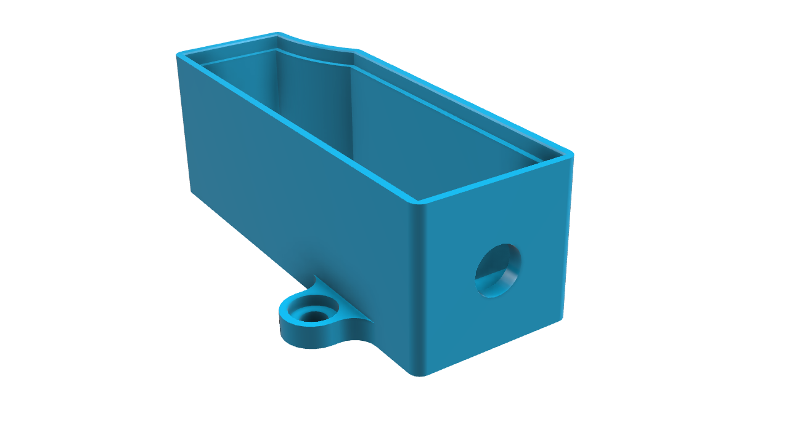|[R7](https://github.com/KonkArLab/KOSMOS/tree/main/hardware/3Dprint_files/R7_KOSMOS_V3-0.stl)|1|Racord de connectiques étanches du moteur|R7 est l'emplacement où l'on va connecter les câbles du moteur au câble noir cobalt. L'étanchéité sera effectué en coulant de la résine dans le contenant.|/|
|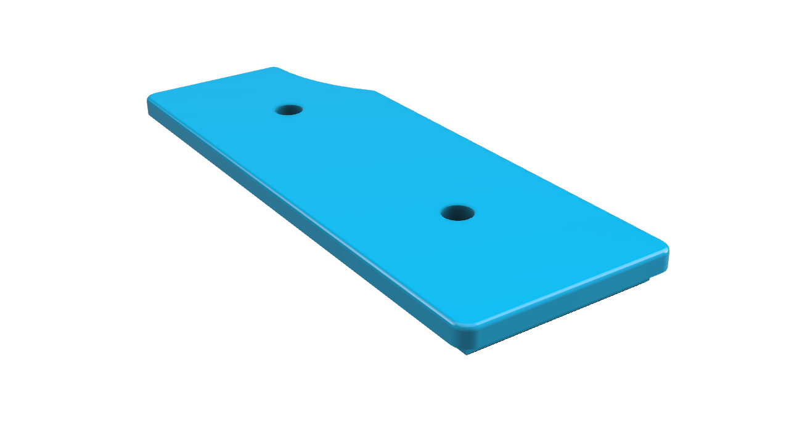|[R7.2](https://github.com/KonkArLab/KOSMOS/tree/main/hardware/3Dprint_files/R7-2_KOSMOS_V3-0.stl)|1|Couvercle pour le racord de connectiques étanches du moteur|Permet de fermer R7|/|
||[R8](https://github.com/KonkArLab/KOSMOS/tree/main/hardware/3Dprint_files/R8_KOSMOS_V3-0.stl)|1|Racord de connectiques étanches du capteur de positionnement|R8 est l'emplacement où l'on va connecter les câbles du capteur ILS au câble noir cobalt. L'étanchéité sera effectué en coulant de la résine dans le contenant.|/|
|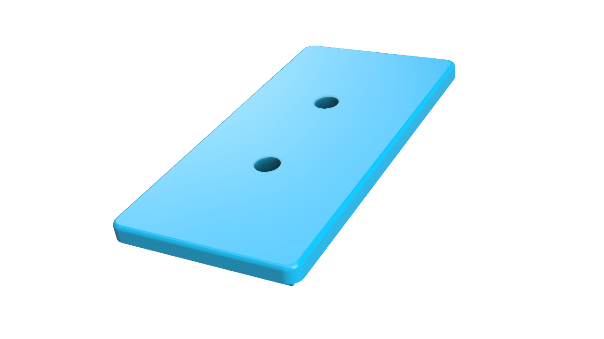|[R8.2](https://github.com/KonkArLab/KOSMOS/tree/main/hardware/3Dprint_files/R8-2_KOSMOS_V3-0.stl)|1|Couvercle pour le racord de connectiques étanches du capteur de positionnement|Permet de fermer R8|/|

_Note  : Toutes les pièces devront être netoyées de leurs supports et au cours du montage, elles nécéssiteront peut-être d'être limées \(papier de verre ou lime à main\) afin de supprimer toutes traces de fils d'anges._

## 2/ Découpe des pièces planes au laser

Le KOSMOS 2.3 est composé en plus de pièces imprimés en 3D et de visserie Inox de pièces à découper au laser dans des plaques de PMMA et de POM. Ainsi on peut immerger ses pièces dans l'eau sans craindre la pression. Les pièces de l'intérieur du caisson peuvent être aussi imprimés en 3D.  [Les trois fichiers vectoriels évoqués ci-dessous sont disponibles ici. ](https://github.com/KonkArLab/KOSMOS/tree/main/hardware/Laser_cut/)

​

**2.1 Pour l'intérieur du caisson :**

* [Télécharger le fichier de découpe](https://github.com/KonkArLab/KOSMOS/tree/main/hardware/Laser_cut/PMMA-5mm_A5_laser-cut.svg )
* Découper les pièces S1 S2 dans du PMMA de 5mm d'éppaisseur \(prévoir l'équivalent de la surface d'une feuille A5\) ;

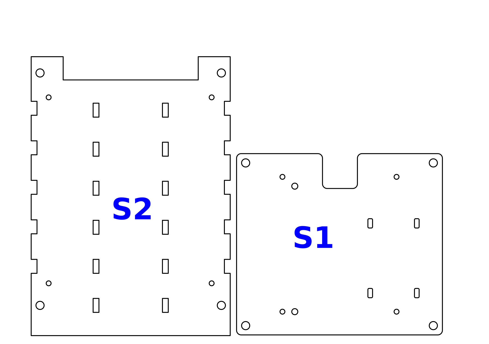

​

​

**2.2 Pour l'extérieur du caisson :**

Ces pièces constituent l'enveloppe du réducteur du KOSMOS. On peut les réaliser en PMMA 5mm si on veut voir à travers ou un autre plastique de 5mm comme des plaques de plastique recyclé.

* Il est nécéssaire de sélectionner une plaque de PMMA bien plane de 5mm d'épaisseur \(prévoir l'équivalent de la surface d'une feuille A3\) ;
* [Télécharger le fichier de découpes](https://github.com/KonkArLab/KOSMOS/tree/main/hardware/Laser_cut/PMMA-5mm_A3_Laser-cut.svg) pour lancer une découpe au laser ou à la fraiseuse numérique ;
* Toutes les pièces sont disposées ici de manière à rentrer dans un format A3 \(42\*29,7 cm\).

​

​

**2.3 Les pièces en mouvements \(engrenages...\) seront usinés de préférence en POM.**

* Il est nécéssaire de sélectionner une plaque  de POM bien plane de 5mm d'épaisseur ;
* Utiliser le fichier POM-5mm\_A4\_laser-cut.svg pour lancer une découpe ;
* Toutes les pièces sont disposées ici de manière à rentrer dans un format A4 \(21\*29,7 cm\) ;

​

​

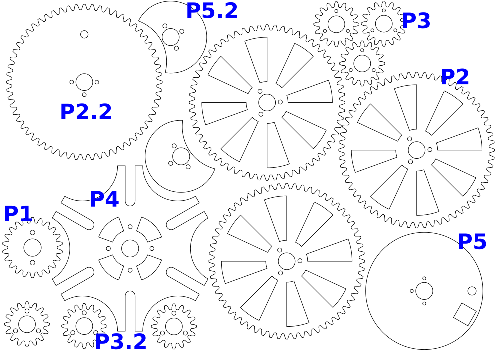

## 3/ Electroniques et câblages

### 3.1 Fabrication du PCB
 - Sur une plaque de circuit imprimé cuivré graver le PCB.
 - Fabriquer le PCB en suivant la documentation en annexe. [Utiliser le fichier pdf](https://github.com/KonkArLab/KOSMOS/tree/main/hardware/electronics/PCB_forprint_KOSMOS_v3-0.pdf) 

### 3.1 Perçage du PCB et soudure

​

* A l'aide d'une dremel sur colonne ou d'une dremel à la main percer les trous du circuit imprimé avec un foret de 0,8mm.
* Élargir les trous dans lesquelles on soudera des pins duponts males \(Encadrés en vert cf. visuels ci dessous\) à l'aide d'un foret de 0,9mm ou 1mm.
* A ces mêmes emplacements, souder des broches duponts mâles.  /!\ Attention on soude les composants de manière a ce qu'ils soient sur la face opposé au circuit. Seule les pattes traversent et sont soudés du coté du circuit.

​
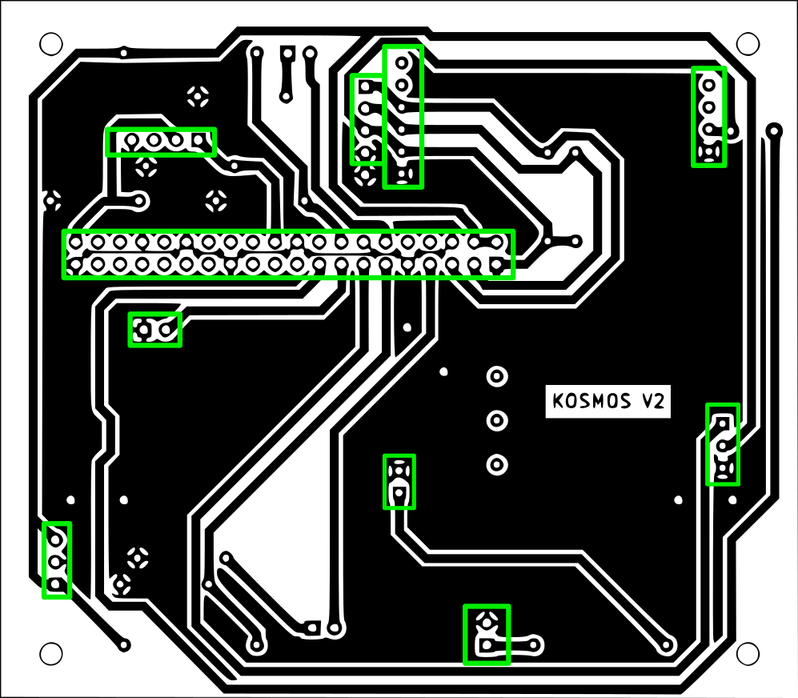

​

​

* Souder 2 résistances de 220ohm et 6 résistances de 1Kohm \(cf. photo ci dessous, 220ohm en bleu et 1kohm en orange\). \(PCB\_step3-2.png\).

​

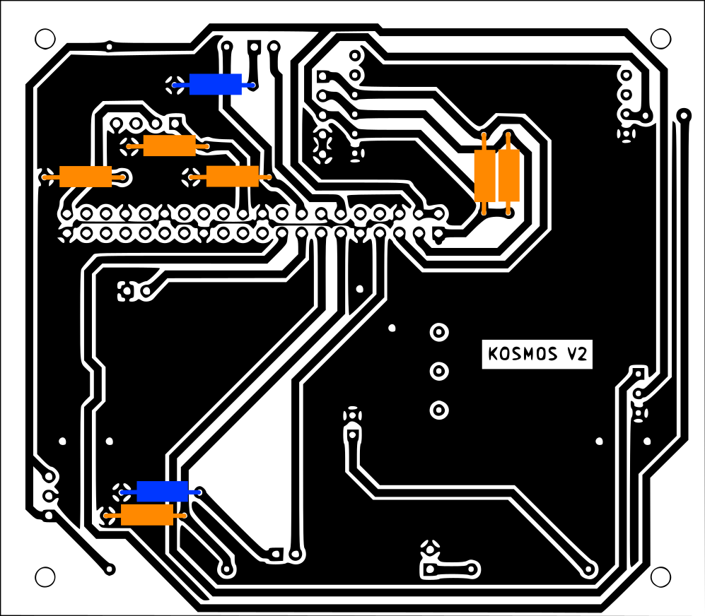

​

​

* Souder les deux diodes en veillant à respecter la polarité. Sur une diode le plus est matérialisé par la patte la plus longue. \(Une LED rouge et une LED verte cf.photo ci dessous\).

​

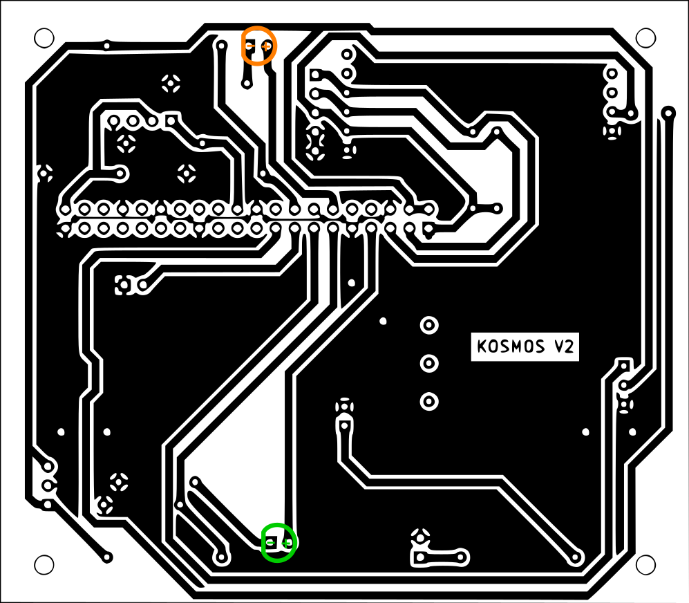

​

​

* Souder 4 fils qui servirons de pont \(en vert cf. dessin ci dessous\).

​

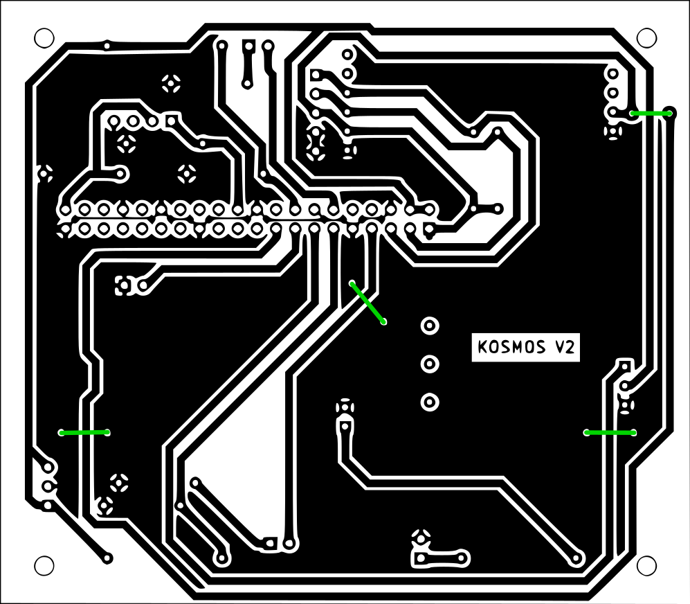

​

* Souder sur les broches duponts, dans le sens indiqué les 3 modules RTC \(Horloge\), l'indicateur de niveau de batterie et le relai. 

​
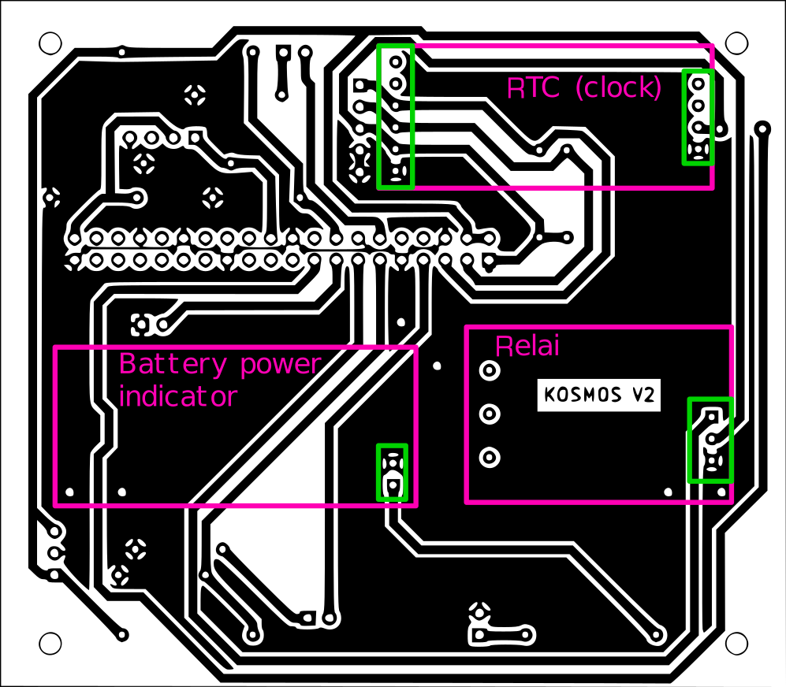

​

​

* Souder 3 ILS sur les emplacements indiqués \(en orange cf. dessin ci dessous\). \(PCB\_step3-6.png\)

​
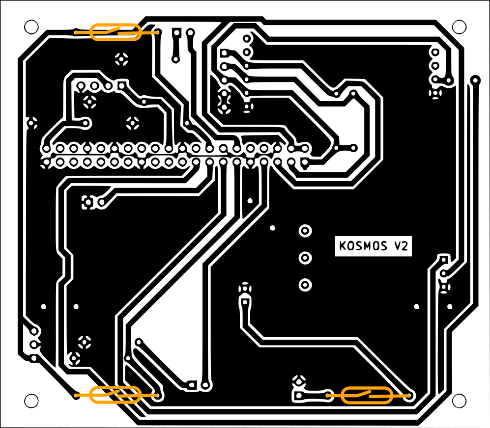
