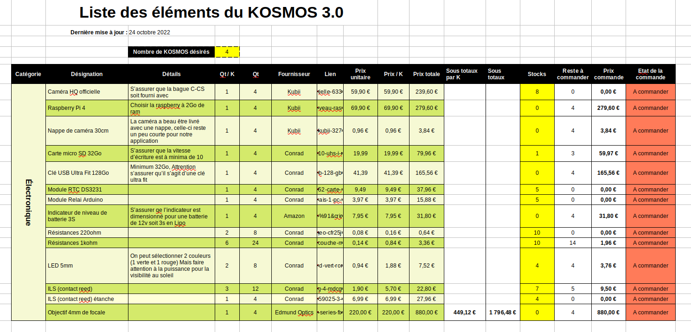

# Nomenclature / Le sourcing

Le sourcing est la première étape du projet et parfois la plus difficile. Sourcer désigne le fait de rassembler tout ce ce qui sera nécéssaire pour fabriquer un KOSMOS. Ce projet demande des composants que l'on trouvera chez un grand-nombre de fournisseurs différents. De plus, ces fournisseurs peuvent différer en fonction du lieu et du moment où l'on va construire un KOSMOS.

**Attention :** Veiller à effectuer ce travail préparatoire bien avant la fabrication. En effet, certaines commandes peuvent avoir de long délais. Et cela sans compter le temps nécéssaire pour le travail du sourcing lui-même. 

## 1. Présentation du fichier de sourcing

 - [Télécharger le fichier de sourcing](files/sourcing/sourcing_kosmos30_fr_221024.ods), ou chercher dans le [dossier "docs/files/sourcing"](files/sourcing) un tableur qui conviendrait d'avantage à votre région ou plus proche en temps de votre date d'achat. 
 - Ouvrir le fichier de sourcing au moyen d'un tableur. Ce fichier à été créé au moyen du logiciel libre [Libre office calc](https://fr.libreoffice.org/download/telecharger-libreoffice/) mais pourra très bien être ouvert par d'autres logiciels de tableurs.

 - Ce fichier se compose d'un onglet listant tout les composants et plusieurs autres onglets dont chacun permettra au moyen d'un tableau croisé dynamique de réaliser des notes de tracabilités (ceci permettra de faciliter le travail de validation par votre administration avant l'achat):
 

### 1.1 Détails du tableau "Liste des éléments du KOSMOS 3.0"

 - **Catégorie :** Catégorie de composants (ex : Electronique,Visserie...)
 - **Désignation :** Appelletion du composant
 - **Détails :** Information complémentaire, souvent des détails auquel faire attention.
 - **Qt / K :** Quantité pour un KOSMOS,
 - **Qt :** Quantité nécéssaire totale pour tous les KOSMOS que l'on souhaite fabriquer,
 - **Fournisseur :** Nom du fournisseur,
 - **Lien :** Lien d'achat,
 - **Prix unitaire :** Prix d'un seul composant,
 - **Prix /K :** Prix des composants de même nom pour un seul KOSMOS,
 - **Prix totale :** Prix des composants de même nom pour tous les KOSMOS que l'on souhaite fabriquer,
 - **Stocks :** Nombre de pièces déjà en stocks,
 - **Reste à commander :** Nombre de pièces qu'il reste à commander,
 - **Prix commande :** Prix totale de chacun des groupes de composants qu'il reste à commander,
 - **Etat de la commande :** Cette colonne permet de sélectionner l'état de l'approvisionnement pour chacun des composant listé. Il existe 4 états : "A commander", "En attente de réception", "Reçu" et "Colis perdu"
 
 
### 1.2 Détails d'une table "note de traçabilité"

 - Dans la seconde partie on pourra modifier au moyen d'un menu déroulant le nom du fournisseur. 
 - Le nombre de composants et les prix affichés correspondent aux quantités après déduction du stock (cf. 1.1 Détails...)
 - Noter que si la valeur renseigné dans la colonne "stocks" de la table "Liste_Materiel" est supérieur ou égal à la quantité totale nécéssaire, la quantité restante à acheter sera de 0. 

## 2. Utilisation du tableur pour sourcer

### 2.1 Mettre à jour les informations des composants

 - Se rendre dans l'onglet "Liste_Matériel"
 - Toutes les cases colorés en jaune sont à éditer en priorité : Changer le nombre de KOSMOS désirés et remplir la colonne des stocks (colonne"N"). Renseigner "0" si aucun composant en stock.
 - Consulter chaque lien un par un (colonne"H"), vérifier que le fournisseur convient, que le prix unitaire correspond bien à celui indiqué dans le tableau. Dans le cas contraire modifier la valeur dans la colonne "I".
 - Si le fournisseur ne distribue plus ce composant, ou que le fournisseur ne convient pas, charcher le composant ailleur puis mettre à jour les colonnes "G" "H" et "I" avec les informations du nouveau fournisseur.
 - Surveiller ainsi ces éléments pour chacune de ligne de l'ongle "Liste_Materiel".

### 2.2 Actualiser les notes de traçabilités

 - Éditer l'entête et la partie "1/" comme désiré,
 - Pour mettre à jour la table croisé, cliquer droit sur "fournisseur" puis "actualiser",
 - Créer un onglet pour chaque fournisseur listé. 
 

## 3. Contribuer

Dans le cas où vous avez modifié le tableur avec des fournisseurs différents ce due au fait que vous ne résidez pas dans la même région ou pour toute autre raison, vos informations pourraient bénéficier par la suite à d'autres personnes.

**Pour contribuer**, déposez votre fichier dans le git à [l'emplacement suivant docs/files/sourcing](files/sourcing). 